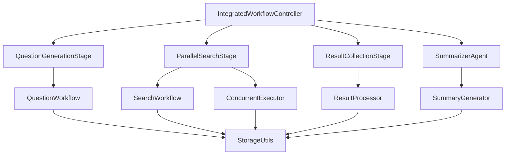

# 技术故事2：集成问题生成与搜索总结系统技术实现设计

## 1. 概述

本设计文档描述了集成问题生成与搜索总结系统的技术实现方案，基于现有的LangGraph框架和项目架构，实现从主题输入到最终报告生成的完整技术流程。系统采用模块化设计，复用现有组件，确保代码的可维护性和可扩展性。

## 2. 技术架构

### 2.1 整体技术架构



### 2.2 核心类设计

#### 2.2.1 IntegratedWorkflowController
```python
class IntegratedWorkflowController:
    """集成工作流控制器"""
    
    def __init__(self, config: Dict[str, Any]):
        self.config = config
        self.question_workflow = QuestionWorkflow(config)
        self.search_workflow = SearchWorkflow(config)
        self.storage = StorageUtils()
        self.concurrent_executor = ConcurrentExecutor(config)
        self.result_processor = ResultProcessor()
        self.summarizer_agent = SummarizerAgent(config)
    
    def process_topic(self, topic: str) -> Dict[str, Any]:
        """处理主题的完整工作流"""
        pass
```

#### 2.2.2 ConcurrentExecutor
```python
class ConcurrentExecutor:
    """并发执行器"""
    
    def __init__(self, config: Dict[str, Any]):
        self.config = config
        self.max_workers = config.get('max_concurrent_searches', 5)
        self.timeout = config.get('search_timeout', 30)
        self.retry_count = config.get('search_retry_count', 3)
    
    def execute_parallel_searches(self, questions: List[QuestionItem]) -> List[SearchResult]:
        """并行执行搜索任务"""
        pass
```

#### 2.2.3 ResultProcessor
```python
class ResultProcessor:
    """结果处理器"""
    
    def __init__(self):
        self.deduplicator = ResultDeduplicator()
        self.quality_assessor = QualityAssessor()
        self.data_standardizer = DataStandardizer()
    
    def process_search_results(self, results: List[SearchResult]) -> ProcessedResults:
        """处理搜索结果"""
        pass
```

#### 2.2.4 SummarizerAgent
```python
class SummarizerAgent:
    """汇总者智能体"""
    
    def __init__(self, config: Dict[str, Any]):
        self.config = config
        self.llm = ChatOpenAI(
            model=config.get("model"),
            api_key=config.get("api_key"),
            base_url=config.get("base_url"),
            temperature=config.get("temperature", 0.7),
            max_tokens=config.get("max_tokens", 2000)
        )
    
    def generate_comprehensive_summary(self, processed_results: ProcessedResults) -> ComprehensiveSummary:
        """生成综合总结"""
        pass
```

## 3. 数据模型设计

### 3.1 核心数据模型

```python
from typing import List, Optional, Dict, Any
from pydantic import BaseModel
from datetime import datetime

class SearchTask(BaseModel):
    """搜索任务模型"""
    question_id: str
    question: str
    direction: str
    priority: int
    status: str  # pending, running, completed, failed
    search_result: Optional[SearchResult] = None
    error: Optional[str] = None
    created_at: datetime
    completed_at: Optional[datetime] = None

class ProcessedResults(BaseModel):
    """处理后的结果模型"""
    total_results: int
    unique_results: int
    quality_scores: Dict[str, float]
    categorized_results: Dict[str, List[SearchResult]]
    deduplication_stats: Dict[str, Any]
    processing_time: float

class ComprehensiveSummary(BaseModel):
    """综合总结模型"""
    executive_summary: str
    detailed_analysis: Dict[str, str]  # 按方向分类的详细分析
    key_insights: List[str]
    cross_cutting_findings: List[str]
    recommendations: List[str]
    confidence_scores: Dict[str, float]
    generated_at: datetime

class IntegratedReport(BaseModel):
    """集成报告模型"""
    topic: str
    questions: List[QuestionItem]
    search_results: List[SearchResult]
    processed_results: ProcessedResults
    comprehensive_summary: ComprehensiveSummary
    execution_stats: Dict[str, Any]
    generated_at: datetime
```

### 3.2 状态管理模型

```python
class IntegratedWorkflowState(TypedDict):
    """集成工作流状态"""
    # 基础信息
    topic: str
    status: str
    error: Optional[str]
    start_time: datetime
    end_time: Optional[datetime]
    
    # 问题生成阶段
    questions: List[QuestionItem]
    question_directions: List[QuestionDirection]
    question_generation_completed: bool
    question_generation_error: Optional[str]
    
    # 搜索阶段
    search_tasks: List[SearchTask]
    search_results: List[SearchResult]
    search_progress: Dict[str, Any]
    search_completed: bool
    search_errors: List[str]
    
    # 结果处理阶段
    processed_results: Optional[ProcessedResults]
    result_processing_completed: bool
    result_processing_error: Optional[str]
    
    # 汇总阶段
    comprehensive_summary: Optional[ComprehensiveSummary]
    summary_completed: bool
    summary_error: Optional[str]
    
    # 最终结果
    final_report: Optional[IntegratedReport]
    report_generated: bool
```

## 4. 核心实现逻辑

### 4.1 集成工作流控制器实现

```python
class IntegratedWorkflowController:
    """集成工作流控制器"""
    
    def __init__(self, config: Dict[str, Any]):
        self.config = config
        self.question_workflow = QuestionWorkflow(config)
        self.search_workflow = SearchWorkflow(config)
        self.storage = StorageUtils()
        self.concurrent_executor = ConcurrentExecutor(config)
        self.result_processor = ResultProcessor()
        self.summarizer_agent = SummarizerAgent(config)
        self.workflow = self._create_workflow()
    
    def _create_workflow(self) -> StateGraph:
        """创建集成工作流"""
        workflow = StateGraph(IntegratedWorkflowState)
        
        # 添加节点
        workflow.add_node("question_generation", self._question_generation_node)
        workflow.add_node("parallel_search", self._parallel_search_node)
        workflow.add_node("result_processing", self._result_processing_node)
        workflow.add_node("comprehensive_summary", self._comprehensive_summary_node)
        workflow.add_node("report_generation", self._report_generation_node)
        
        # 设置入口点
        workflow.set_entry_point("question_generation")
        
        # 添加边
        workflow.add_edge("question_generation", "parallel_search")
        workflow.add_edge("parallel_search", "result_processing")
        workflow.add_edge("result_processing", "comprehensive_summary")
        workflow.add_edge("comprehensive_summary", "report_generation")
        
        # 条件边
        workflow.add_conditional_edges(
            "question_generation",
            self._should_continue_after_questions,
            {
                "continue": "parallel_search",
                "error": END
            }
        )
        
        workflow.add_conditional_edges(
            "parallel_search",
            self._should_continue_after_search,
            {
                "continue": "result_processing",
                "error": END
            }
        )
        
        workflow.add_conditional_edges(
            "result_processing",
            self._should_continue_after_processing,
            {
                "continue": "comprehensive_summary",
                "error": END
            }
        )
        
        workflow.add_conditional_edges(
            "comprehensive_summary",
            self._should_continue_after_summary,
            {
                "continue": "report_generation",
                "error": END
            }
        )
        
        return workflow.compile()
    
    def process_topic(self, topic: str) -> Dict[str, Any]:
        """处理主题的完整工作流"""
        workflow_logger.log_workflow_start("IntegratedWorkflow", topic)
        
        try:
            # 初始化状态
            initial_state: IntegratedWorkflowState = {
                "topic": topic,
                "status": "running",
                "error": None,
                "start_time": datetime.now(),
                "end_time": None,
                "questions": [],
                "question_directions": [],
                "question_generation_completed": False,
                "question_generation_error": None,
                "search_tasks": [],
                "search_results": [],
                "search_progress": {},
                "search_completed": False,
                "search_errors": [],
                "processed_results": None,
                "result_processing_completed": False,
                "result_processing_error": None,
                "comprehensive_summary": None,
                "summary_completed": False,
                "summary_error": None,
                "final_report": None,
                "report_generated": False
            }
            
            # 运行工作流
            final_state = self.workflow.invoke(initial_state)
            
            # 构建最终结果
            result_dict = self._build_final_result(final_state)
            
            workflow_logger.log_workflow_end("IntegratedWorkflow", final_state.get('status', 'unknown'), result_dict)
            
            return result_dict
            
        except Exception as e:
            error_result = {
                "topic": topic,
                "status": "error",
                "error": str(e),
                "generated_at": datetime.now()
            }
            workflow_logger.log_error(f"集成工作流执行失败: {str(e)}", "process_topic")
            return error_result
```

### 4.2 并发搜索执行器实现

```python
class ConcurrentExecutor:
    """并发执行器"""
    
    def __init__(self, config: Dict[str, Any]):
        self.config = config
        self.max_workers = config.get('max_concurrent_searches', 5)
        self.timeout = config.get('search_timeout', 30)
        self.retry_count = config.get('search_retry_count', 3)
        self.search_workflow = SearchWorkflow(config)
    
    def execute_parallel_searches(self, questions: List[QuestionItem]) -> List[SearchResult]:
        """并行执行搜索任务"""
        workflow_logger.log_info(f"开始并行搜索 {len(questions)} 个问题")
        
        # 创建搜索任务
        search_tasks = []
        for i, question in enumerate(questions):
            task = SearchTask(
                question_id=f"q_{i+1}",
                question=question.question,
                direction=question.direction,
                priority=i,
                status="pending",
                created_at=datetime.now()
            )
            search_tasks.append(task)
        
        # 使用线程池执行并发搜索
        with ThreadPoolExecutor(max_workers=self.max_workers) as executor:
            # 提交所有搜索任务
            future_to_task = {
                executor.submit(self._execute_single_search, task): task
                for task in search_tasks
            }
            
            # 收集结果
            search_results = []
            for future in as_completed(future_to_task, timeout=self.timeout * len(questions)):
                task = future_to_task[future]
                try:
                    result = future.result()
                    if result:
                        search_results.append(result)
                        task.status = "completed"
                        task.completed_at = datetime.now()
                    else:
                        task.status = "failed"
                        task.error = "搜索返回空结果"
                except Exception as e:
                    task.status = "failed"
                    task.error = str(e)
                    workflow_logger.log_error(f"搜索任务失败: {task.question_id} - {str(e)}")
        
        workflow_logger.log_info(f"并行搜索完成，成功 {len(search_results)} 个，失败 {len(questions) - len(search_results)} 个")
        return search_results
    
    def _execute_single_search(self, task: SearchTask) -> Optional[SearchResult]:
        """执行单个搜索任务"""
        try:
            # 调用现有的SearchWorkflow
            result = self.search_workflow.process_topic(task.question)
            
            if result.get("status") == "completed":
                # 转换结果格式
                search_result = SearchResult(
                    query=task.question,
                    results=result.get("search_results", []),
                    summaries=result.get("summaries", []),
                    key_points=result.get("key_points", [])
                )
                return search_result
            else:
                workflow_logger.log_warning(f"搜索任务失败: {task.question_id} - {result.get('error', '未知错误')}")
                return None
                
        except Exception as e:
            workflow_logger.log_error(f"搜索任务执行异常: {task.question_id} - {str(e)}")
            return None
```

### 4.3 结果处理器实现

```python
class ResultProcessor:
    """结果处理器"""
    
    def __init__(self):
        self.deduplicator = ResultDeduplicator()
        self.quality_assessor = QualityAssessor()
        self.data_standardizer = DataStandardizer()
    
    def process_search_results(self, results: List[SearchResult]) -> ProcessedResults:
        """处理搜索结果"""
        workflow_logger.log_info(f"开始处理 {len(results)} 个搜索结果")
        
        start_time = time.time()
        
        # 1. 数据标准化
        standardized_results = self.data_standardizer.standardize(results)
        
        # 2. 去重处理
        deduplicated_results, dedup_stats = self.deduplicator.deduplicate(standardized_results)
        
        # 3. 质量评估
        quality_scores = self.quality_assessor.assess_quality(deduplicated_results)
        
        # 4. 结果分类
        categorized_results = self._categorize_results(deduplicated_results)
        
        processing_time = time.time() - start_time
        
        processed_results = ProcessedResults(
            total_results=len(standardized_results),
            unique_results=len(deduplicated_results),
            quality_scores=quality_scores,
            categorized_results=categorized_results,
            deduplication_stats=dedup_stats,
            processing_time=processing_time
        )
        
        workflow_logger.log_info(f"结果处理完成，处理时间: {processing_time:.2f}秒")
        return processed_results
    
    def _categorize_results(self, results: List[SearchResult]) -> Dict[str, List[SearchResult]]:
        """按方向分类结果"""
        categorized = {}
        for result in results:
            direction = getattr(result, 'direction', 'unknown')
            if direction not in categorized:
                categorized[direction] = []
            categorized[direction].append(result)
        return categorized
```

### 4.4 汇总者智能体实现

```python
class SummarizerAgent:
    """汇总者智能体"""
    
    def __init__(self, config: Dict[str, Any]):
        self.config = config
        self.llm = ChatOpenAI(
            model=config.get("model"),
            api_key=config.get("api_key"),
            base_url=config.get("base_url"),
            temperature=config.get("temperature", 0.7),
            max_tokens=config.get("max_tokens", 2000)
        )
    
    def generate_comprehensive_summary(self, processed_results: ProcessedResults) -> ComprehensiveSummary:
        """生成综合总结"""
        workflow_logger.log_info("开始生成综合总结")
        
        # 构建汇总提示词
        summary_prompt = self._build_summary_prompt(processed_results)
        
        # 调用LLM生成总结
        messages = [
            SystemMessage(content=self._get_system_prompt()),
            HumanMessage(content=summary_prompt)
        ]
        
        try:
            response = self.llm.invoke(messages)
            summary_content = response.content
            
            # 解析总结内容
            comprehensive_summary = self._parse_summary_content(summary_content, processed_results)
            
            workflow_logger.log_info("综合总结生成完成")
            return comprehensive_summary
            
        except Exception as e:
            workflow_logger.log_error(f"综合总结生成失败: {str(e)}")
            raise
    
    def _build_summary_prompt(self, processed_results: ProcessedResults) -> str:
        """构建汇总提示词"""
        prompt_parts = [
            f"请对以下搜索结果进行综合分析和总结：",
            f"",
            f"总结果数：{processed_results.total_results}",
            f"去重后结果数：{processed_results.unique_results}",
            f"",
            f"按方向分类的结果："
        ]
        
        for direction, results in processed_results.categorized_results.items():
            prompt_parts.append(f"\n{direction}方向：")
            for i, result in enumerate(results[:3], 1):  # 只取前3个结果
                prompt_parts.append(f"  {i}. {result.query}")
                if hasattr(result, 'summaries') and result.summaries:
                    prompt_parts.append(f"     总结：{result.summaries[0][:200]}...")
        
        prompt_parts.extend([
            f"",
            f"请按照以下格式生成综合总结：",
            f"1. 执行摘要（200-300字）",
            f"2. 按方向分类的详细分析",
            f"3. 关键洞察和发现（5-10个）",
            f"4. 跨方向关联性发现",
            f"5. 建议和后续行动"
        ])
        
        return "\n".join(prompt_parts)
    
    def _get_system_prompt(self) -> str:
        """获取系统提示词"""
        return """你是一个专业的汇总者智能体，负责对多个问题的搜索结果进行综合总结。

你的任务：
1. 分析所有问题的搜索结果
2. 识别关键信息和洞察
3. 生成结构化的综合报告
4. 提取跨问题的关联性发现
5. 提供实用的建议和后续行动

要求：
- 总结要准确、全面、有层次
- 关键洞察要具体、可操作
- 语言要专业、简洁
- 结构要清晰、逻辑性强"""
    
    def _parse_summary_content(self, content: str, processed_results: ProcessedResults) -> ComprehensiveSummary:
        """解析总结内容"""
        # 这里可以实现更复杂的解析逻辑
        # 目前使用简单的文本分割
        
        lines = content.split('\n')
        executive_summary = ""
        detailed_analysis = {}
        key_insights = []
        cross_cutting_findings = []
        recommendations = []
        
        current_section = None
        current_content = []
        
        for line in lines:
            line = line.strip()
            if not line:
                continue
                
            if "执行摘要" in line or "摘要" in line:
                current_section = "executive_summary"
                current_content = []
            elif "详细分析" in line or "分析" in line:
                current_section = "detailed_analysis"
                current_content = []
            elif "关键洞察" in line or "洞察" in line:
                current_section = "key_insights"
                current_content = []
            elif "关联性" in line or "关联" in line:
                current_section = "cross_cutting"
                current_content = []
            elif "建议" in line or "后续行动" in line:
                current_section = "recommendations"
                current_content = []
            else:
                if current_section:
                    current_content.append(line)
        
        # 处理各节内容
        if current_section == "executive_summary":
            executive_summary = "\n".join(current_content)
        elif current_section == "key_insights":
            key_insights = [item.strip() for item in current_content if item.strip()]
        elif current_section == "cross_cutting":
            cross_cutting_findings = [item.strip() for item in current_content if item.strip()]
        elif current_section == "recommendations":
            recommendations = [item.strip() for item in current_content if item.strip()]
        
        return ComprehensiveSummary(
            executive_summary=executive_summary,
            detailed_analysis=detailed_analysis,
            key_insights=key_insights,
            cross_cutting_findings=cross_cutting_findings,
            recommendations=recommendations,
            confidence_scores={},
            generated_at=datetime.now()
        )
```

## 5. 配置和部署

### 5.1 配置文件扩展

```python
# config.py 中添加集成工作流配置
INTEGRATED_WORKFLOW_CONFIG = {
    "max_concurrent_searches": 5,
    "search_timeout": 30,
    "search_retry_count": 3,
    "min_results_per_question": 3,
    "max_results_per_question": 20,
    "similarity_threshold": 0.8,
    "quality_score_threshold": 0.6,
    "max_summary_length": 5000,
    "max_insights_count": 10
}
```

### 5.2 主程序集成

```python
# main.py 中添加集成工作流选项
def main():
    parser.add_argument("--integrated", action="store_true", help="启用集成工作流模式：问题生成+搜索+汇总")
    
    # 在分支处理中添加
    if args.integrated:
        print(f"正在为主题 '{topic}' 执行集成工作流...")
        workflow_logger.log_info("启动集成工作流模式")
        integrated_system = IntegratedWorkflowController(config)
        result = integrated_system.process_topic(topic)
        
        if result.get("status") == "completed":
            print(f"\n=== 集成工作流结果 ===")
            print(f"主题：{result['topic']}")
            print(f"生成问题数：{len(result.get('questions', []))}")
            print(f"搜索结果数：{len(result.get('search_results', []))}")
            print(f"处理时间：{result.get('execution_stats', {}).get('total_time', 'N/A')}")
            
            # 显示综合总结
            if result.get('comprehensive_summary'):
                summary = result['comprehensive_summary']
                print(f"\n=== 综合总结 ===")
                print(f"执行摘要：{summary.get('executive_summary', '')}")
                print(f"关键洞察：")
                for i, insight in enumerate(summary.get('key_insights', []), 1):
                    print(f"  {i}. {insight}")
        else:
            print(f"集成工作流失败：{result.get('error', '未知错误')}")
```

## 6. 测试策略

### 6.1 单元测试
- 测试各个组件的独立功能
- 测试数据模型的验证
- 测试错误处理机制

### 6.2 集成测试
- 测试完整工作流的执行
- 测试并发搜索的性能
- 测试结果处理的正确性

### 6.3 性能测试
- 测试不同并发数下的性能
- 测试大规模问题处理的稳定性
- 测试内存和CPU使用情况

## 7. 监控和日志

### 7.1 进度监控
```python
class ProgressMonitor:
    """进度监控器"""
    
    def __init__(self):
        self.progress_data = {}
    
    def update_progress(self, stage: str, progress: float, details: str = ""):
        """更新进度"""
        self.progress_data[stage] = {
            "progress": progress,
            "details": details,
            "timestamp": datetime.now()
        }
    
    def get_overall_progress(self) -> float:
        """获取总体进度"""
        if not self.progress_data:
            return 0.0
        
        total_progress = sum(data["progress"] for data in self.progress_data.values())
        return total_progress / len(self.progress_data)
```

### 7.2 性能监控
```python
class PerformanceMonitor:
    """性能监控器"""
    
    def __init__(self):
        self.metrics = {}
    
    def start_timer(self, operation: str):
        """开始计时"""
        self.metrics[operation] = {
            "start_time": time.time(),
            "end_time": None,
            "duration": None
        }
    
    def end_timer(self, operation: str):
        """结束计时"""
        if operation in self.metrics:
            self.metrics[operation]["end_time"] = time.time()
            self.metrics[operation]["duration"] = (
                self.metrics[operation]["end_time"] - 
                self.metrics[operation]["start_time"]
            )
    
    def get_metrics(self) -> Dict[str, Any]:
        """获取性能指标"""
        return self.metrics
```

## 8. 总结

本技术实现设计提供了集成问题生成与搜索总结系统的完整技术方案，包括：

1. **模块化架构**：基于现有组件构建，确保代码复用和维护性
2. **并发处理**：支持高效的并行搜索执行
3. **智能汇总**：通过专门的汇总者智能体提供高质量的综合分析
4. **完善的错误处理**：确保系统的稳定性和可靠性
5. **详细的监控**：提供完整的进度和性能监控

该实现方案充分利用了现有的技术栈和架构，通过合理的扩展和集成，实现了从主题输入到最终报告生成的完整技术流程。
