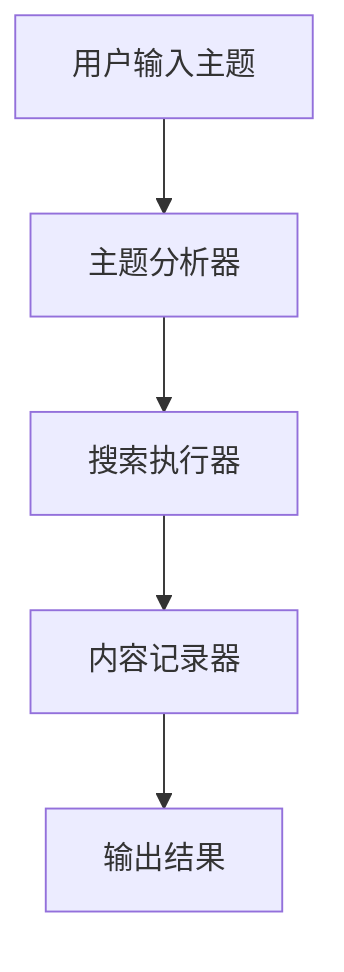
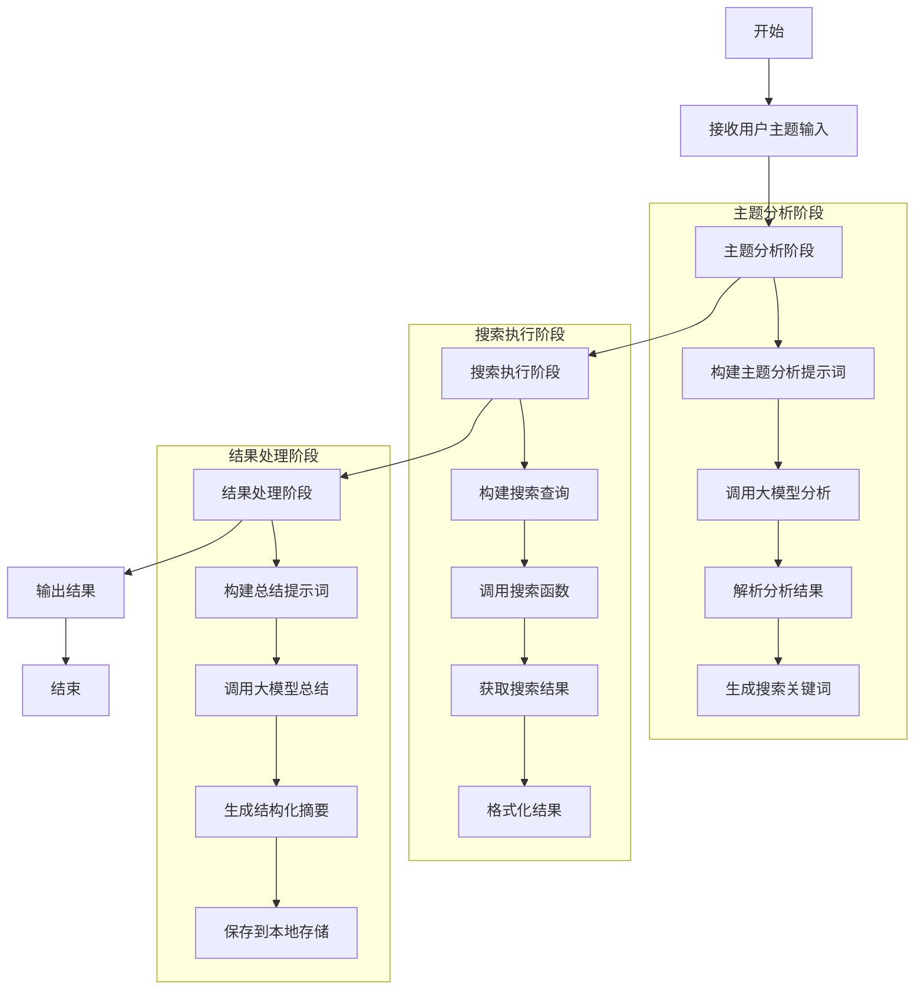
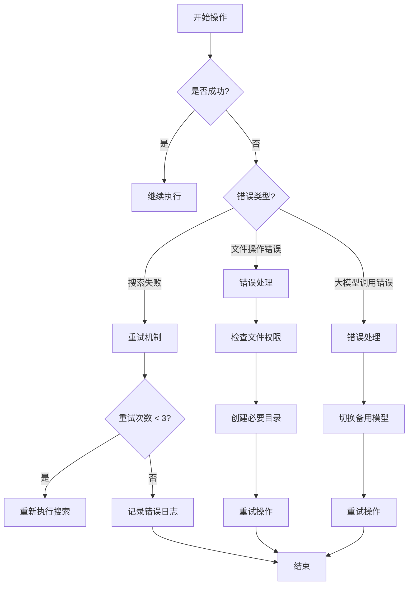
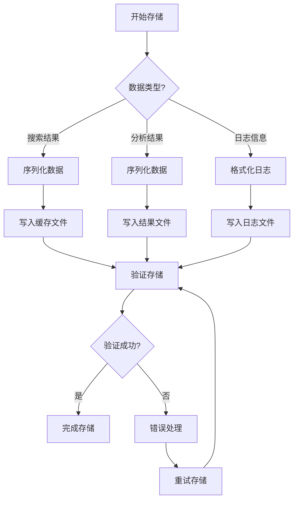
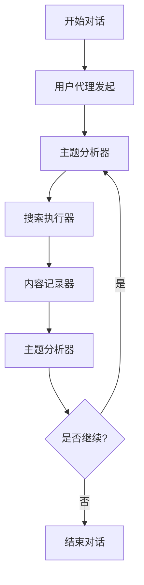

# 用户故事1：主题搜索与内容记录系统设计（MVP版本）

## 1. 概述

本设计文档描述了MVP版本的用户故事实现方案，主要聚焦于核心功能：基于用户提供的主题进行搜索和内容记录。系统使用 autogen 框架实现多智能体协作，通过群组对话的方式完成搜索任务。

## 2. 系统组件（MVP）

### 2.1 主要组件

1. **主题分析器（Topic Analyzer）**
   - 解析用户输入的主题
   - 提取核心关键词
   - 生成相关子主题
   - 评估搜索难度

2. **搜索执行器（Search Executor）**
   - 执行搜索请求
   - 管理搜索结果
   - 使用 Searx 搜索引擎
   - 支持多引擎搜索

3. **内容记录器（Content Recorder）**
   - 记录搜索结果
   - 生成结构化摘要
   - 对内容进行分类和标记
   - 评估内容完整性

4. **用户代理（User Proxy）**
   - 管理对话流程
   - 执行工具调用
   - 协调其他代理

### 2.2 数据流

## 3. 详细设计（MVP）

### 3.1 主题分析阶段

1. **输入处理**
   - 接收用户主题输入
   - 分析核心概念
   - 提取关键词
   - 生成子主题

2. **大模型参与**
   - 使用大模型进行主题理解和扩展
   - 生成相关子主题和搜索建议
   - 评估主题的完整性和搜索策略

### 3.2 搜索执行阶段

1. **搜索流程**
   - 使用 Searx 搜索引擎
   - 支持多引擎搜索
   - 本地文件缓存
   - 错误处理和重试机制

2. **大模型参与**
   - 构建合适的搜索查询
   - 对搜索结果进行初步筛选
   - 评估内容相关性
   - 识别重复和低质量内容

3. **质量控制**
   - 基本相关性检查
   - 简单去重
   - 错误处理和日志记录

### 3.3 结果处理阶段

1. **内容记录**
   - 保存搜索结果到本地文件
   - 生成结构化摘要
   - 对内容进行分类和标记

2. **大模型参与**
   - 对搜索结果进行总结和归纳
   - 生成结构化摘要
   - 评估内容完整性
   - 提取关键点

## 4. 配置参数（MVP）

### 4.1 搜索参数
- 默认结果数：20
- 最小相关性阈值：0.5
- 搜索轮次：1
- 搜索引擎：presearch

### 4.2 本地存储
- 缓存文件位置：./data/cache/
- 结果文件位置：./data/results/
- 日志文件位置：./data/logs/

## 5. 错误处理（MVP）

1. **基本错误处理**
   - 搜索失败重试（最多3次）
   - 本地文件读写错误处理
   - 简单日志记录
   - 异常捕获和报告

## 6. 测试计划（MVP）

1. **基本功能测试**
   - 主题分析测试
   - 搜索执行测试
   - 本地存储测试
   - 群组对话测试

## 7. 部署要求（MVP）

1. **系统要求**
   - Python 3.8+
   - 本地文件系统
   - 网络连接

2. **依赖服务**
   - Searx 搜索引擎
   - 本地文件系统（用于缓存和日志）
   - 大模型API服务（GLM-4-9B或DeepSeek-R1-Distill-Qwen-32B）

## 8. 详细流程图

### 8.1 主流程

### 8.2 错误处理流程

### 8.3 数据存储流程

### 8.4 群组对话流程

这些流程图展示了：
1. 主流程：从用户输入到最终输出的完整过程
2. 错误处理：各种错误情况的处理机制
3. 数据存储：不同类型数据的存储流程
4. 群组对话：代理之间的交互过程

每个流程图都包含了详细的步骤和决策点，可以帮助开发团队更好地理解系统的工作流程。 

### 9. 已知待解决问题

[] 多轮对话后，模型会陷入重复。预期：不陷入重复，按照新发现的文章形成新话题继续讨论。
[] 多轮对话后，搜索执行者会不进行工具调用，仅重复前者说的话。预期：每轮都进行工具调用，如果调用不成功则提示推出该轮。