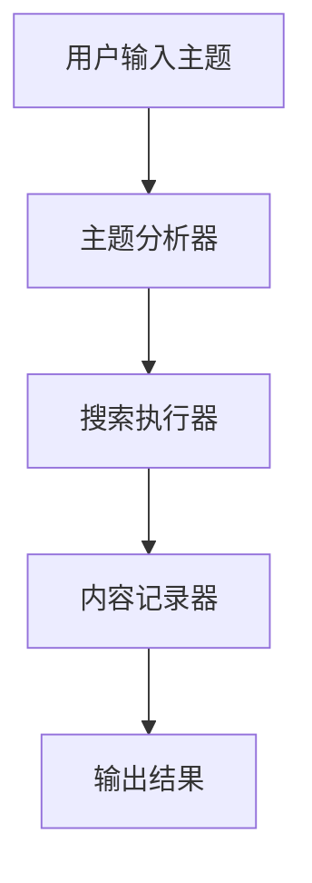
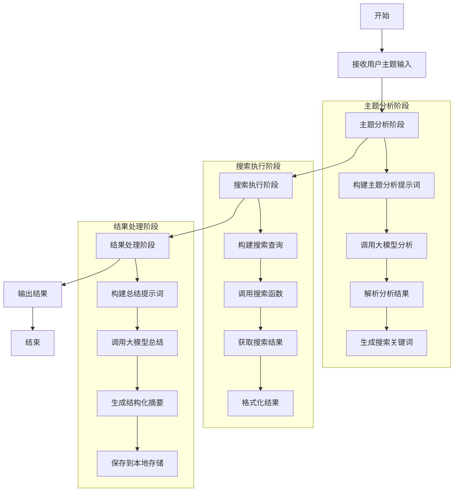
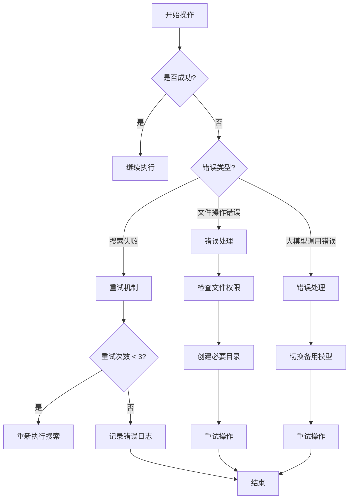
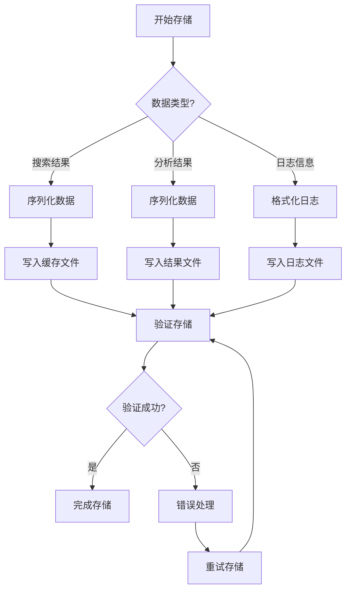
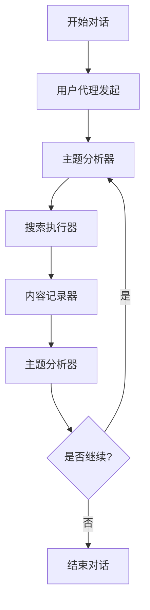

# 用户故事1：主题搜索与内容记录系统设计（MVP版本）

## 1. 概述

本设计文档描述了MVP版本的用户故事实现方案，主要聚焦于核心功能：基于用户提供的主题进行搜索和内容记录。系统使用 autogen 框架实现多智能体协作，通过群组对话的方式完成搜索任务。

## 2. 系统组件（MVP）

### 2.1 主要组件

1. **主题分析器（Topic Analyzer）**
   - 解析用户输入的主题
   - 提取核心关键词
   - 生成相关子主题
   - 评估搜索难度

2. **搜索执行器（Search Executor）**
   - 执行搜索请求
   - 管理搜索结果
   - 使用 Searx 搜索引擎
   - 支持多引擎搜索

3. **内容记录器（Content Recorder）**
   - 记录搜索结果
   - 生成结构化摘要
   - 对内容进行分类和标记
   - 评估内容完整性

4. **用户代理（User Proxy）**
   - 管理对话流程
   - 执行工具调用
   - 协调其他代理

### 2.2 数据流

## 3. 详细设计（MVP）

### 3.1 主题分析阶段

1. **输入处理**
   - 接收用户主题输入
   - 分析核心概念
   - 提取关键词
   - 生成子主题

2. **大模型参与**
   - 使用大模型进行主题理解和扩展
   - 生成相关子主题和搜索建议
   - 评估主题的完整性和搜索策略

### 3.2 搜索执行阶段

1. **搜索流程**
   - 使用 Searx 搜索引擎
   - 支持多引擎搜索
   - 本地文件缓存
   - 错误处理和重试机制

2. **大模型参与**
   - 构建合适的搜索查询
   - 对搜索结果进行初步筛选
   - 评估内容相关性
   - 识别重复和低质量内容

3. **质量控制**
   - 基本相关性检查
   - 简单去重
   - 错误处理和日志记录

### 3.3 结果处理阶段

1. **内容记录**
   - 保存搜索结果到本地文件
   - 生成结构化摘要
   - 对内容进行分类和标记

2. **大模型参与**
   - 对搜索结果进行总结和归纳
   - 生成结构化摘要
   - 评估内容完整性
   - 提取关键点

## 4. 配置参数（MVP）

### 4.1 搜索参数
- 默认结果数：20
- 最小相关性阈值：0.5
- 搜索轮次：1
- 搜索引擎：presearch

### 4.2 本地存储
- 缓存文件位置：./data/cache/
- 结果文件位置：./data/results/
- 日志文件位置：./data/logs/

## 5. 错误处理（MVP）

1. **基本错误处理**
   - 搜索失败重试（最多3次）
   - 本地文件读写错误处理
   - 简单日志记录
   - 异常捕获和报告

## 6. 测试计划（MVP）

1. **基本功能测试**
   - 主题分析测试
   - 搜索执行测试
   - 本地存储测试
   - 群组对话测试

## 7. 部署要求（MVP）

1. **系统要求**
   - Python 3.8+
   - 本地文件系统
   - 网络连接

2. **依赖服务**
   - Searx 搜索引擎
   - 本地文件系统（用于缓存和日志）
   - 大模型API服务（GLM-4-9B或DeepSeek-R1-Distill-Qwen-32B）

## 8. 详细流程图

### 8.1 主流程

### 8.2 错误处理流程

### 8.3 数据存储流程

### 8.4 群组对话流程

这些流程图展示了：
1. 主流程：从用户输入到最终输出的完整过程
2. 错误处理：各种错误情况的处理机制
3. 数据存储：不同类型数据的存储流程
4. 群组对话：代理之间的交互过程

每个流程图都包含了详细的步骤和决策点，可以帮助开发团队更好地理解系统的工作流程。 

### 9. 已知待解决问题

#### 9.1 搜索执行器工具调用问题

##### 9.1.1 问题描述
在多轮对话过程中，搜索执行器（Search Executor）代理会出现不执行工具调用的情况，仅重复前一个代理的发言内容。这与预期行为不符，预期是每轮对话都应该尝试执行搜索工具调用，如果调用不成功则明确提示并退出当前轮次。

##### 9.1.2 问题细分
1. **工具调用机制问题**
   - 缺乏工具调用的强制性和优先级设置
   - 系统提示词中工具调用说明不够明确
   - 缺乏工具调用的执行约束

2. **对话状态管理问题**
   - 对话状态转换逻辑过于简单
   - 缺乏对话上下文的追踪机制
   - 状态评估机制不完善

3. **错误处理机制问题**
   - 工具调用失败时的处理流程不明确
   - 缺乏状态恢复机制
   - 错误反馈机制不完善

4. **对话轮次控制问题**
   - 对话轮次控制机制缺失
   - 缺乏对话质量的评估标准
   - 缺乏对话终止条件

##### 9.1.3 解决方案设计
1. **工具调用机制改进**
   - 强化工具调用约束
     * 在系统提示词中明确工具调用的强制性
     * 设置工具调用的优先级
     * 定义工具调用的执行条件
   - 完善提示词设计
     * 明确每次对话必须执行工具调用
     * 定义工具调用失败的处理方式
     * 提供工具调用的执行指南

2. **对话状态管理改进**
   - 智能状态转换
     * 基于对话上下文的状态转换
     * 考虑工具调用结果的状态转换
     * 实现状态评估机制
   - 上下文追踪
     * 记录对话历史
     * 追踪工具调用状态
     * 维护对话上下文

3. **错误处理机制改进**
   - 工具调用监控
     * 实现工具调用监控机制
     * 定义监控指标
     * 设置监控阈值
   - 状态恢复机制
     * 定义状态恢复策略
     * 实现自动恢复机制
     * 提供手动干预接口

4. **对话质量控制**
   - 质量评估机制
     * 定义评估指标
     * 实现评估算法
     * 设置评估阈值
   - 对话控制机制
     * 实现对话轮次控制
     * 定义终止条件
     * 提供干预机制

##### 9.1.4 实施计划
1. **第一阶段：基础改进**
   - 改进系统提示词
   - 实现基础状态管理
   - 添加简单错误处理

2. **第二阶段：机制完善**
   - 实现工具调用监控
   - 完善状态转换逻辑
   - 添加质量评估机制

3. **第三阶段：优化提升**
   - 优化对话控制
   - 提升错误处理能力
   - 完善监控机制

##### 9.1.5 预期效果
1. **工具调用改进**
   - 提高工具调用频率
   - 减少重复对话
   - 提升对话效率

2. **对话质量提升**
   - 提高对话连贯性
   - 减少无效对话
   - 提升结果质量

3. **系统稳定性提升**
   - 提高错误处理能力
   - 增强系统鲁棒性
   - 提升用户体验

##### 9.1.5 当前解决效果

1. 目前能够稳定至少查询两轮以上
2. 不再出现第二轮就出现重复回答遗忘的情况
3. 对于某些个别话题能够深入查询到4轮

#### 9.2 模型重复问题

##### 9.2.1 问题描述
在多轮对话过程中，模型会陷入重复讨论相同内容的循环，无法基于新发现的文章形成新的话题。这与预期行为不符，预期是模型应该能够：
1. 基于新发现的文章内容形成新的讨论点
2. 避免重复讨论已经涉及过的内容
3. 保持对话的连贯性和深度

##### 9.2.2 问题细分
1. **内容记忆问题**
   - 缺乏对已讨论内容的有效追踪
   - 没有建立话题之间的关联关系
   - 缺乏内容去重机制

2. **话题扩展问题**
   - 缺乏新话题的生成机制
   - 没有建立话题的层次结构
   - 缺乏话题深度控制

3. **对话连贯性问题**
   - 缺乏对话上下文的维护
   - 没有建立话题转换的平滑机制
   - 缺乏对话进展的评估

4. **知识整合问题**
   - 缺乏对新旧知识的整合机制
   - 没有建立知识之间的关联
   - 缺乏知识更新的触发机制

##### 9.2.3 解决方案设计
1. **历史消息差异判断机制**
   - 消息内容比较
     * 计算相邻消息的相似度
     * 设置相似度阈值
     * 识别重复内容
   - 话题进展评估
     * 分析新消息带来的新信息
     * 评估话题的深入程度
     * 判断话题是否停滞

2. **话题引导机制**
   - 新话题触发
     * 基于搜索结果生成新话题
     * 在检测到重复时主动切换话题
     * 保持话题的连贯性
   - 话题深度控制
     * 设置话题切换阈值
     * 控制话题转换时机
     * 避免过早切换话题

3. **对话质量控制**
   - 重复检测
     * 实现消息相似度计算
     * 设置重复判定标准
     * 记录重复次数
   - 进展监控
     * 跟踪新信息引入
     * 评估对话质量
     * 控制对话方向

##### 9.2.4 实施计划
1. **第一阶段：基础机制**
   - 实现内容追踪系统
   - 建立话题扩展规则
   - 添加对话历史管理

2. **第二阶段：核心功能**
   - 实现知识图谱构建
   - 添加话题深度控制
   - 完善进展评估机制

3. **第三阶段：优化提升**
   - 优化知识整合机制
   - 提升对话连贯性
   - 完善评估指标

##### 9.2.5 预期效果
1. **内容管理改进**
   - 减少重复讨论
   - 提高内容覆盖率
   - 提升知识整合度

2. **话题扩展改进**
   - 增加新话题生成
   - 提高话题深度
   - 提升讨论质量

3. **对话质量提升**
   - 提高对话连贯性
   - 增强知识关联
   - 提升用户体验

#### 9.3 退出结果返回问题

##### 9.3.1 问题描述
在系统退出时，未能将终止原因和最终执行结果适当地返回给用户。这导致用户无法了解对话终止的具体原因和已获取的成果。

##### 9.3.2 问题分析
1. **结果收集不完整**
   - 缺乏对最终结果的汇总机制
   - 没有记录对话终止的原因
   - 缺少对已获取内容的整理

2. **退出流程不完善**
   - 退出条件判断不明确
   - 缺乏退出前的状态检查
   - 没有统一的退出处理流程

3. **结果展示不清晰**
   - 缺乏结构化的结果展示
   - 没有对重要信息的突出显示
   - 缺少对未完成任务的说明

##### 9.3.3 解决方案设计
1. **结果收集机制**
   - 在对话过程中实时记录关键信息
   - 维护对话状态和进展
   - 收集已获取的搜索结果和总结

2. **退出处理流程**
   - 定义明确的退出条件
   - 实现退出前的状态检查
   - 统一退出处理逻辑

3. **结果展示格式**
   - 结构化展示最终结果
   - 突出显示重要信息
   - 说明未完成的任务

##### 9.3.4 实施计划
1. **第一阶段：基础实现**
   - 添加结果收集机制
   - 实现基本的退出处理
   - 设计结果展示格式

2. **第二阶段：功能完善**
   - 完善退出条件判断
   - 优化结果展示
   - 添加状态检查

3. **第三阶段：优化提升**
   - 改进结果收集效率
   - 优化展示效果
   - 提升用户体验

##### 9.3.5 预期效果
1. **结果完整性提升**
   - 完整记录对话过程
   - 清晰展示最终结果
   - 明确说明终止原因

2. **用户体验改善**
   - 提供清晰的结果展示
   - 帮助理解对话进展
   - 便于后续操作

3. **系统可维护性提升**
   - 便于问题诊断
   - 方便结果追踪
   - 支持系统优化

### 10 其他待解决问题
[] 当search_executor不愿意进行搜索了的时候，应该有个智能体对这次的搜索结果做出总结，并思考一篇基于现有材料的文章结构。
[] 记录者并没有好好工作，按预期该智能体应该把之前的内容收录后进行总结