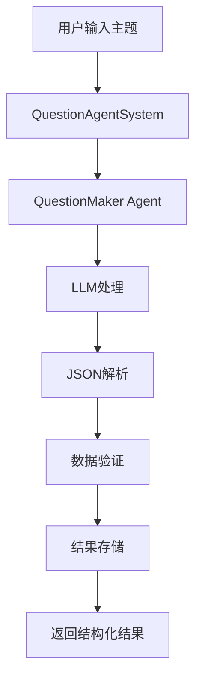
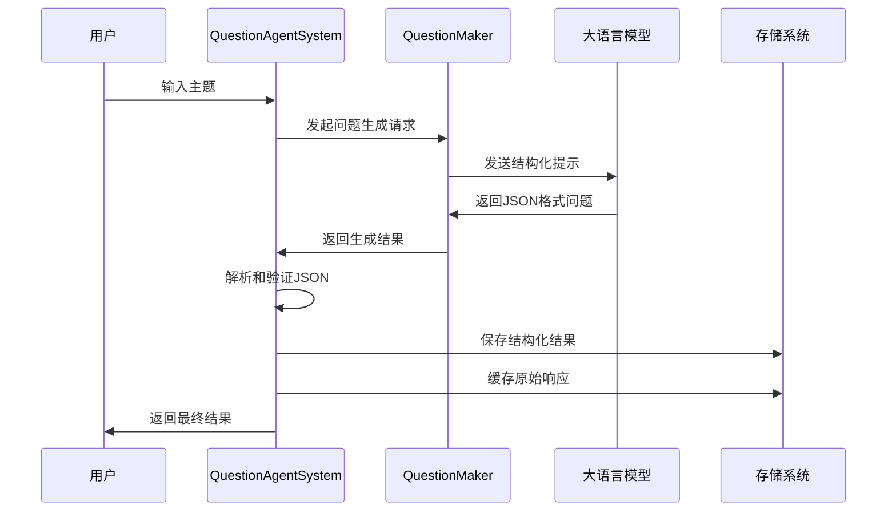

# 用户故事2：智能问题生成系统设计

## 1. 概述

本设计文档描述了基于 `question_agent` 的智能问题生成系统，该系统能够接受用户提供的主题，并基于5个互补且覆盖全面的方向自动生成25个高质量问题。系统采用单一智能体架构，专注于结构化问题产出，为后续的搜索和分析工作提供基础。

## 2. 系统目标

### 2.1 核心功能
- **主题理解**：深度理解用户提供的主题内容
- **方向规划**：从5个互补角度规划问题方向
- **问题生成**：每个方向生成5个高质量、可执行的问题
- **结构化输出**：以标准JSON格式输出结果
- **数据持久化**：将生成的问题保存到本地存储

### 2.2 质量要求
- **问题具体性**：避免空泛问题，确保问题具体可回答
- **方向区分度**：5个方向之间应有明确区分，覆盖不同视角
- **全面覆盖**：包括背景/现状、目标/价值、方案/实现、风险/挑战、评估/指标等视角
- **中文输出**：所有问题使用中文表达
- **格式规范**：严格遵循JSON格式，无代码围栏

## 3. 系统架构

### 3.1 组件设计



### 3.2 核心组件

#### 3.2.1 QuestionAgentSystem
- **职责**：系统主控制器
- **功能**：
  - 初始化LLM配置
  - 管理存储接口
  - 协调问题生成流程
  - 处理结果验证和存储

#### 3.2.2 QuestionMaker Agent
- **职责**：问题生成专家
- **功能**：
  - 理解主题内容
  - 规划5个问题方向
  - 生成25个具体问题
  - 输出结构化JSON

#### 3.2.3 存储系统
- **职责**：数据持久化
- **功能**：
  - 保存问题生成结果
  - 缓存原始LLM响应
  - 支持结果检索和回放

### 3.3 数据流设计



## 4. 详细设计

### 4.1 问题生成策略

#### 4.1.1 方向规划
系统预设5个互补的问题方向，确保全面覆盖主题：

1. **背景/现状分析**
   - 当前状态描述
   - 历史发展脉络
   - 现状特征分析
   - 相关环境因素
   - 现状问题识别

2. **目标/价值定位**
   - 核心目标定义
   - 价值主张阐述
   - 成功标准制定
   - 期望成果描述
   - 价值实现路径

3. **方案/实现路径**
   - 具体实施方案
   - 技术实现细节
   - 操作流程设计
   - 资源配置方案
   - 实施时间规划

4. **风险/挑战识别**
   - 潜在风险分析
   - 挑战因素识别
   - 应对策略制定
   - 风险缓解措施
   - 应急预案设计

5. **评估/指标体系**
   - 评估标准制定
   - 关键指标设计
   - 测量方法选择
   - 监控机制建立
   - 改进反馈循环

#### 4.1.2 问题质量要求
- **具体性**：问题应具体明确，避免模糊表述
- **可执行性**：问题应具有可操作性，能够通过搜索或分析获得答案
- **相关性**：问题应与主题高度相关，避免偏离主题
- **层次性**：问题应具有适当的深度和广度
- **实用性**：问题应具有实际应用价值

### 4.2 系统提示词设计

#### 4.2.1 核心提示词结构
```
你是一名问题设计专家。
- 输入：用户给定的主题
- 任务：围绕该主题，从5个互补且覆盖全面的方向提出共计25个高质量问题（每个方向5个）。
- 输出：用严格的JSON返回，包含5个方向的名称、每个方向的设计动机（rationale）、以及5条清晰、可执行的问题。
- 约束：
  1) 问题要具体、可回答，避免空泛；
  2) 5个方向之间应有区分度，覆盖视角包括但不限于：背景/现状、目标/价值、方案/实现、风险/挑战、评估/指标 等；
  3) 严格输出为JSON，不要自然语言解释；
  4) 禁止使用任何代码围栏（例如 ```json 或 ```），直接输出纯JSON文本；
  4) 问题使用中文。
```

#### 4.2.2 JSON输出格式
```json
{
  "directions": [
    {
      "direction": "方向名称",
      "rationale": "该方向为何重要的简述",
      "questions": [
        {"question": "问题1"},
        {"question": "问题2"},
        {"question": "问题3"},
        {"question": "问题4"},
        {"question": "问题5"}
      ]
    }
  ]
}
```

### 4.3 数据处理流程

#### 4.3.1 JSON解析机制
1. **代码围栏处理**：自动识别并去除 ```json 或 ``` 标记
2. **直接解析**：尝试直接解析整个文本为JSON
3. **片段提取**：使用括号计数方法提取JSON片段
4. **错误处理**：解析失败时返回空对象

#### 4.3.2 数据验证
1. **结构验证**：检查JSON结构是否符合预期格式
2. **内容验证**：验证方向名称、问题内容等关键字段
3. **数量验证**：确保每个方向包含5个问题
4. **质量验证**：检查问题内容是否为空或无效

#### 4.3.3 数据转换
1. **模型映射**：将解析结果转换为Pydantic模型
2. **类型转换**：确保数据类型正确
3. **默认值处理**：为缺失字段设置默认值
4. **数据清理**：清理无效或重复数据

### 4.4 存储设计

#### 4.4.1 存储结构
```
./data/
├── results/
│   └── questions_YYYYMMDD_HHMMSS.json  # 结构化问题结果
└── cache/
    └── questions_raw_YYYYMMDD_HHMMSS.json  # 原始LLM响应
```

#### 4.4.2 数据模型
- **QuestionsResult**：主要结果模型
  - topic: 主题
  - directions: 问题方向列表
  - total_questions: 总问题数
  - timestamp: 生成时间

- **QuestionDirection**：问题方向模型
  - direction: 方向名称
  - rationale: 设计动机
  - questions: 问题列表

- **QuestionItem**：单个问题模型
  - question: 问题内容
  - intent: 问题意图（可选）

## 5. 配置参数

### 5.1 LLM配置
- **模型选择**：支持多种LLM模型
- **温度设置**：0.7（平衡创造性和一致性）
- **最大令牌数**：1500
- **API配置**：支持自定义API密钥和基础URL

### 5.2 存储配置
- **存储类型**：文件系统存储
- **基础目录**：./data
- **文件命名**：基于时间戳的命名规则
- **数据格式**：JSON格式

## 6. 错误处理

### 6.1 JSON解析错误
- **问题**：LLM返回格式不符合JSON规范
- **处理**：使用多种解析策略，逐步尝试解析
- **降级**：解析失败时返回空结果

### 6.2 数据验证错误
- **问题**：解析后的数据不符合预期结构
- **处理**：使用默认值填充缺失字段
- **记录**：记录验证失败的详细信息

### 6.3 存储错误
- **问题**：文件写入失败
- **处理**：捕获异常，不影响主流程
- **日志**：记录存储失败的详细信息

## 7. 性能优化

### 7.1 响应时间优化
- **单次调用**：避免多轮对话，使用单次LLM调用
- **提示词优化**：精简提示词，提高处理效率
- **缓存机制**：缓存原始响应，便于问题定位

### 7.2 资源使用优化
- **内存管理**：及时释放不需要的数据
- **文件管理**：合理组织文件结构
- **并发控制**：避免并发访问冲突

## 8. 测试策略

### 8.1 单元测试
- **JSON解析测试**：测试各种格式的JSON解析
- **数据验证测试**：测试数据验证逻辑
- **存储测试**：测试存储和读取功能

### 8.2 集成测试
- **端到端测试**：测试完整的问题生成流程
- **LLM集成测试**：测试与LLM的交互
- **存储集成测试**：测试存储系统的集成

### 8.3 性能测试
- **响应时间测试**：测试系统响应时间
- **并发测试**：测试并发处理能力
- **资源使用测试**：测试内存和CPU使用情况

## 9. 部署要求

### 9.1 系统要求
- **Python版本**：3.8+
- **依赖库**：autogen, pydantic, 存储相关库
- **存储空间**：至少100MB可用空间

### 9.2 外部依赖
- **LLM服务**：支持的大语言模型API
- **文件系统**：可读写的本地文件系统
- **网络连接**：访问LLM API的网络连接

## 10. 扩展性设计

### 10.1 模型扩展
- **多模型支持**：支持不同的LLM模型
- **模型切换**：支持运行时模型切换
- **模型配置**：支持动态模型配置

### 10.2 存储扩展
- **多存储后端**：支持数据库、云存储等
- **存储策略**：支持不同的存储策略
- **数据迁移**：支持数据在不同存储间迁移

### 10.3 功能扩展
- **问题类型扩展**：支持不同类型的问题生成
- **方向自定义**：支持自定义问题方向
- **质量评估**：支持问题质量自动评估

## 11. 监控和日志

### 11.1 系统监控
- **性能指标**：响应时间、成功率、错误率
- **资源监控**：CPU、内存、磁盘使用情况
- **业务指标**：问题生成数量、质量评分

### 11.2 日志记录
- **操作日志**：记录所有操作和结果
- **错误日志**：记录错误和异常信息
- **调试日志**：记录详细的调试信息

## 12. 用户故事示例

### 12.1 基本使用场景
**作为** 一个研究人员  
**我希望** 能够输入一个研究主题  
**以便** 系统自动生成25个结构化问题，帮助我全面分析该主题

**验收标准**：
- 输入主题后，系统在30秒内返回结果
- 生成的问题覆盖5个不同方向
- 每个方向包含5个具体可执行的问题
- 问题使用中文表达
- 结果以JSON格式返回

### 12.2 高级使用场景
**作为** 一个项目经理  
**我希望** 能够基于项目主题生成问题清单  
**以便** 在项目规划阶段全面考虑各种因素

**验收标准**：
- 问题方向包括背景分析、目标设定、实施方案、风险识别、评估标准
- 每个问题都具有实际应用价值
- 问题之间具有逻辑关联性
- 生成的问题可以直接用于项目规划

### 12.3 错误处理场景
**作为** 一个系统用户  
**我希望** 当系统出现错误时能够获得清晰的错误信息  
**以便** 了解问题原因并采取相应措施

**验收标准**：
- 系统错误时返回明确的错误信息
- 错误信息包含问题描述和解决建议
- 系统能够优雅降级，不会完全崩溃
- 错误信息记录在日志中便于排查

## 13. 技术债务和已知问题

### 13.1 当前限制
- **单模型依赖**：目前只支持单一LLM模型
- **固定方向**：问题方向固定为5个，不支持自定义
- **简单存储**：只支持文件系统存储
- **基础验证**：数据验证机制相对简单

### 13.2 改进计划
- **多模型支持**：增加对多种LLM模型的支持
- **方向自定义**：允许用户自定义问题方向
- **高级存储**：支持数据库和云存储
- **智能验证**：使用AI进行问题质量评估

### 13.3 技术债务
- **代码重构**：优化代码结构和可读性
- **测试覆盖**：提高测试覆盖率
- **文档完善**：完善技术文档和用户手册
- **性能优化**：优化系统性能和资源使用

## 14. 总结

本设计文档详细描述了基于 `question_agent` 的智能问题生成系统，该系统通过单一智能体架构实现了高效、结构化的问题生成功能。系统具有以下特点：

1. **专注性**：专注于问题生成这一核心功能
2. **结构化**：输出标准化的JSON格式结果
3. **高质量**：通过精心设计的提示词确保问题质量
4. **可扩展**：支持多种LLM模型和存储后端
5. **可维护**：清晰的架构设计和完善的错误处理

该系统为后续的搜索和分析工作提供了坚实的基础，是整体系统架构中的重要组成部分。
