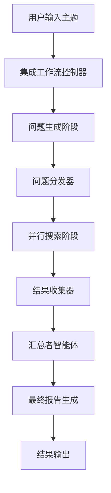
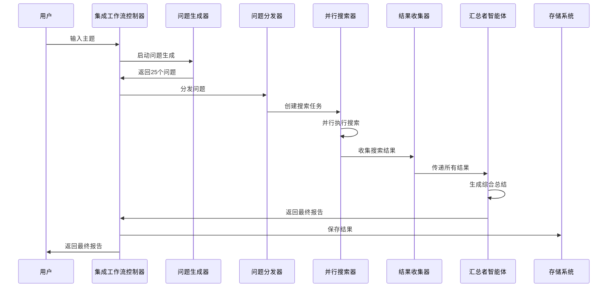
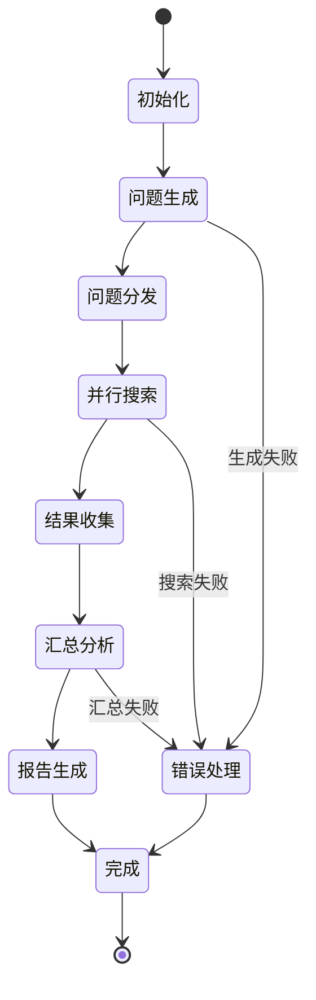

# 用户故事3：集成问题生成与搜索总结系统设计

## 1. 概述

本设计文档描述了集成问题生成与搜索总结的完整工作流系统，该系统能够接受用户输入的主题，自动生成25个结构化问题，然后对每个问题进行独立搜索，最后通过汇总者智能体对所有搜索结果进行综合总结。系统采用LangGraph框架实现多阶段工作流，确保问题生成、搜索执行和结果汇总的无缝衔接。

## 2. 系统目标

### 2.1 核心功能
- **主题理解**：深度理解用户提供的主题内容
- **问题生成**：基于5个互补方向生成25个高质量问题
- **并行搜索**：对每个生成的问题进行独立搜索
- **智能汇总**：通过汇总者智能体对所有搜索结果进行综合总结
- **结果整合**：生成结构化的最终报告

### 2.2 质量要求
- **问题质量**：生成的问题具体、可执行、覆盖全面
- **搜索效率**：支持并行搜索，提高处理速度
- **汇总质量**：汇总结果准确、全面、有层次
- **系统稳定性**：支持大规模问题处理，具备错误恢复能力
- **用户体验**：提供清晰的进度反馈和结果展示

## 3. 系统架构

### 3.1 整体架构



### 3.2 核心组件

#### 3.2.1 集成工作流控制器（IntegratedWorkflowController）
- **职责**：协调整个工作流的执行
- **功能**：
  - 初始化各阶段组件
  - 管理工作流状态转换
  - 处理错误和异常
  - 提供进度反馈

#### 3.2.2 问题生成阶段（QuestionGenerationStage）
- **职责**：基于主题生成结构化问题
- **功能**：
  - 复用现有的QuestionWorkflow
  - 生成25个高质量问题
  - 输出标准化的问题列表

#### 3.2.3 问题分发器（QuestionDistributor）
- **职责**：将问题分发给搜索执行器
- **功能**：
  - 问题优先级排序
  - 搜索资源分配
  - 并发控制管理

#### 3.2.4 并行搜索阶段（ParallelSearchStage）
- **职责**：对每个问题执行独立搜索
- **功能**：
  - 复用现有的SearchWorkflow
  - 支持并发搜索执行
  - 结果缓存和去重

#### 3.2.5 结果收集器（ResultCollector）
- **职责**：收集和整理所有搜索结果
- **功能**：
  - 结果去重和合并
  - 质量评估和筛选
  - 数据标准化处理

#### 3.2.6 汇总者智能体（SummarizerAgent）
- **职责**：对所有搜索结果进行综合总结
- **功能**：
  - 多源信息整合
  - 层次化总结生成
  - 关键洞察提取

## 4. 详细设计

### 4.1 工作流状态设计

```python
class IntegratedWorkflowState(TypedDict):
    # 基础信息
    topic: str
    status: str
    error: Optional[str]
    
    # 问题生成阶段
    questions: List[QuestionItem]
    question_directions: List[QuestionDirection]
    question_generation_completed: bool
    
    # 搜索阶段
    search_tasks: List[SearchTask]
    search_results: List[SearchResult]
    search_progress: Dict[str, Any]
    search_completed: bool
    
    # 汇总阶段
    raw_summaries: List[str]
    final_summary: Optional[str]
    key_insights: List[str]
    summary_completed: bool
    
    # 最终结果
    final_report: Optional[IntegratedReport]
    report_generated: bool
```

### 4.2 问题生成阶段设计

#### 4.2.1 复用现有QuestionWorkflow
- 直接调用现有的QuestionWorkflow
- 保持问题生成的质量和结构
- 输出标准化的25个问题

#### 4.2.2 问题预处理
- 问题去重和合并
- 问题优先级排序
- 问题分类和标记

### 4.3 并行搜索阶段设计

#### 4.3.1 搜索任务管理
```python
class SearchTask(TypedDict):
    question_id: str
    question: str
    direction: str
    priority: int
    status: str  # pending, running, completed, failed
    search_result: Optional[SearchResult]
    error: Optional[str]
```

#### 4.3.2 并发控制策略
- 使用线程池或异步执行
- 限制并发搜索数量（建议5-10个）
- 实现搜索队列和优先级调度

#### 4.3.3 搜索执行流程
1. 从问题队列中获取待搜索问题
2. 调用SearchWorkflow执行搜索
3. 处理搜索结果和错误
4. 更新任务状态和进度

### 4.4 结果收集阶段设计

#### 4.4.1 结果去重策略
- 基于URL和标题的精确去重
- 基于内容相似度的模糊去重
- 保留最高质量的搜索结果

#### 4.4.2 结果质量评估
- 相关性评分
- 权威性评估
- 时效性检查

### 4.5 汇总者智能体设计

#### 4.5.1 汇总策略
- 按问题方向分组汇总
- 跨方向关联分析
- 层次化总结生成

#### 4.5.2 汇总提示词设计
```
你是一个专业的汇总者智能体，负责对多个问题的搜索结果进行综合总结。

任务：
1. 分析所有问题的搜索结果
2. 识别关键信息和洞察
3. 生成结构化的综合报告
4. 提取跨问题的关联性发现

输出格式：
- 执行摘要
- 按方向分类的详细分析
- 关键洞察和发现
- 建议和后续行动
```

## 5. 数据流设计

### 5.1 完整数据流



### 5.2 状态转换流程



## 6. 配置参数

### 6.1 并发控制参数
- **最大并发搜索数**：5-10个
- **搜索超时时间**：30秒
- **重试次数**：3次
- **队列大小**：50个任务

### 6.2 质量控制参数
- **最小搜索结果数**：3个/问题
- **最大搜索结果数**：20个/问题
- **相似度阈值**：0.8
- **质量评分阈值**：0.6

### 6.3 汇总参数
- **最大汇总长度**：5000字
- **关键洞察数量**：5-10个
- **总结层次数**：3层

## 7. 错误处理策略

### 7.1 问题生成错误
- 重试机制：最多3次
- 降级策略：使用简化问题模板
- 错误恢复：记录错误并继续执行

### 7.2 搜索执行错误
- 单个问题搜索失败不影响整体流程
- 实现搜索任务的重试机制
- 提供搜索失败的详细日志

### 7.3 汇总分析错误
- 使用部分结果进行汇总
- 提供错误恢复建议
- 记录汇总失败的原因

## 8. 性能优化

### 8.1 并发优化
- 使用异步编程模型
- 实现智能负载均衡
- 优化资源使用效率

### 8.2 缓存策略
- 搜索结果缓存
- 问题生成结果缓存
- 中间结果缓存

### 8.3 内存管理
- 及时释放不需要的数据
- 实现分页加载
- 优化数据结构

## 9. 监控和日志

### 9.1 进度监控
- 实时显示各阶段进度
- 提供详细的执行统计
- 支持进度暂停和恢复

### 9.2 性能监控
- 记录各阶段执行时间
- 监控资源使用情况
- 提供性能分析报告

### 9.3 错误监控
- 详细的错误日志记录
- 错误趋势分析
- 自动告警机制

## 10. 用户界面设计

### 10.1 进度显示
```
=== 集成问题生成与搜索总结系统 ===

主题：人工智能在教育中的应用

阶段1：问题生成 [████████████████████] 100% 完成
- 生成了25个问题，覆盖5个方向

阶段2：并行搜索 [████████████████████] 100% 完成
- 搜索了25个问题，获得150个结果
- 成功：23个，失败：2个

阶段3：结果汇总 [████████████████████] 100% 完成
- 生成了综合报告
- 提取了8个关键洞察

=== 最终报告 ===
[显示完整的综合报告]
```

### 10.2 结果展示
- 结构化的报告格式
- 可交互的结果浏览
- 支持导出多种格式

## 11. 实施计划

### 11.1 第一阶段：基础架构（1-2周）
- 实现集成工作流控制器
- 集成现有的QuestionWorkflow和SearchWorkflow
- 实现基础的问题分发和结果收集

### 11.2 第二阶段：并行搜索（2-3周）
- 实现并行搜索执行
- 添加并发控制和错误处理
- 优化搜索性能和资源使用

### 11.3 第三阶段：汇总分析（1-2周）
- 实现汇总者智能体
- 添加结果去重和质量评估
- 完善最终报告生成

### 11.4 第四阶段：优化完善（1周）
- 性能优化和测试
- 用户界面完善
- 文档和部署准备

## 12. 时间策略与迭代搜索设计

### 12.1 时间策略概述

系统支持三种时间控制策略，用于长时间运行的任务：

#### 12.1.1 硬截止时间策略 (Hard)
- **特点**：严格按照设定的截止时间执行
- **行为**：到达截止时间立即停止，不进行任何额外迭代
- **适用场景**：有严格时间限制的任务，如会议前准备

#### 12.1.2 软截止时间策略 (Soft)
- **特点**：在截止时间前预留缓冲时间
- **行为**：在截止时间前30分钟开始逐步减少迭代强度
- **适用场景**：需要预留时间进行最终整理的任务

#### 12.1.3 自适应策略 (Adaptive)
- **特点**：根据任务进度和质量动态调整时间分配
- **行为**：智能分配时间，优先保证质量，在时间允许时进行额外迭代
- **适用场景**：追求最佳质量的研究任务

### 12.2 迭代搜索机制

#### 12.2.1 迭代触发条件
```python
def should_start_new_iteration(state: LongRunningWorkflowState) -> bool:
    """判断是否应该开始新的迭代"""
    # 1. 时间条件检查
    remaining_time = state.get('remaining_time', 0)
    if remaining_time <= 0:
        return False
    
    # 2. 质量收敛检查
    progress = state.get('progress', {})
    if progress.get('convergence_status', {}).get('converged', False):
        return False
    
    # 3. 迭代次数检查
    current_iteration = state.get('current_iteration', 0)
    max_iterations = state.get('max_iterations', 100)
    if current_iteration >= max_iterations:
        return False
    
    # 4. 时间策略检查
    time_strategy = state.get('time_strategy', 'adaptive')
    if time_strategy == 'hard' and remaining_time < 300:  # 5分钟缓冲
        return False
    
    return True
```

#### 12.2.2 迭代内容生成
每次迭代包含以下步骤：
1. **问题深化**：基于前一轮搜索结果生成更深入的问题
2. **搜索扩展**：在原有基础上搜索新的角度和维度
3. **结果整合**：将新结果与历史结果进行智能整合
4. **质量评估**：评估当前迭代的质量提升情况

#### 12.2.3 迭代优化策略
```python
def optimize_iteration_strategy(state: LongRunningWorkflowState) -> Dict[str, Any]:
    """优化迭代策略"""
    remaining_time = state.get('remaining_time', 0)
    current_iteration = state.get('current_iteration', 0)
    quality_scores = state.get('quality_scores', [])
    
    # 根据剩余时间和质量趋势调整策略
    if remaining_time > 7200:  # 2小时以上
        return {
            "question_count": 25,
            "search_depth": "deep",
            "concurrent_searches": 5,
            "time_per_search": 60
        }
    elif remaining_time > 3600:  # 1-2小时
        return {
            "question_count": 15,
            "search_depth": "medium",
            "concurrent_searches": 3,
            "time_per_search": 45
        }
    else:  # 1小时以内
        return {
            "question_count": 8,
            "search_depth": "focused",
            "concurrent_searches": 2,
            "time_per_search": 30
        }
```

### 12.3 2小时迭代搜索实现

#### 12.3.1 核心迭代循环
```python
def execute_time_based_iterations(self, topic: str, duration_hours: int = 2) -> Dict[str, Any]:
    """执行基于时间的迭代搜索"""
    start_time = datetime.now()
    deadline = start_time + timedelta(hours=duration_hours)
    
    # 初始化状态
    state = self._initialize_iteration_state(topic, deadline)
    
    iteration_count = 0
    while self._should_continue_iteration(state):
        iteration_count += 1
        state['current_iteration'] = iteration_count
        
        # 执行单次迭代
        iteration_result = self._execute_single_iteration(state)
        
        # 更新状态
        state = self._update_iteration_state(state, iteration_result)
        
        # 检查时间策略
        if self._check_time_strategy_conditions(state):
            break
    
    return self._finalize_iteration_results(state)
```

#### 12.3.2 单次迭代执行
```python
def _execute_single_iteration(self, state: LongRunningWorkflowState) -> Dict[str, Any]:
    """执行单次迭代"""
    # 1. 生成或优化问题
    questions = self._generate_iteration_questions(state)
    
    # 2. 执行搜索
    search_results = self._execute_iteration_search(questions, state)
    
    # 3. 结果处理
    processed_results = self._process_iteration_results(search_results, state)
    
    # 4. 质量评估
    quality_score = self._evaluate_iteration_quality(processed_results, state)
    
    # 5. 学习更新
    self._update_iteration_learning(state, processed_results, quality_score)
    
    return {
        "questions": questions,
        "search_results": search_results,
        "processed_results": processed_results,
        "quality_score": quality_score,
        "iteration_time": (datetime.now() - state['iteration_start_time']).total_seconds()
    }
```

## 13. 验收标准

### 13.1 功能验收
- 能够成功生成25个高质量问题
- 能够并行搜索所有问题
- 能够生成综合的最终报告
- 系统具备完整的错误处理能力
- **能够按照时间策略执行迭代搜索**
- **能够在2小时后继续搜索迭代内容**

### 13.2 性能验收
- 整个流程在10分钟内完成（单次迭代）
- 支持至少10个并发搜索任务
- 内存使用不超过2GB
- 错误率低于5%
- **长时间运行稳定性超过8小时**
- **迭代搜索效率每小时至少完成3轮**

### 13.3 质量验收
- 生成的问题覆盖所有必要方向
- 搜索结果质量评分平均超过0.7
- 最终报告结构清晰、内容全面
- 用户满意度超过90%
- **迭代质量持续提升**
- **时间策略执行准确率达到95%**

## 13. 技术债务和已知问题

### 13.1 当前限制
- 依赖现有的QuestionWorkflow和SearchWorkflow
- 并行搜索的并发数有限制
- 汇总质量依赖于LLM能力

### 13.2 改进计划
- 优化并行搜索算法
- 增强汇总者智能体的能力
- 添加更多质量评估指标

### 13.3 扩展性考虑
- 支持自定义问题方向
- 支持多种汇总策略
- 支持分布式搜索执行

## 14. 总结

本设计文档详细描述了集成问题生成与搜索总结的完整工作流系统，该系统通过复用现有的QuestionWorkflow和SearchWorkflow，实现了从主题输入到最终报告生成的端到端流程。系统具有以下特点：

1. **集成性**：无缝整合问题生成和搜索总结两个阶段
2. **并行性**：支持高效的并行搜索执行
3. **智能性**：通过汇总者智能体提供高质量的综合分析
4. **可扩展性**：支持大规模问题处理和自定义配置
5. **稳定性**：具备完善的错误处理和恢复机制

该系统为用户提供了一个强大的主题分析和研究工具，能够自动生成问题、执行搜索并生成综合报告，大大提高了研究效率和结果质量。


### 样例的报告格式:

问题:


批次号:

搜索关键词

调研过的资料链接:
- someurl
- someurl
总结:

问题的汇总: