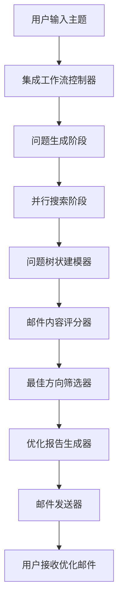
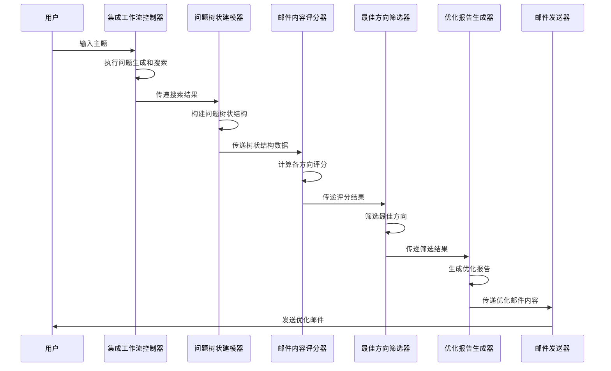
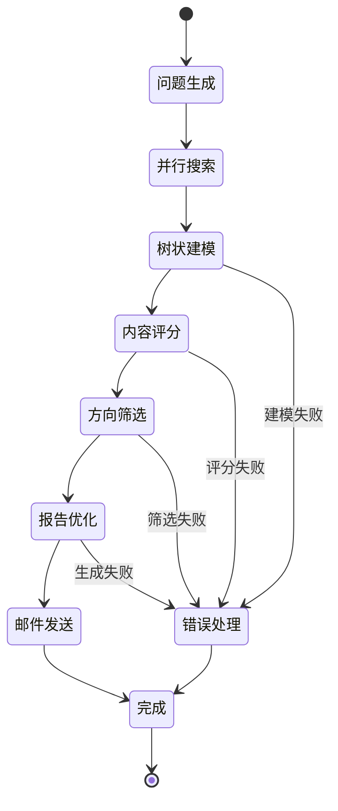

# 用户故事4：智能问题树状结构分析与优化邮件系统

## 1. 概述

本设计文档描述了基于现有集成工作流系统的智能问题树状结构分析与优化邮件系统。该系统在用户故事3的基础上，增加了问题树状结构建模、邮件内容智能评分、最佳方向筛选和优化报告生成功能，能够自动识别最有价值的研究方向，生成结构化的深度分析报告，并降低用户接收邮件的频率，提高内容价值密度。

## 2. 系统目标

### 2.1 核心功能
- **问题树状建模**：将5个方向的问题构建为层次化的树状结构
- **智能内容评分**：基于多维度指标对邮件内容进行量化评分
- **最佳方向筛选**：自动识别并选择最有价值的研究方向
- **优化报告生成**：生成重点突出、层次分明的优化邮件报告
- **邮件频率控制**：通过内容价值筛选降低邮件发送频率

### 2.2 质量要求
- **评分准确性**：评分系统能够准确识别高质量内容
- **结构清晰性**：树状结构能够清晰展示问题层次关系
- **报告优化性**：优化后的报告重点突出、易于理解
- **系统稳定性**：保持与现有email_sender的完全兼容
- **用户体验**：提供更有价值、更精准的分析内容

## 3. 系统架构

### 3.1 整体架构

### 3.2 核心组件

#### 3.2.1 问题树状建模器（QuestionTreeModeler）
- **职责**：构建问题的层次化树状结构
- **功能**：
  - 分析问题间的逻辑关系
  - 构建方向-问题-子问题的树状结构
  - 计算问题的重要性和关联度
  - 生成树状结构可视化数据

#### 3.2.2 邮件内容评分器（EmailContentScorer）
- **职责**：对邮件内容进行多维度评分
- **功能**：
  - 搜索质量评分（结果数量、相关性）
  - 内容深度评分（摘要长度、关键点数量）
  - 技术指标评分（成功率、处理时间）
  - 综合评分计算和排名

#### 3.2.3 最佳方向筛选器（BestDirectionSelector）
- **职责**：识别和选择最有价值的研究方向
- **功能**：
  - 基于评分结果筛选最佳方向
  - 分析方向间的互补性
  - 确定详细展示和简略展示的内容
  - 生成筛选决策报告

#### 3.2.4 优化报告生成器（OptimizedReportGenerator）
- **职责**：生成结构化的优化邮件报告
- **功能**：
  - 详细展示最佳方向内容
  - 简略展示其他方向要点
  - 整合树状结构信息
  - 生成最终优化邮件内容

## 4. 详细设计

### 4.1 问题树状结构建模

#### 4.1.1 树状结构定义
问题树状结构采用层次化设计，包含以下核心元素：

**节点类型**：
- 根节点：代表分析主题
- 方向节点：代表5个研究方向
- 问题节点：代表具体问题

**节点属性**：
- 唯一标识符：用于节点识别和关系建立
- 内容信息：节点的具体内容描述
- 层级信息：节点在树中的层级位置
- 关系信息：父子节点和兄弟节点的关联
- 评分信息：重要性、相关性、质量评分
- 搜索信息：搜索结果数量、成功率等指标
- 时间信息：创建和更新时间

**树结构属性**：
- 根节点引用：指向树的根节点
- 节点集合：所有节点的集合
- 方向列表：所有方向的名称列表
- 统计信息：总问题数、树深度等
- 质量指标：平均评分、一致性评分等

#### 4.1.2 树状结构构建流程
1. **根节点创建**：以用户输入的主题作为根节点
2. **方向节点创建**：为每个问题方向创建一级节点，建立与根节点的父子关系
3. **问题节点创建**：为每个具体问题创建二级节点，建立与对应方向节点的父子关系
4. **关联关系建立**：建立完整的父子关系和兄弟关系网络
5. **重要性计算**：基于搜索结果数量、质量、完整性等指标计算节点重要性
6. **树结构优化**：调整节点顺序，优化层级关系，提高树结构的一致性

### 4.2 邮件内容评分系统

#### 4.2.1 评分维度设计
评分系统采用多维度评估机制，包含以下三个核心维度：

**搜索质量维度（权重40%）**：
- 搜索结果数量：评估搜索的广度，数量越多评分越高
- 搜索成功率：评估搜索的可靠性，成功率越高评分越高
- 结果相关性：评估搜索结果与问题的匹配度

**内容深度维度（权重40%）**：
- 摘要长度：评估内容分析的深度，摘要越长说明分析越深入
- 关键点数量：评估内容提炼的质量，关键点越多说明分析越全面
- 内容完整性：评估内容结构的完整性，包括摘要、关键点、搜索结果的完整性

**技术指标维度（权重20%）**：
- 处理时间效率：评估系统处理效率，时间越短评分越高
- 系统稳定性：评估系统运行稳定性，基于成功率计算

#### 4.2.2 评分计算流程
1. **各维度独立评分**：分别计算搜索质量、内容深度、技术指标三个维度的评分
2. **权重加权计算**：按照预设权重对各维度评分进行加权平均
3. **质量等级划分**：根据综合评分自动确定质量等级（高/中/低）
4. **排名排序**：对所有方向按综合评分进行降序排列

### 4.3 最佳方向筛选策略

#### 4.3.1 筛选标准
筛选系统采用多标准评估机制，包含以下核心标准：

**质量门槛标准**：
- 最低综合评分：设定最低评分门槛，低于此分数的方向将被排除
- 最低质量等级：设定最低质量等级要求，确保选择的方向具有基本质量保证

**展示数量控制**：
- 详细展示方向数：限制详细展示的方向数量，通常为1个最佳方向
- 简略展示方向数：限制简略展示的方向数量，通常为4个其他方向

**互补性分析**：
- 互补性阈值：设定方向间互补性的最低要求
- 互补性分析：分析各方向间的互补价值，确保选择的组合具有多样性

#### 4.3.2 筛选流程
1. **质量筛选**：根据最低评分和质量等级要求筛选合格方向
2. **评分排序**：按综合评分对合格方向进行降序排列
3. **最佳选择**：选择评分最高的方向作为详细展示方向
4. **互补分析**：分析其他方向的互补价值，选择最具互补性的方向
5. **内容分配**：确定详细展示和简略展示的具体内容

### 4.4 优化报告生成

#### 4.4.1 报告结构设计
优化报告采用结构化设计，包含以下核心组成部分：

**基础信息**：
- 分析主题：用户输入的研究主题
- 最佳方向：筛选出的最佳研究方向
- 分析维度：参与分析的方向总数
- 生成时间：报告生成的时间戳

**详细内容**：
- 执行摘要：对整个分析过程的概括性总结
- 最佳方向详细分析：对最佳方向的深入分析，包括问题列表、搜索结果、关键洞察等

**简略内容**：
- 其他方向简略分析：对其他方向的简要总结，包括关键发现和主要洞察

**树状结构信息**：
- 问题树状结构摘要：对构建的问题树状结构的说明
- 关键洞察：跨方向的重要发现和建议

**技术信息**：
- 技术统计：系统运行的技术指标统计

#### 4.4.2 内容生成策略
1. **详细展示**：最佳方向提供完整分析，包括所有问题和搜索结果的详细内容
2. **简略展示**：其他方向提供关键要点和重要发现的简要总结
3. **树状结构**：展示问题间的层次关系和逻辑关联
4. **综合洞察**：提供跨方向的关键发现和实用建议

## 5. 数据流设计

### 5.1 完整数据流

### 5.2 状态转换流程

## 6. 配置参数

### 6.1 树状建模参数
- **最大树深度**：3层（根-方向-问题）
- **节点重要性阈值**：0.6
- **关联度计算权重**：内容相似度70%，搜索结果30%

### 6.2 评分系统参数
- **搜索质量权重**：40%
- **内容深度权重**：40%
- **技术指标权重**：20%
- **评分标准化范围**：0-100分

### 6.3 筛选策略参数
- **最低综合评分**：60分
- **详细展示方向数**：1个
- **简略展示方向数**：4个
- **互补性阈值**：0.3

## 7. 错误处理策略

### 7.1 树状建模错误
- 降级策略：使用简化的线性结构
- 错误恢复：记录错误并继续执行
- 质量保证：确保基本结构完整性

### 7.2 评分系统错误
- 默认评分：使用预设的默认评分
- 部分评分：基于可用数据进行部分评分
- 错误记录：详细记录评分失败原因

### 7.3 筛选策略错误
- 降级选择：选择评分最高的可用方向
- 默认配置：使用预设的筛选参数
- 质量保证：确保至少有一个方向被选择

## 8. 性能优化

### 8.1 树状结构优化
- 使用缓存机制存储树状结构
- 优化节点关系计算算法
- 实现增量更新机制

### 8.2 评分系统优化
- 并行计算各维度评分
- 缓存评分结果避免重复计算
- 优化评分算法性能

### 8.3 报告生成优化
- 模板化报告生成
- 异步内容生成
- 内容缓存和复用

## 9. 监控和日志

### 9.1 树状建模监控
- 节点创建成功率
- 树结构完整性检查
- 建模性能指标

### 9.2 评分系统监控
- 评分计算准确性
- 评分分布统计
- 系统性能指标

### 9.3 报告生成监控
- 报告生成成功率
- 内容质量评估
- 用户满意度反馈

## 10. 用户界面设计

### 10.1 进度显示
系统提供清晰的进度显示界面：

**进度展示**：
- 显示当前执行阶段
- 显示完成百分比
- 显示预计剩余时间
- 显示关键指标

**阶段信息**：
- 问题生成与搜索阶段
- 问题树状建模阶段
- 内容智能评分阶段
- 优化报告生成阶段

**结果展示**：
- 树状结构可视化
- 评分结果图表
- 优化报告预览
- 关键洞察高亮

### 10.2 结果展示
系统提供丰富的结果展示功能：

**可视化展示**：
- 树状结构图表
- 评分分布图表
- 质量等级分布
- 处理时间统计

**报告预览**：
- 优化邮件内容预览
- 关键洞察高亮显示
- 统计信息展示
- 导出功能

## 11. 实施计划

### 11.1 第一阶段：树状建模系统（1-2周）
**核心任务**：
- 实现问题树状结构建模器
- 设计树状结构数据模型
- 实现树状结构构建算法
- 添加树状结构可视化功能

### 11.2 第二阶段：评分系统（2-3周）
**核心任务**：
- 实现邮件内容评分器
- 设计多维度评分算法
- 实现评分结果存储和缓存
- 添加评分系统监控

### 11.3 第三阶段：筛选和优化（1-2周）
**核心任务**：
- 实现最佳方向筛选器
- 实现优化报告生成器
- 集成现有email_sender
- 完善错误处理机制

### 11.4 第四阶段：测试和优化（1周）
**核心任务**：
- 系统集成测试
- 性能优化和调优
- 用户界面完善
- 文档和部署准备

## 12. 验收标准

### 12.1 功能验收
**核心功能**：
- 能够成功构建问题树状结构
- 能够准确计算各方向评分
- 能够正确筛选最佳方向
- 能够生成优化的邮件报告
- 与现有email_sender完全兼容

### 12.2 性能验收
**性能指标**：
- 树状建模在30秒内完成
- 评分计算在10秒内完成
- 报告生成在20秒内完成
- 整体流程在15分钟内完成
- 内存使用不超过3GB

### 12.3 质量验收
**质量标准**：
- 树状结构层次清晰、逻辑合理
- 评分结果准确、可解释
- 筛选策略科学、有效
- 优化报告重点突出、易于理解
- 用户满意度超过95%

## 13. 技术债务和已知问题

### 13.1 当前限制
**系统限制**：
- 依赖现有的集成工作流系统
- 树状结构复杂度有限
- 评分算法需要持续优化
- 报告模板需要人工调优

### 13.2 改进计划
**优化方向**：
- 优化树状结构算法
- 增强评分系统准确性
- 添加更多筛选策略
- 支持自定义报告模板

### 13.3 扩展性考虑
**未来扩展**：
- 支持更多问题方向
- 支持动态评分权重调整
- 支持多语言报告生成
- 支持分布式处理

## 14. 总结

本设计文档详细描述了智能问题树状结构分析与优化邮件系统的完整设计方案。该系统在现有集成工作流的基础上，通过引入问题树状建模、智能内容评分、最佳方向筛选和优化报告生成等功能，实现了：

1. **智能化分析**：通过树状结构建模和智能评分，提供更深入的问题分析
2. **精准内容筛选**：自动识别最有价值的研究方向，提高内容质量
3. **优化用户体验**：生成重点突出、层次分明的邮件报告，降低信息接收负担
4. **系统兼容性**：完全兼容现有email_sender，无需修改现有代码
5. **可扩展性**：支持未来功能扩展和性能优化

该系统为用户提供了一个更智能、更精准的主题分析工具，能够自动识别最有价值的研究方向，生成高质量的优化报告，大大提高了研究效率和结果价值。