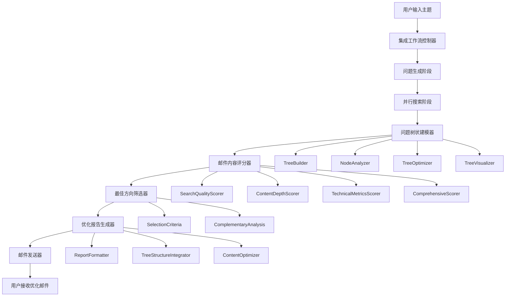
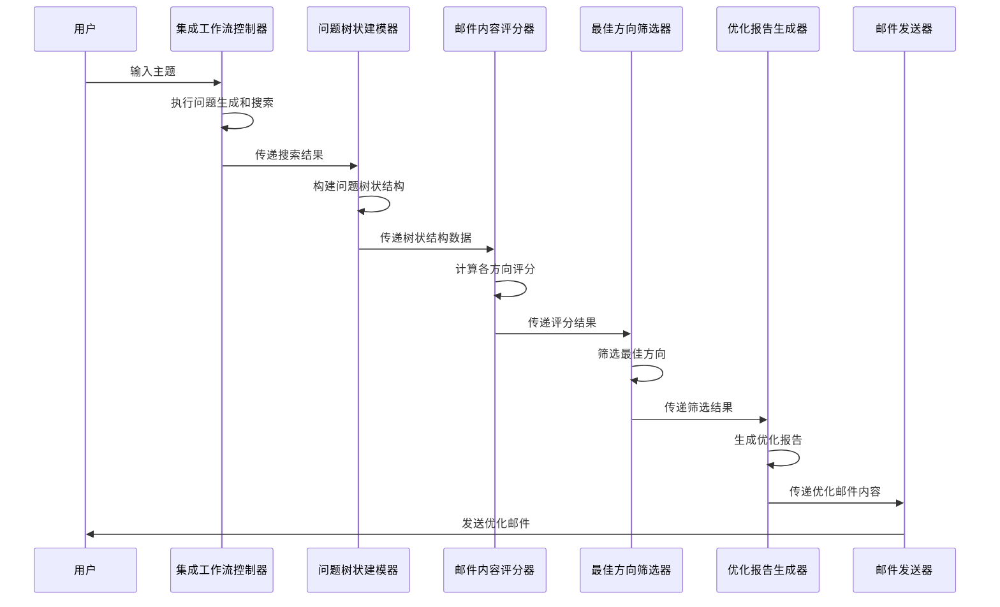

# 用户故事4：实施指南和总结

## 1. 概述

本文档是用户故事4的完整实施指南，总结了智能问题树状结构分析与优化邮件系统的设计要点、实施步骤和集成方案。

## 2. 系统架构总览

### 2.1 完整系统架构



### 2.2 核心组件关系

| 组件 | 职责 | 输入 | 输出 | 依赖 |
|------|------|------|------|------|
| QuestionTreeModeler | 构建问题树状结构 | SearchRoundRecord[] | QuestionTree | 无 |
| EmailContentScorer | 多维度内容评分 | QuestionTree, SearchRoundRecord[] | ScoringResult | QuestionTreeModeler |
| BestDirectionSelector | 筛选最佳方向 | ScoringResult | SelectionResult | EmailContentScorer |
| OptimizedReportGenerator | 生成优化报告 | SelectionResult, ScoringResult, QuestionTree | OptimizedReport | BestDirectionSelector |
| EmailSender | 发送优化邮件 | OptimizedReport | 邮件发送结果 | OptimizedReportGenerator |

## 3. 实施步骤

### 3.1 第一阶段：问题树状结构建模系统（1-2周）

#### 3.1.1 核心任务
- [ ] 实现QuestionTreeNode和QuestionTree数据模型
- [ ] 实现TreeBuilder类，完成树状结构构建算法
- [ ] 实现NodeAnalyzer类，完成节点关系分析
- [ ] 实现TreeOptimizer类，完成树结构优化
- [ ] 实现TreeVisualizer类，完成可视化功能
- [ ] 实现QuestionTreeModeler主类，提供集成接口

#### 3.1.2 关键文件
```
design/user_story_4_tree_modeling.md
question_tree_modeler.py
tree_builder.py
node_analyzer.py
tree_optimizer.py
tree_visualizer.py
```

#### 3.1.3 验收标准
- 能够成功构建3层树状结构（根-方向-问题）
- 能够计算节点重要性、相关性和质量评分
- 能够生成树状结构可视化图表
- 能够导出树结构数据（JSON/YAML格式）

### 3.2 第二阶段：邮件内容评分系统（2-3周）

#### 3.2.1 核心任务
- [ ] 实现ScoringDimensions和DirectionScore数据模型
- [ ] 实现SearchQualityScorer类，完成搜索质量评分
- [ ] 实现ContentDepthScorer类，完成内容深度评分
- [ ] 实现TechnicalMetricsScorer类，完成技术指标评分
- [ ] 实现ComprehensiveScorer类，完成综合评分计算
- [ ] 实现ScoreAnalyzer类，完成评分结果分析
- [ ] 实现EmailContentScorer主类，提供集成接口

#### 3.2.2 关键文件
```
design/user_story_4_scoring_system.md
email_content_scorer.py
search_quality_scorer.py
content_depth_scorer.py
technical_metrics_scorer.py
comprehensive_scorer.py
score_analyzer.py
```

#### 3.2.3 验收标准
- 能够准确计算搜索质量、内容深度、技术指标三个维度的评分
- 能够基于权重计算综合评分（0-100分）
- 能够自动确定质量等级（高/中/低）
- 能够提供评分结果的深度分析和洞察

### 3.3 第三阶段：报告优化和展示系统（1-2周）

#### 3.3.1 核心任务
- [ ] 实现SelectionCriteria和SelectionResult数据模型
- [ ] 实现BestDirectionSelector类，完成最佳方向筛选
- [ ] 实现OptimizedReportGenerator类，完成优化报告生成
- [ ] 实现ReportFormatter类，完成报告格式化
- [ ] 实现OptimizedReportGenerator主类，提供集成接口
- [ ] 集成现有email_sender，确保兼容性

#### 3.3.2 关键文件
```
design/user_story_4_report_optimization.md
best_direction_selector.py
optimized_report_generator.py
report_formatter.py
```

#### 3.3.3 验收标准
- 能够基于评分结果科学筛选最佳方向
- 能够生成结构化的优化邮件报告
- 能够详细展示最佳方向，简略展示其他方向
- 能够与现有email_sender无缝集成

### 3.4 第四阶段：系统集成和测试（1周）

#### 3.4.1 核心任务
- [ ] 集成所有组件到现有集成工作流
- [ ] 实现完整的端到端流程
- [ ] 进行系统集成测试
- [ ] 进行性能优化和调优
- [ ] 完善错误处理和日志记录
- [ ] 编写用户文档和部署指南

#### 3.4.2 关键文件
```
integrated_workflow.py (修改)
main.py (修改)
config.py (修改)
README.md (更新)
```

#### 3.4.3 验收标准
- 整个流程在15分钟内完成
- 能够成功生成优化邮件报告
- 与现有系统完全兼容
- 错误处理机制完善

## 4. 集成方案

### 4.1 与现有系统集成

#### 4.1.1 集成工作流修改
在现有的集成工作流中添加新的处理节点：

**新增节点**：
- 树状建模节点：负责构建问题树状结构
- 内容评分节点：负责计算各方向的综合评分
- 方向筛选节点：负责筛选最佳方向
- 报告优化节点：负责生成优化报告

**节点连接**：
- 在结果处理节点后添加树状建模节点
- 树状建模节点连接到内容评分节点
- 内容评分节点连接到方向筛选节点
- 方向筛选节点连接到报告优化节点
- 报告优化节点连接到现有的汇总生成节点

#### 4.1.2 状态模型扩展
扩展现有的工作流状态，添加以下新字段：

**树状建模相关**：
- 问题树状结构数据
- 树状建模完成状态
- 树状建模错误信息

**内容评分相关**：
- 评分结果数据
- 内容评分完成状态
- 内容评分错误信息

**方向筛选相关**：
- 筛选结果数据
- 方向筛选完成状态
- 方向筛选错误信息

**报告优化相关**：
- 优化报告数据
- 报告优化完成状态
- 报告优化错误信息

### 4.2 配置参数集成

#### 4.2.1 配置文件更新
在现有配置文件中添加新的配置参数：

**树状建模配置**：
- 最大树深度：限制树状结构的最大层级数
- 最小重要性阈值：设定节点重要性的最低要求
- 相似度阈值：设定内容相似度的判断标准
- 最大分支因子：限制单个节点的最大子节点数
- 优化功能开关：控制是否启用树结构优化
- 可视化功能开关：控制是否生成可视化图表

**评分系统配置**：
- 搜索质量权重：搜索质量在综合评分中的权重
- 内容深度权重：内容深度在综合评分中的权重
- 技术指标权重：技术指标在综合评分中的权重
- 最低综合评分：设定方向筛选的最低评分要求
- 最低质量等级：设定方向筛选的最低质量等级

**报告优化配置**：
- 详细展示方向数：限制详细展示的方向数量
- 简略展示方向数：限制简略展示的方向数量
- 互补性阈值：设定方向间互补性的判断标准
- 质量筛选开关：控制是否启用质量筛选
- 互补性分析开关：控制是否启用互补性分析

## 5. 数据流设计

### 5.1 完整数据流



### 5.2 关键数据传递

| 阶段 | 输入数据 | 输出数据 | 数据格式 |
|------|----------|----------|----------|
| 树状建模 | SearchRoundRecord[] | QuestionTree | Pydantic模型 |
| 内容评分 | QuestionTree, SearchRoundRecord[] | ScoringResult | Pydantic模型 |
| 方向筛选 | ScoringResult | SelectionResult | Pydantic模型 |
| 报告优化 | SelectionResult, ScoringResult, QuestionTree | OptimizedReport | Pydantic模型 |
| 邮件发送 | OptimizedReport | 邮件发送结果 | Dict |

## 6. 错误处理策略

### 6.1 分层错误处理
系统采用分层错误处理机制，确保系统稳定运行：

**组件级错误处理**：
- 树状建模错误：降级到简化结构，记录错误但继续执行
- 评分计算错误：使用默认评分，提供错误恢复机制
- 方向筛选错误：选择评分最高的可用方向
- 报告生成错误：使用模板化内容，确保基本功能

**系统级错误处理**：
- 数据验证错误：检查输入数据格式和完整性
- 配置错误：使用默认配置参数
- 网络错误：实现重试机制和超时处理
- 存储错误：提供本地缓存和备份机制

### 6.2 错误恢复机制
系统提供完善的错误恢复机制：

**降级策略**：
- 当高级功能失败时，自动降级到基础功能
- 确保系统基本功能可用
- 记录降级原因和过程

**默认配置**：
- 提供预设的默认配置参数
- 在配置错误时使用默认值
- 确保系统能够正常运行

**重试机制**：
- 对网络请求实现重试机制
- 设置合理的重试次数和间隔
- 避免无限重试

**备份机制**：
- 提供本地缓存和备份
- 在存储失败时使用备份数据
- 确保数据不丢失

## 7. 性能优化

### 7.1 性能指标
系统性能优化的关键指标：

**时间指标**：
- 树状建模时间：目标30秒内完成
- 评分计算时间：目标10秒内完成
- 报告生成时间：目标20秒内完成
- 整体流程时间：目标15分钟内完成

**资源指标**：
- 内存使用：目标不超过3GB
- CPU使用率：合理控制CPU使用
- 网络延迟：优化网络请求

**质量指标**：
- 错误率：目标低于5%
- 成功率：目标高于95%
- 用户满意度：目标超过95%

### 7.2 优化策略
系统性能优化的主要策略：

**算法优化**：
- 使用缓存机制存储中间结果
- 实现并行计算提高效率
- 优化数据结构减少内存使用
- 使用增量更新避免重复计算

**系统优化**：
- 实现异步处理提高并发性
- 使用连接池管理资源
- 实现分页加载处理大数据
- 优化数据库查询性能

## 8. 监控和日志

### 8.1 监控指标
系统监控的关键指标：

**业务指标**：
- 树状建模成功率
- 评分计算准确性
- 方向筛选有效性
- 报告生成成功率
- 用户满意度

**技术指标**：
- 系统响应时间
- 内存使用情况
- CPU使用率
- 网络延迟
- 错误率统计

### 8.2 日志记录
系统日志记录机制：

**日志内容**：
- 详细记录每个步骤的执行情况
- 记录错误和异常信息
- 提供性能指标统计
- 支持调试模式

**日志级别**：
- 信息日志：记录正常执行流程
- 警告日志：记录潜在问题
- 错误日志：记录错误和异常
- 调试日志：记录详细的调试信息

#### 6.1.1 组件级错误处理
- **树状建模错误**：降级到简化结构，记录错误但继续执行
- **评分计算错误**：使用默认评分，提供错误恢复机制
- **方向筛选错误**：选择评分最高的可用方向
- **报告生成错误**：使用模板化内容，确保基本功能

#### 6.1.2 系统级错误处理
- **数据验证错误**：检查输入数据格式和完整性
- **配置错误**：使用默认配置参数
- **网络错误**：实现重试机制和超时处理
- **存储错误**：提供本地缓存和备份机制

### 6.2 错误恢复机制

```python
class ErrorRecoveryManager:
    """错误恢复管理器"""
    
    def __init__(self, config: Dict[str, Any]):
        self.config = config
        self.logger = workflow_logger
    
    def handle_tree_modeling_error(self, error: Exception) -> Dict[str, Any]:
        """处理树状建模错误"""
        self.logger.log_error(f"树状建模错误: {str(error)}")
        return {
            "status": "degraded",
            "tree": self._create_simple_tree(),
            "error": str(error)
        }
    
    def handle_scoring_error(self, error: Exception) -> Dict[str, Any]:
        """处理评分错误"""
        self.logger.log_error(f"评分错误: {str(error)}")
        return {
            "status": "default",
            "scores": self._get_default_scores(),
            "error": str(error)
        }
    
    def handle_selection_error(self, error: Exception) -> Dict[str, Any]:
        """处理筛选错误"""
        self.logger.log_error(f"筛选错误: {str(error)}")
        return {
            "status": "fallback",
            "selection": self._get_fallback_selection(),
            "error": str(error)
        }
```

## 7. 性能优化

### 7.1 性能指标

| 指标 | 目标值 | 监控方法 |
|------|--------|----------|
| 树状建模时间 | < 30秒 | 时间戳记录 |
| 评分计算时间 | < 10秒 | 时间戳记录 |
| 报告生成时间 | < 20秒 | 时间戳记录 |
| 整体流程时间 | < 15分钟 | 端到端监控 |
| 内存使用 | < 3GB | 系统监控 |
| 错误率 | < 5% | 错误日志统计 |

### 7.2 优化策略

#### 7.2.1 算法优化
- 使用缓存机制存储中间结果
- 实现并行计算提高效率
- 优化数据结构减少内存使用
- 使用增量更新避免重复计算

#### 7.2.2 系统优化
- 实现异步处理提高并发性
- 使用连接池管理资源
- 实现分页加载处理大数据
- 优化数据库查询性能

## 8. 监控和日志

### 8.1 监控指标

#### 8.1.1 业务指标
- 树状建模成功率
- 评分计算准确性
- 方向筛选有效性
- 报告生成成功率
- 用户满意度

#### 8.1.2 技术指标
- 系统响应时间
- 内存使用情况
- CPU使用率
- 网络延迟
- 错误率统计

### 8.2 日志记录

```python
class MonitoringLogger:
    """监控日志记录器"""
    
    def log_tree_modeling_metrics(self, metrics: Dict[str, Any]):
        """记录树状建模指标"""
        self.logger.log_info(f"树状建模指标: {metrics}")
    
    def log_scoring_metrics(self, metrics: Dict[str, Any]):
        """记录评分指标"""
        self.logger.log_info(f"评分指标: {metrics}")
    
    def log_selection_metrics(self, metrics: Dict[str, Any]):
        """记录筛选指标"""
        self.logger.log_info(f"筛选指标: {metrics}")
    
    def log_report_generation_metrics(self, metrics: Dict[str, Any]):
        """记录报告生成指标"""
        self.logger.log_info(f"报告生成指标: {metrics}")
```

## 9. 测试策略

### 9.1 测试层次

#### 9.1.1 单元测试
- 测试各个组件的核心功能
- 测试数据模型的验证
- 测试算法的正确性
- 测试错误处理机制

#### 9.1.2 集成测试
- 测试组件间的数据传递
- 测试完整的业务流程
- 测试与现有系统的集成
- 测试错误恢复机制

#### 9.1.3 系统测试
- 测试端到端的完整流程
- 测试性能指标
- 测试并发处理能力
- 测试异常情况处理

### 9.2 测试用例

#### 9.2.1 功能测试用例
```python
def test_tree_modeling():
    """测试树状建模功能"""
    # 测试正常情况
    # 测试异常情况
    # 测试边界条件

def test_content_scoring():
    """测试内容评分功能"""
    # 测试各维度评分
    # 测试综合评分
    # 测试质量等级

def test_direction_selection():
    """测试方向筛选功能"""
    # 测试最佳方向选择
    # 测试筛选标准
    # 测试互补性分析

def test_report_optimization():
    """测试报告优化功能"""
    # 测试报告生成
    # 测试内容格式化
    # 测试邮件发送
```

#### 9.2.2 性能测试用例
```python
def test_performance_tree_modeling():
    """测试树状建模性能"""
    # 测试大规模数据处理
    # 测试内存使用
    # 测试响应时间

def test_performance_scoring():
    """测试评分性能"""
    # 测试并发评分
    # 测试缓存效果
    # 测试算法效率
```

## 10. 部署指南

### 10.1 环境要求

#### 10.1.1 硬件要求
- CPU: 4核心以上
- 内存: 8GB以上
- 存储: 50GB以上可用空间
- 网络: 稳定的互联网连接

#### 10.1.2 软件要求
- Python 3.8+
- 依赖包: 见requirements.txt
- 数据库: SQLite/PostgreSQL
- 邮件服务: Mailgun API

### 10.2 部署步骤

#### 10.2.1 环境准备
```bash
# 1. 克隆代码库
git clone <repository_url>
cd searchReg-ng2

# 2. 创建虚拟环境
python -m venv venv
source venv/bin/activate  # Linux/Mac
# 或
venv\Scripts\activate  # Windows

# 3. 安装依赖
pip install -r requirements.txt

# 4. 配置环境变量
cp .env.example .env
# 编辑.env文件，配置必要的参数
```

#### 10.2.2 系统配置
```bash
# 1. 初始化数据库
python init_database.py

# 2. 配置邮件服务
# 在.env文件中配置Mailgun参数

# 3. 测试系统
python test_system.py
```

#### 10.2.3 启动服务
```bash
# 启动主服务
python main.py

# 或使用Docker
docker-compose up -d
```

## 11. 维护和更新

### 11.1 日常维护

#### 11.1.1 监控检查
- 检查系统运行状态
- 检查错误日志
- 检查性能指标
- 检查资源使用情况

#### 11.1.2 数据清理
- 清理过期日志文件
- 清理临时数据
- 优化数据库性能
- 备份重要数据

### 11.2 版本更新

#### 11.2.1 更新流程
1. 备份当前版本
2. 下载新版本代码
3. 更新依赖包
4. 运行数据库迁移
5. 测试新功能
6. 部署到生产环境

#### 11.2.2 回滚策略
- 保留前一个版本的备份
- 准备快速回滚脚本
- 测试回滚流程
- 监控回滚后的系统状态

## 12. 总结

用户故事4的智能问题树状结构分析与优化邮件系统是一个复杂的系统工程，涉及多个组件的设计和实现。通过本实施指南，开发团队可以：

1. **理解系统架构**：掌握各个组件的职责和关系
2. **制定实施计划**：按照4个阶段有序推进开发
3. **确保系统集成**：与现有系统无缝集成
4. **保证质量**：通过完善的测试和监控确保系统质量
5. **支持维护**：提供完整的部署和维护指南

该系统将显著提升用户体验，通过智能分析和优化，为用户提供更有价值、更精准的分析内容，实现"降低客户接受时间的频率，也能从生成内容和深度研究中，找到更有价值的部分进行挖掘"的目标。
