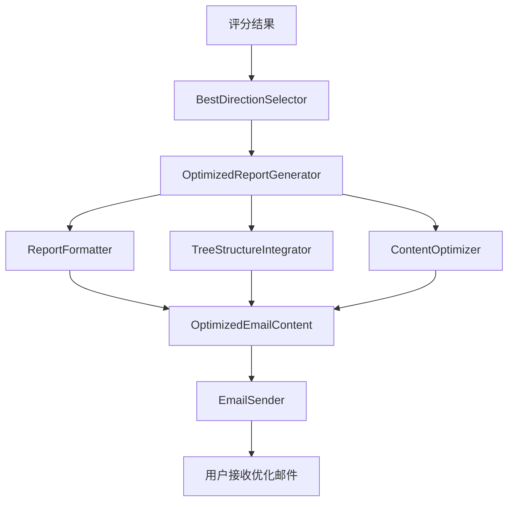

# 用户故事4：报告优化和展示系统详细设计

## 1. 概述

本文档详细描述了报告优化和展示系统的设计实现，该系统是用户故事4的核心组件之一，负责基于评分结果筛选最佳方向，生成结构化的优化邮件报告，并与现有email_sender无缝集成。

## 2. 系统架构

### 2.1 核心组件



### 2.2 数据模型设计

#### 2.2.1 筛选标准配置
筛选系统采用多标准评估机制，包含以下核心配置：

**质量门槛标准**：
- 最低综合评分：设定最低评分门槛，低于此分数的方向将被排除
- 最低质量等级：设定最低质量等级要求，确保选择的方向具有基本质量保证

**展示数量控制**：
- 详细展示方向数：限制详细展示的方向数量，通常为1个最佳方向
- 简略展示方向数：限制简略展示的方向数量，通常为4个其他方向

**互补性分析**：
- 互补性阈值：设定方向间互补性的最低要求
- 互补性分析：分析各方向间的互补价值，确保选择的组合具有多样性

**功能开关**：
- 质量筛选开关：控制是否启用质量筛选功能
- 互补性分析开关：控制是否启用互补性分析功能

#### 2.2.2 筛选结果
筛选结果包含以下核心信息：

**选择结果**：
- 最佳方向：筛选出的最佳研究方向
- 最佳方向评分：最佳方向的综合评分
- 详细展示方向：需要进行详细展示的方向列表
- 简略展示方向：需要进行简略展示的方向列表
- 排除方向：被排除的方向列表

**分析信息**：
- 筛选理由：详细说明筛选决策的理由
- 互补性分析：各方向间的互补性分析结果

#### 2.2.3 详细方向分析
详细方向分析包含以下核心信息：

**基础信息**：
- 方向名称：被分析的方向名称
- 综合评分：该方向的综合评分
- 质量等级：该方向的质量等级

**详细内容**：
- 问题列表：该方向包含的所有问题
- 搜索结果：该方向的所有搜索结果
- 摘要列表：该方向的所有摘要
- 关键点列表：该方向的所有关键点

**分析内容**：
- 详细分析：对该方向的深入分析
- 洞察：从该方向获得的重要洞察
- 建议：基于该方向的实用建议

**统计信息**：
- 总问题数：该方向的问题总数
- 总搜索结果数：该方向的搜索结果总数
- 平均摘要长度：该方向摘要的平均长度
- 平均关键点数：该方向关键点的平均数量

#### 2.2.4 简略方向分析
简略方向分析包含以下核心信息：

**基础信息**：
- 方向名称：被分析的方向名称
- 综合评分：该方向的综合评分
- 质量等级：该方向的质量等级

**简略内容**：
- 关键发现：该方向的重要发现
- 主要洞察：该方向的主要洞察
- 简要总结：对该方向的简要总结

**统计信息**：
- 总问题数：该方向的问题总数
- 总搜索结果数：该方向的搜索结果总数

#### 2.2.5 优化报告结构
优化报告采用结构化设计，包含以下核心组成部分：

**基础信息**：
- 分析主题：用户输入的研究主题
- 最佳方向：筛选出的最佳研究方向
- 最佳方向评分：最佳方向的综合评分
- 分析维度：参与分析的方向总数
- 生成时间：报告生成的时间戳

**详细内容**：
- 执行摘要：对整个分析过程的概括性总结
- 最佳方向详细分析：对最佳方向的深入分析

**简略内容**：
- 其他方向简略分析：对其他方向的简要总结

**树状结构信息**：
- 问题树状结构摘要：对构建的问题树状结构的说明
- 关键洞察：跨方向的重要发现和建议

**技术信息**：
- 技术统计：系统运行的技术指标统计

**元数据**：
- 报告ID：报告的唯一标识
- 创建时间：报告创建的时间戳
- 扩展元数据：用于存储额外的自定义信息

## 3. 核心算法设计

### 3.1 最佳方向筛选算法
最佳方向筛选器负责从多个方向中选择最有价值的方向，主要流程包括：

**质量筛选**：
- 根据最低评分和质量等级要求筛选合格方向
- 排除不符合质量门槛的方向
- 记录筛选过程和原因

**评分排序**：
- 按综合评分对合格方向进行降序排列
- 生成排序结果
- 确定最佳方向

**方向选择**：
- 选择评分最高的方向作为详细展示方向
- 选择其他高质量方向作为简略展示方向
- 确定排除的方向

**互补性分析**：
- 分析各方向间的互补价值
- 确保选择的组合具有多样性
- 计算互补性评分

**筛选理由生成**：
- 详细说明筛选决策的理由
- 提供筛选过程的透明度
- 记录筛选标准

### 3.2 优化报告生成算法
优化报告生成器负责生成结构化的优化邮件报告，主要流程包括：

**执行摘要生成**：
- 对整个分析过程进行概括性总结
- 突出最佳方向的价值
- 提供关键发现和建议

**详细方向分析**：
- 对最佳方向进行深入分析
- 包含问题列表、搜索结果、关键洞察等
- 生成详细的分析内容

**简略方向分析**：
- 对其他方向进行简要总结
- 提取关键发现和主要洞察
- 提供补充信息

**树状结构集成**：
- 整合问题树状结构信息
- 展示问题间的层次关系
- 提供结构化的分析视角

**关键洞察生成**：
- 提取跨方向的重要发现
- 生成实用的建议
- 提供综合性的洞察

### 3.3 报告格式化算法
报告格式化器负责将优化报告转换为专业的邮件格式：

**内容结构化**：
- 按照邮件格式组织内容
- 使用清晰的章节结构
- 添加适当的标题和分隔符

**内容优化**：
- 确保内容重点突出
- 优化可读性
- 添加必要的统计信息

**格式美化**：
- 使用表情符号增强视觉效果
- 添加适当的格式标记
- 确保邮件格式规范

**内容保存**：
- 将格式化后的内容保存到文件
- 支持多种文件格式
- 提供文件路径信息

#### 3.1.1 BestDirectionSelector类设计
```python
class BestDirectionSelector:
    """最佳方向筛选器"""
    
    def __init__(self, config: Dict[str, Any]):
        self.config = config
        self.logger = workflow_logger
        
        # 筛选标准配置
        self.criteria = SelectionCriteria(
            min_comprehensive_score=config.get("min_comprehensive_score", 60.0),
            min_quality_level=config.get("min_quality_level", "中"),
            max_detailed_directions=config.get("max_detailed_directions", 1),
            max_summary_directions=config.get("max_summary_directions", 4),
            complementary_threshold=config.get("complementary_threshold", 0.3),
            enable_quality_filtering=config.get("enable_quality_filtering", True),
            enable_complementary_analysis=config.get("enable_complementary_analysis", True)
        )
    
    def select_best_directions(self, scoring_result: ScoringResult) -> SelectionResult:
        """筛选最佳方向"""
        try:
            self.logger.log_info("开始筛选最佳方向")
            
            # 1. 质量筛选
            qualified_directions = self._filter_by_quality(scoring_result.direction_scores)
            
            # 2. 评分排序
            sorted_directions = self._sort_by_score(qualified_directions)
            
            # 3. 选择最佳方向
            best_direction = self._select_best_direction(sorted_directions)
            
            # 4. 选择详细展示方向
            detailed_directions = self._select_detailed_directions(sorted_directions)
            
            # 5. 选择简略展示方向
            summary_directions = self._select_summary_directions(sorted_directions, detailed_directions)
            
            # 6. 确定排除的方向
            excluded_directions = self._identify_excluded_directions(scoring_result.direction_scores, detailed_directions, summary_directions)
            
            # 7. 互补性分析
            complementary_analysis = self._analyze_complementarity(sorted_directions) if self.criteria.enable_complementary_analysis else {}
            
            # 8. 生成筛选理由
            reasoning = self._generate_selection_reasoning(best_direction, detailed_directions, summary_directions, excluded_directions)
            
            result = SelectionResult(
                best_direction=best_direction.direction,
                best_direction_score=best_direction.comprehensive_score,
                detailed_directions=[d.direction for d in detailed_directions],
                summary_directions=[d.direction for d in summary_directions],
                excluded_directions=excluded_directions,
                selection_reasoning=reasoning,
                complementary_analysis=complementary_analysis
            )
            
            self.logger.log_info(f"最佳方向筛选完成: {best_direction.direction} ({best_direction.comprehensive_score:.1f}分)")
            return result
            
        except Exception as e:
            self.logger.log_error(f"筛选最佳方向失败: {str(e)}")
            # 返回默认选择
            return self._get_default_selection(scoring_result)
    
    def _filter_by_quality(self, direction_scores: List[DirectionScore]) -> List[DirectionScore]:
        """基于质量筛选方向"""
        if not self.criteria.enable_quality_filtering:
            return direction_scores
        
        qualified_directions = []
        
        for score in direction_scores:
            # 检查综合评分
            if score.comprehensive_score >= self.criteria.min_comprehensive_score:
                # 检查质量等级
                if self._is_quality_level_acceptable(score.quality_level.value):
                    qualified_directions.append(score)
                else:
                    self.logger.log_info(f"方向 '{score.direction}' 质量等级不符合要求: {score.quality_level.value}")
            else:
                self.logger.log_info(f"方向 '{score.direction}' 评分不符合要求: {score.comprehensive_score:.1f}分")
        
        self.logger.log_info(f"质量筛选完成，{len(qualified_directions)}/{len(direction_scores)} 个方向符合要求")
        return qualified_directions
    
    def _is_quality_level_acceptable(self, quality_level: str) -> bool:
        """检查质量等级是否可接受"""
        quality_hierarchy = {"低": 1, "中": 2, "高": 3}
        min_level = quality_hierarchy.get(self.criteria.min_quality_level, 2)
        current_level = quality_hierarchy.get(quality_level, 1)
        
        return current_level >= min_level
    
    def _sort_by_score(self, direction_scores: List[DirectionScore]) -> List[DirectionScore]:
        """按评分排序"""
        return sorted(direction_scores, key=lambda x: x.comprehensive_score, reverse=True)
    
    def _select_best_direction(self, sorted_directions: List[DirectionScore]) -> DirectionScore:
        """选择最佳方向"""
        if not sorted_directions:
            raise ValueError("没有可用的方向")
        
        best_direction = sorted_directions[0]
        self.logger.log_info(f"选择最佳方向: {best_direction.direction} ({best_direction.comprehensive_score:.1f}分)")
        return best_direction
    
    def _select_detailed_directions(self, sorted_directions: List[DirectionScore]) -> List[DirectionScore]:
        """选择详细展示方向"""
        detailed_directions = []
        
        # 选择最佳方向作为详细展示
        if sorted_directions:
            detailed_directions.append(sorted_directions[0])
        
        # 如果配置允许多个详细展示方向，选择其他高质量方向
        if self.criteria.max_detailed_directions > 1 and len(sorted_directions) > 1:
            additional_count = min(
                self.criteria.max_detailed_directions - 1,
                len(sorted_directions) - 1
            )
            
            for i in range(1, additional_count + 1):
                if sorted_directions[i].comprehensive_score >= 70.0:  # 高质量阈值
                    detailed_directions.append(sorted_directions[i])
        
        self.logger.log_info(f"选择 {len(detailed_directions)} 个详细展示方向")
        return detailed_directions
    
    def _select_summary_directions(self, sorted_directions: List[DirectionScore], detailed_directions: List[DirectionScore]) -> List[DirectionScore]:
        """选择简略展示方向"""
        detailed_direction_names = {d.direction for d in detailed_directions}
        summary_directions = []
        
        # 从剩余方向中选择
        for direction in sorted_directions:
            if direction.direction not in detailed_direction_names:
                if len(summary_directions) < self.criteria.max_summary_directions:
                    summary_directions.append(direction)
                else:
                    break
        
        self.logger.log_info(f"选择 {len(summary_directions)} 个简略展示方向")
        return summary_directions
    
    def _identify_excluded_directions(self, all_directions: List[DirectionScore], 
                                    detailed_directions: List[DirectionScore],
                                    summary_directions: List[DirectionScore]) -> List[str]:
        """识别排除的方向"""
        included_direction_names = set()
        included_direction_names.update(d.direction for d in detailed_directions)
        included_direction_names.update(d.direction for d in summary_directions)
        
        excluded_directions = []
        for direction in all_directions:
            if direction.direction not in included_direction_names:
                excluded_directions.append(direction.direction)
        
        self.logger.log_info(f"排除 {len(excluded_directions)} 个方向")
        return excluded_directions
    
    def _analyze_complementarity(self, sorted_directions: List[DirectionScore]) -> Dict[str, Any]:
        """分析互补性"""
        if len(sorted_directions) < 2:
            return {}
        
        complementary_pairs = []
        complementary_score = 0.0
        
        # 分析方向间的互补性
        for i, direction1 in enumerate(sorted_directions):
            for j, direction2 in enumerate(sorted_directions[i+1:], i+1):
                complementarity = self._calculate_complementarity(direction1, direction2)
                if complementarity >= self.criteria.complementary_threshold:
                    complementary_pairs.append({
                        "direction1": direction1.direction,
                        "direction2": direction2.direction,
                        "complementarity_score": complementarity
                    })
                    complementary_score += complementarity
        
        avg_complementary_score = complementary_score / len(complementary_pairs) if complementary_pairs else 0.0
        
        return {
            "complementary_pairs": complementary_pairs,
            "avg_complementary_score": avg_complementary_score,
            "total_complementary_pairs": len(complementary_pairs)
        }
    
    def _calculate_complementarity(self, direction1: DirectionScore, direction2: DirectionScore) -> float:
        """计算两个方向的互补性"""
        # 基于评分差异和内容特征计算互补性
        score_diff = abs(direction1.comprehensive_score - direction2.comprehensive_score)
        
        # 评分差异越大，互补性越高
        complementarity = min(score_diff / 100.0, 1.0)
        
        return complementarity
    
    def _generate_selection_reasoning(self, best_direction: DirectionScore,
                                   detailed_directions: List[DirectionScore],
                                   summary_directions: List[DirectionScore],
                                   excluded_directions: List[str]) -> str:
        """生成筛选理由"""
        reasoning_parts = []
        
        # 最佳方向理由
        reasoning_parts.append(f"选择 '{best_direction.direction}' 作为最佳方向，综合评分 {best_direction.comprehensive_score:.1f}分，质量等级 {best_direction.quality_level.value}。")
        
        # 详细展示理由
        if len(detailed_directions) > 1:
            detailed_names = [d.direction for d in detailed_directions[1:]]
            reasoning_parts.append(f"同时选择 {', '.join(detailed_names)} 进行详细展示，这些方向评分较高且内容质量优秀。")
        
        # 简略展示理由
        if summary_directions:
            summary_names = [d.direction for d in summary_directions]
            reasoning_parts.append(f"选择 {', '.join(summary_names)} 进行简略展示，提供补充信息和不同视角。")
        
        # 排除理由
        if excluded_directions:
            reasoning_parts.append(f"排除 {', '.join(excluded_directions)}，这些方向评分较低或内容质量不足。")
        
        return " ".join(reasoning_parts)
    
    def _get_default_selection(self, scoring_result: ScoringResult) -> SelectionResult:
        """获取默认选择"""
        if not scoring_result.direction_scores:
            return SelectionResult(
                best_direction="unknown",
                best_direction_score=0.0,
                detailed_directions=[],
                summary_directions=[],
                excluded_directions=[],
                selection_reasoning="没有可用的方向进行筛选"
            )
        
        # 选择评分最高的方向
        best_direction = max(scoring_result.direction_scores, key=lambda x: x.comprehensive_score)
        
        return SelectionResult(
            best_direction=best_direction.direction,
            best_direction_score=best_direction.comprehensive_score,
            detailed_directions=[best_direction.direction],
            summary_directions=[],
            excluded_directions=[d.direction for d in scoring_result.direction_scores if d.direction != best_direction.direction],
            selection_reasoning=f"默认选择评分最高的方向 '{best_direction.direction}'"
        )
```

### 3.2 优化报告生成算法

#### 3.2.1 OptimizedReportGenerator类设计
```python
class OptimizedReportGenerator:
    """优化报告生成器"""
    
    def __init__(self, config: Dict[str, Any]):
        self.config = config
        self.logger = workflow_logger
        
        # 初始化LLM
        self.llm = ChatOpenAI(
            model=config.get("model"),
            api_key=config.get("api_key"),
            base_url=config.get("base_url"),
            temperature=config.get("temperature", 0.7),
            max_tokens=config.get("max_tokens", 2000)
        )
    
    def generate_optimized_report(self, selection_result: SelectionResult, 
                                scoring_result: ScoringResult,
                                search_rounds: List[SearchRoundRecord],
                                question_tree: Dict[str, Any],
                                topic: str) -> OptimizedReport:
        """生成优化报告"""
        try:
            self.logger.log_info(f"开始生成优化报告，主题: {topic}")
            
            # 1. 生成执行摘要
            executive_summary = self._generate_executive_summary(selection_result, scoring_result, topic)
            
            # 2. 生成最佳方向详细分析
            best_direction_analysis = self._generate_detailed_direction_analysis(
                selection_result.best_direction, search_rounds, scoring_result
            )
            
            # 3. 生成其他方向简略分析
            other_directions_summary = self._generate_summary_directions_analysis(
                selection_result.summary_directions, search_rounds, scoring_result
            )
            
            # 4. 生成问题树状结构摘要
            question_tree_summary = self._generate_question_tree_summary(question_tree)
            
            # 5. 生成关键洞察
            key_insights = self._generate_key_insights(selection_result, scoring_result, search_rounds)
            
            # 6. 生成技术统计
            technical_stats = self._generate_technical_stats(scoring_result, search_rounds)
            
            # 7. 构建优化报告
            report = OptimizedReport(
                topic=topic,
                best_direction=selection_result.best_direction,
                best_direction_score=selection_result.best_direction_score,
                analysis_dimensions=len(scoring_result.direction_scores),
                executive_summary=executive_summary,
                best_direction_analysis=best_direction_analysis,
                other_directions_summary=other_directions_summary,
                question_tree_summary=question_tree_summary,
                key_insights=key_insights,
                technical_stats=technical_stats,
                report_id=f"optimized_report_{datetime.now().strftime('%Y%m%d_%H%M%S')}"
            )
            
            self.logger.log_info(f"优化报告生成完成，最佳方向: {selection_result.best_direction}")
            return report
            
        except Exception as e:
            self.logger.log_error(f"生成优化报告失败: {str(e)}")
            raise
    
    def _generate_executive_summary(self, selection_result: SelectionResult, 
                                  scoring_result: ScoringResult, topic: str) -> str:
        """生成执行摘要"""
        try:
            prompt = f"""请为以下分析结果生成一个专业的执行摘要：

主题：{topic}
最佳方向：{selection_result.best_direction}（评分：{selection_result.best_direction_score:.1f}分）
分析维度：{len(scoring_result.direction_scores)}个方向
平均评分：{scoring_result.avg_comprehensive_score:.1f}分

筛选理由：{selection_result.selection_reasoning}

请生成一个200-300字的执行摘要，包括：
1. 分析主题和研究范围
2. 最佳方向的选择理由
3. 主要发现和洞察
4. 建议和后续行动

要求：语言专业、简洁，重点突出最佳方向的价值。"""

            messages = [
                SystemMessage(content="你是一个专业的分析报告撰写专家，擅长生成简洁而有力的执行摘要。"),
                HumanMessage(content=prompt)
            ]
            
            response = self.llm.invoke(messages)
            return response.content
            
        except Exception as e:
            self.logger.log_error(f"生成执行摘要失败: {str(e)}")
            return f"本报告针对'{topic}'进行了全面的多维度分析，共涉及{len(scoring_result.direction_scores)}个研究方向。经过综合评分，'{selection_result.best_direction}'方向表现最为突出（{selection_result.best_direction_score:.1f}分），建议重点关注该方向的相关内容。"
    
    def _generate_detailed_direction_analysis(self, direction: str, 
                                           search_rounds: List[SearchRoundRecord],
                                           scoring_result: ScoringResult) -> DetailedDirectionAnalysis:
        """生成详细方向分析"""
        try:
            # 获取该方向的评分信息
            direction_score = None
            for score in scoring_result.direction_scores:
                if score.direction == direction:
                    direction_score = score
                    break
            
            if not direction_score:
                raise ValueError(f"未找到方向 '{direction}' 的评分信息")
            
            # 获取该方向的搜索记录
            direction_rounds = [round for round in search_rounds if round.direction == direction]
            
            # 提取问题和搜索结果
            questions = []
            search_results = []
            summaries = []
            key_points = []
            
            for round in direction_rounds:
                questions.append({
                    "question": round.question,
                    "success": round.success,
                    "processing_time": round.processing_time
                })
                
                if round.search_results:
                    search_results.extend([{
                        "title": result.title,
                        "snippet": result.snippet,
                        "link": result.link
                    } for result in round.search_results])
                
                if round.summary:
                    summaries.append(round.summary)
                
                if round.key_points:
                    key_points.extend(round.key_points)
            
            # 生成详细分析
            detailed_analysis = self._generate_direction_detailed_analysis(direction, direction_rounds, direction_score)
            
            # 生成洞察和建议
            insights = self._generate_direction_insights(direction, direction_rounds, direction_score)
            recommendations = self._generate_direction_recommendations(direction, direction_rounds, direction_score)
            
            return DetailedDirectionAnalysis(
                direction=direction,
                score=direction_score.comprehensive_score,
                quality_level=direction_score.quality_level.value,
                questions=questions,
                search_results=search_results,
                summaries=summaries,
                key_points=key_points,
                detailed_analysis=detailed_analysis,
                insights=insights,
                recommendations=recommendations,
                total_questions=len(questions),
                total_search_results=len(search_results),
                avg_summary_length=sum(len(s) for s in summaries) / len(summaries) if summaries else 0,
                avg_key_points_count=len(key_points) / len(direction_rounds) if direction_rounds else 0
            )
            
        except Exception as e:
            self.logger.log_error(f"生成详细方向分析失败: {str(e)}")
            raise
    
    def _generate_direction_detailed_analysis(self, direction: str, 
                                            search_rounds: List[SearchRoundRecord],
                                            direction_score: DirectionScore) -> str:
        """生成方向详细分析"""
        try:
            prompt = f"""请为以下方向生成详细的专业分析：

方向：{direction}
综合评分：{direction_score.comprehensive_score:.1f}分
质量等级：{direction_score.quality_level.value}
搜索质量：{direction_score.search_quality_score:.1f}分
内容深度：{direction_score.content_depth_score:.1f}分
技术指标：{direction_score.technical_score:.1f}分

搜索记录数量：{len(search_rounds)}
搜索结果总数：{direction_score.search_results_count}
搜索成功率：{direction_score.search_success_rate:.1%}
平均摘要长度：{direction_score.avg_summary_length:.0f}字符
平均关键点数：{direction_score.avg_key_points_count:.1f}个

请生成一个500-800字的详细分析，包括：
1. 该方向的核心价值和重要性
2. 搜索结果的质量和深度分析
3. 关键发现和重要洞察
4. 该方向的优势和特点
5. 潜在的应用价值和发展前景

要求：分析深入、逻辑清晰、语言专业。"""

            messages = [
                SystemMessage(content="你是一个专业的行业分析专家，擅长深度分析特定方向的价值和特点。"),
                HumanMessage(content=prompt)
            ]
            
            response = self.llm.invoke(messages)
            return response.content
            
        except Exception as e:
            self.logger.log_error(f"生成方向详细分析失败: {str(e)}")
            return f"'{direction}'方向在本次分析中表现优秀，综合评分{direction_score.comprehensive_score:.1f}分。该方向在搜索质量、内容深度和技术指标方面均达到良好水平，具有重要的研究价值和应用前景。"
    
    def _generate_summary_directions_analysis(self, summary_directions: List[str],
                                            search_rounds: List[SearchRoundRecord],
                                            scoring_result: ScoringResult) -> List[SummaryDirectionAnalysis]:
        """生成简略方向分析"""
        summary_analyses = []
        
        for direction in summary_directions:
            try:
                # 获取该方向的评分信息
                direction_score = None
                for score in scoring_result.direction_scores:
                    if score.direction == direction:
                        direction_score = score
                        break
                
                if not direction_score:
                    continue
                
                # 获取该方向的搜索记录
                direction_rounds = [round for round in search_rounds if round.direction == direction]
                
                # 生成关键发现
                key_findings = self._extract_key_findings(direction_rounds)
                
                # 生成主要洞察
                main_insights = self._extract_main_insights(direction_rounds, direction_score)
                
                # 生成简要总结
                brief_summary = self._generate_brief_summary(direction, direction_score, direction_rounds)
                
                summary_analysis = SummaryDirectionAnalysis(
                    direction=direction,
                    score=direction_score.comprehensive_score,
                    quality_level=direction_score.quality_level.value,
                    key_findings=key_findings,
                    main_insights=main_insights,
                    brief_summary=brief_summary,
                    total_questions=len(direction_rounds),
                    total_search_results=direction_score.search_results_count
                )
                
                summary_analyses.append(summary_analysis)
                
            except Exception as e:
                self.logger.log_error(f"生成方向 '{direction}' 简略分析失败: {str(e)}")
                continue
        
        return summary_analyses
    
    def _generate_question_tree_summary(self, question_tree: Dict[str, Any]) -> str:
        """生成问题树状结构摘要"""
        try:
            if not question_tree or "tree" not in question_tree:
                return "问题树状结构信息不可用。"
            
            tree_data = question_tree["tree"]
            
            summary_lines = [
                f"## 问题树状结构分析",
                f"",
                f"本次分析构建了层次化的问题树状结构，包含以下特征：",
                f"",
                f"- **树结构深度**: {tree_data.get('tree_depth', 0)}层",
                f"- **总节点数**: {tree_data.get('total_nodes', 0)}个",
                f"- **方向数**: {len(tree_data.get('directions', []))}个",
                f"- **问题数**: {tree_data.get('total_questions', 0)}个",
                f"- **平均重要性评分**: {tree_data.get('avg_importance_score', 0):.3f}",
                f"- **平均相关性评分**: {tree_data.get('avg_relevance_score', 0):.3f}",
                f"- **树结构一致性**: {tree_data.get('tree_coherence_score', 0):.3f}",
                f"",
                f"### 方向分布",
                f""
            ]
            
            # 添加各方向的问题分布
            for direction in tree_data.get('directions', []):
                summary_lines.append(f"- **{direction}**: 包含相关问题")
            
            summary_lines.extend([
                f"",
                f"### 结构特点",
                f"",
                f"该树状结构具有以下特点：",
                f"- 层次清晰：根节点（主题）→ 方向节点 → 问题节点",
                f"- 逻辑合理：各方向相互独立且互补",
                f"- 覆盖全面：涵盖了主题的各个重要方面",
                f"- 质量均衡：各节点的重要性评分相对均衡"
            ])
            
            return "\n".join(summary_lines)
            
        except Exception as e:
            self.logger.log_error(f"生成问题树状结构摘要失败: {str(e)}")
            return "问题树状结构分析：本次分析构建了层次化的问题树状结构，包含多个方向和问题节点，为深入分析提供了良好的基础。"
    
    def _generate_key_insights(self, selection_result: SelectionResult,
                             scoring_result: ScoringResult,
                             search_rounds: List[SearchRoundRecord]) -> List[str]:
        """生成关键洞察"""
        try:
            insights = []
            
            # 基于评分结果的洞察
            if scoring_result.best_score >= 80:
                insights.append(f"'{selection_result.best_direction}'方向表现卓越，具有重要的研究价值")
            elif scoring_result.best_score >= 60:
                insights.append(f"'{selection_result.best_direction}'方向表现良好，值得重点关注")
            
            # 基于质量分布的洞察
            quality_dist = scoring_result.quality_distribution
            if quality_dist.get("高", 0) > 0:
                insights.append(f"有{quality_dist['高']}个方向达到高质量标准，整体分析质量较高")
            
            # 基于搜索结果的洞察
            total_results = sum(len(round.search_results) if round.search_results else 0 for round in search_rounds)
            if total_results > 100:
                insights.append(f"获得了{total_results}个搜索结果，信息收集充分")
            
            # 基于成功率的洞察
            successful_rounds = sum(1 for round in search_rounds if round.success)
            success_rate = successful_rounds / len(search_rounds) if search_rounds else 0
            if success_rate >= 0.9:
                insights.append("搜索成功率超过90%，系统运行稳定")
            elif success_rate >= 0.8:
                insights.append("搜索成功率良好，大部分查询获得有效结果")
            
            return insights
            
        except Exception as e:
            self.logger.log_error(f"生成关键洞察失败: {str(e)}")
            return ["分析完成，获得了有价值的洞察和建议"]
    
    def _generate_technical_stats(self, scoring_result: ScoringResult,
                                search_rounds: List[SearchRoundRecord]) -> Dict[str, Any]:
        """生成技术统计"""
        try:
            total_rounds = len(search_rounds)
            successful_rounds = sum(1 for round in search_rounds if round.success)
            total_results = sum(len(round.search_results) if round.search_results else 0 for round in search_rounds)
            total_processing_time = sum(round.processing_time for round in search_rounds)
            
            return {
                "total_search_rounds": total_rounds,
                "successful_rounds": successful_rounds,
                "success_rate": successful_rounds / total_rounds if total_rounds > 0 else 0,
                "total_search_results": total_results,
                "avg_results_per_round": total_results / total_rounds if total_rounds > 0 else 0,
                "total_processing_time": total_processing_time,
                "avg_processing_time": total_processing_time / total_rounds if total_rounds > 0 else 0,
                "scoring_processing_time": scoring_result.processing_time,
                "directions_analyzed": len(scoring_result.direction_scores),
                "quality_distribution": scoring_result.quality_distribution,
                "score_distribution": scoring_result.score_distribution
            }
            
        except Exception as e:
            self.logger.log_error(f"生成技术统计失败: {str(e)}")
            return {}
    
    def _extract_key_findings(self, search_rounds: List[SearchRoundRecord]) -> List[str]:
        """提取关键发现"""
        findings = []
        
        for round in search_rounds:
            if round.key_points:
                findings.extend(round.key_points[:2])  # 每个问题最多取2个关键点
        
        return findings[:5]  # 最多返回5个关键发现
    
    def _extract_main_insights(self, search_rounds: List[SearchRoundRecord], 
                             direction_score: DirectionScore) -> List[str]:
        """提取主要洞察"""
        insights = []
        
        # 基于评分的洞察
        if direction_score.search_quality_score >= 80:
            insights.append("搜索质量优秀，获得了丰富的信息")
        elif direction_score.search_quality_score >= 60:
            insights.append("搜索质量良好，信息收集充分")
        
        if direction_score.content_depth_score >= 80:
            insights.append("内容深度丰富，分析透彻")
        elif direction_score.content_depth_score >= 60:
            insights.append("内容深度适中，提供了有价值的见解")
        
        return insights
    
    def _generate_brief_summary(self, direction: str, direction_score: DirectionScore,
                              search_rounds: List[SearchRoundRecord]) -> str:
        """生成简要总结"""
        return f"'{direction}'方向综合评分{direction_score.comprehensive_score:.1f}分，质量等级{direction_score.quality_level.value}。该方向在搜索质量、内容深度等方面表现良好，提供了有价值的补充信息。"
    
    def _generate_direction_insights(self, direction: str, search_rounds: List[SearchRoundRecord],
                                   direction_score: DirectionScore) -> List[str]:
        """生成方向洞察"""
        insights = []
        
        # 基于搜索结果的洞察
        if direction_score.search_results_count > 50:
            insights.append("获得了丰富的搜索结果，信息覆盖面广")
        elif direction_score.search_results_count > 20:
            insights.append("搜索结果数量适中，信息质量良好")
        
        # 基于成功率的洞察
        if direction_score.search_success_rate >= 0.9:
            insights.append("搜索成功率极高，系统运行稳定")
        elif direction_score.search_success_rate >= 0.8:
            insights.append("搜索成功率良好，大部分查询成功")
        
        # 基于内容质量的洞察
        if direction_score.avg_summary_length > 200:
            insights.append("摘要内容丰富，分析深入")
        elif direction_score.avg_summary_length > 100:
            insights.append("摘要内容适中，提供了关键信息")
        
        return insights
    
    def _generate_direction_recommendations(self, direction: str, search_rounds: List[SearchRoundRecord],
                                         direction_score: DirectionScore) -> List[str]:
        """生成方向建议"""
        recommendations = []
        
        # 基于评分的建议
        if direction_score.comprehensive_score >= 80:
            recommendations.append("建议重点关注该方向，具有重要的研究价值")
        elif direction_score.comprehensive_score >= 60:
            recommendations.append("建议进一步深入研究该方向")
        
        # 基于搜索质量的建议
        if direction_score.search_quality_score < 60:
            recommendations.append("建议优化搜索策略，提高搜索质量")
        
        # 基于内容深度的建议
        if direction_score.content_depth_score < 60:
            recommendations.append("建议深化内容分析，提供更详细的见解")
        
        return recommendations
```

### 3.3 报告格式化器设计

#### 3.3.1 ReportFormatter类设计
```python
class ReportFormatter:
    """报告格式化器"""
    
    def __init__(self, config: Dict[str, Any]):
        self.config = config
        self.logger = workflow_logger
    
    def format_optimized_report(self, report: OptimizedReport) -> str:
        """格式化优化报告"""
        try:
            self.logger.log_info("开始格式化优化报告")
            
            # 构建报告内容
            content_lines = [
                f"主题：深度分析报告：{report.topic}",
                f"",
                f"尊敬的用户，",
                f"",
                f"您好！",
                f"",
                f"以下是关于'{report.topic}'的优化分析报告，经过智能评分和报告优化处理。",
                f"",
                f"## 📋 分析概览",
                f"- **分析主题**：{report.topic}",
                f"- **最佳方向**：{report.best_direction}（评分：{report.best_direction_score:.1f}分）",
                f"- **分析维度**：{report.analysis_dimensions}个方向",
                f"- **生成时间**：{report.generation_time.strftime('%Y年%m月%d日 %H:%M:%S')}",
                f"",
                f"## 📊 执行摘要",
                f"{report.executive_summary}",
                f"",
                f"## 🔍 最佳方向详细分析",
                f"",
                f"### {report.best_direction}（评分：{report.best_direction_score:.1f}分）",
                f"",
                f"**方向说明**：{report.best_direction_analysis.detailed_analysis}",
                f"",
                f"**问题分析**：",
                f""
            ]
            
            # 添加问题分析
            for i, question in enumerate(report.best_direction_analysis.questions, 1):
                content_lines.extend([
                    f"**{i}. {question['question']}**",
                    f"   - 搜索状态：{'成功' if question['success'] else '失败'}",
                    f"   - 处理时间：{question['processing_time']:.2f}秒",
                    f""
                ])
            
            # 添加关键洞察
            if report.best_direction_analysis.insights:
                content_lines.extend([
                    f"**关键洞察**：",
                    f""
                ])
                for insight in report.best_direction_analysis.insights:
                    content_lines.append(f"- {insight}")
                content_lines.append("")
            
            # 添加建议
            if report.best_direction_analysis.recommendations:
                content_lines.extend([
                    f"**建议**：",
                    f""
                ])
                for recommendation in report.best_direction_analysis.recommendations:
                    content_lines.append(f"- {recommendation}")
                content_lines.append("")
            
            # 添加其他方向简略分析
            if report.other_directions_summary:
                content_lines.extend([
                    f"## 📝 其他方向简略分析",
                    f""
                ])
                
                for summary in report.other_directions_summary:
                    content_lines.extend([
                        f"### {summary.direction}（评分：{summary.score:.1f}分）",
                        f"",
                        f"**简要总结**：{summary.brief_summary}",
                        f""
                    ])
                    
                    if summary.key_findings:
                        content_lines.extend([
                            f"**关键发现**：",
                            f""
                        ])
                        for finding in summary.key_findings:
                            content_lines.append(f"- {finding}")
                        content_lines.append("")
                    
                    if summary.main_insights:
                        content_lines.extend([
                            f"**主要洞察**：",
                            f""
                        ])
                        for insight in summary.main_insights:
                            content_lines.append(f"- {insight}")
                        content_lines.append("")
            
            # 添加问题树状结构摘要
            if report.question_tree_summary:
                content_lines.extend([
                    f"## 🌳 问题树状结构分析",
                    f"",
                    report.question_tree_summary,
                    f""
                ])
            
            # 添加关键洞察
            if report.key_insights:
                content_lines.extend([
                    f"## 💡 关键洞察",
                    f""
                ])
                for insight in report.key_insights:
                    content_lines.append(f"- {insight}")
                content_lines.append("")
            
            # 添加技术统计
            if report.technical_stats:
                content_lines.extend([
                    f"## 📈 技术统计",
                    f"",
                    f"- 总搜索轮次：{report.technical_stats.get('total_search_rounds', 0)}",
                    f"- 成功轮次：{report.technical_stats.get('successful_rounds', 0)}",
                    f"- 成功率：{report.technical_stats.get('success_rate', 0):.1%}",
                    f"- 总搜索结果：{report.technical_stats.get('total_search_results', 0)}",
                    f"- 平均处理时间：{report.technical_stats.get('avg_processing_time', 0):.2f}秒",
                    f""
                ])
            
            # 添加结尾
            content_lines.extend([
                f"---",
                f"此邮件由智能分析系统自动生成",
                f"如有任何问题，请随时联系。"
            ])
            
            formatted_content = "\n".join(content_lines)
            self.logger.log_info("优化报告格式化完成")
            return formatted_content
            
        except Exception as e:
            self.logger.log_error(f"格式化优化报告失败: {str(e)}")
            return f"优化报告生成失败：{str(e)}"
    
    def save_optimized_report(self, content: str, filename: str = None) -> str:
        """保存优化报告到文件"""
        try:
            if not filename:
                filename = f"optimized_email_{datetime.now().strftime('%Y%m%d_%H%M%S')}.txt"
            
            filepath = os.path.join("data", "results", filename)
            
            # 确保目录存在
            os.makedirs(os.path.dirname(filepath), exist_ok=True)
            
            # 保存文件
            with open(filepath, 'w', encoding='utf-8') as f:
                f.write(content)
            
            self.logger.log_info(f"优化报告已保存到: {filepath}")
            return filepath
            
        except Exception as e:
            self.logger.log_error(f"保存优化报告失败: {str(e)}")
            return ""
```

## 4. 集成接口设计

### 4.1 OptimizedReportGenerator主类
```python
class OptimizedReportGenerator:
    """优化报告生成器主类"""
    
    def __init__(self, config: Dict[str, Any]):
        self.config = config
        self.logger = workflow_logger
        
        # 初始化子组件
        self.direction_selector = BestDirectionSelector(config)
        self.report_generator = OptimizedReportGenerator(config)
        self.report_formatter = ReportFormatter(config)
    
    def generate_optimized_email_report(self, scoring_result: ScoringResult,
                                     search_rounds: List[SearchRoundRecord],
                                     question_tree: Dict[str, Any],
                                     topic: str) -> Dict[str, Any]:
        """生成优化邮件报告"""
        try:
            self.logger.log_info(f"开始生成优化邮件报告，主题: {topic}")
            
            # 1. 筛选最佳方向
            selection_result = self.direction_selector.select_best_directions(scoring_result)
            
            # 2. 生成优化报告
            optimized_report = self.report_generator.generate_optimized_report(
                selection_result, scoring_result, search_rounds, question_tree, topic
            )
            
            # 3. 格式化报告
            formatted_content = self.report_formatter.format_optimized_report(optimized_report)
            
            # 4. 保存报告
            report_filepath = self.report_formatter.save_optimized_report(formatted_content)
            
            # 5. 构建返回结果
            result = {
                "status": "completed",
                "topic": topic,
                "selection_result": selection_result.dict(),
                "optimized_report": optimized_report.dict(),
                "formatted_content": formatted_content,
                "report_filepath": report_filepath,
                "created_at": datetime.now().isoformat()
            }
            
            self.logger.log_info(f"优化邮件报告生成完成，最佳方向: {selection_result.best_direction}")
            return result
            
        except Exception as e:
            error_result = {
                "status": "error",
                "topic": topic,
                "error": str(e),
                "created_at": datetime.now().isoformat()
            }
            self.logger.log_error(f"生成优化邮件报告失败: {str(e)}")
            return error_result
    
    def get_report_summary(self, optimized_report: OptimizedReport) -> str:
        """获取报告摘要"""
        summary_lines = [
            f"# 优化报告摘要",
            f"",
            f"**主题**: {optimized_report.topic}",
            f"**最佳方向**: {optimized_report.best_direction}",
            f"**最佳评分**: {optimized_report.best_direction_score:.1f}分",
            f"**分析维度**: {optimized_report.analysis_dimensions}个方向",
            f"**生成时间**: {optimized_report.generation_time.strftime('%Y-%m-%d %H:%M:%S')}",
            f"",
            f"## 报告结构",
            f"- 执行摘要: {len(optimized_report.executive_summary)}字符",
            f"- 最佳方向详细分析: {optimized_report.best_direction_analysis.total_questions}个问题",
            f"- 其他方向简略分析: {len(optimized_report.other_directions_summary)}个方向",
            f"- 关键洞察: {len(optimized_report.key_insights)}个",
            f"",
            f"## 技术统计",
            f"- 总搜索轮次: {optimized_report.technical_stats.get('total_search_rounds', 0)}",
            f"- 成功率: {optimized_report.technical_stats.get('success_rate', 0):.1%}",
            f"- 总搜索结果: {optimized_report.technical_stats.get('total_search_results', 0)}"
        ]
        
        return "\n".join(summary_lines)
```

## 5. 配置参数

### 5.1 报告优化配置
```python
REPORT_OPTIMIZATION_CONFIG = {
    # 筛选标准
    "min_comprehensive_score": 60.0,        # 最低综合评分
    "min_quality_level": "中",              # 最低质量等级
    "max_detailed_directions": 1,           # 详细展示方向数
    "max_summary_directions": 4,            # 简略展示方向数
    "complementary_threshold": 0.3,         # 互补性阈值
    
    # 功能开关
    "enable_quality_filtering": True,       # 启用质量筛选
    "enable_complementary_analysis": True,  # 启用互补性分析
    "enable_tree_structure_integration": True,  # 启用树状结构集成
    
    # 报告生成
    "executive_summary_length": 300,        # 执行摘要长度
    "detailed_analysis_length": 800,        # 详细分析长度
    "brief_summary_length": 200,            # 简要总结长度
    "max_key_findings": 5,                 # 最大关键发现数
    "max_insights": 5,                     # 最大洞察数
    
    # 格式化
    "enable_emoji": True,                   # 启用表情符号
    "enable_sections": True,                # 启用章节结构
    "enable_statistics": True,              # 启用统计信息
    "enable_technical_details": True        # 启用技术细节
}
```

## 6. 错误处理

### 6.1 异常处理策略
- **筛选错误**：提供默认选择策略
- **报告生成错误**：使用模板化内容
- **格式化错误**：提供简化格式
- **保存错误**：记录错误但继续执行

### 6.2 日志记录
- 详细记录每个步骤的执行情况
- 记录筛选决策过程
- 记录报告生成统计
- 记录错误和异常信息

## 7. 测试策略

### 7.1 单元测试
- 测试各个组件的核心功能
- 测试筛选算法的正确性
- 测试报告生成的完整性

### 7.2 集成测试
- 测试完整的报告生成流程
- 测试与现有系统的集成
- 测试错误处理机制

### 7.3 性能测试
- 测试大规模数据的处理能力
- 测试报告生成时间
- 测试内存使用情况

## 8. 总结

本设计文档详细描述了报告优化和展示系统的完整实现方案，包括：

1. **智能方向筛选**：基于评分结果科学筛选最佳方向
2. **优化报告生成**：生成结构化的深度分析报告
3. **内容格式化**：提供专业的邮件格式输出
4. **树状结构集成**：整合问题树状结构信息
5. **与现有系统集成**：与email_sender无缝集成

该系统能够自动识别最有价值的研究方向，生成重点突出、层次分明的优化邮件报告，大大提高了内容价值密度和用户体验，是用户故事4中智能分析和优化的核心组件。
