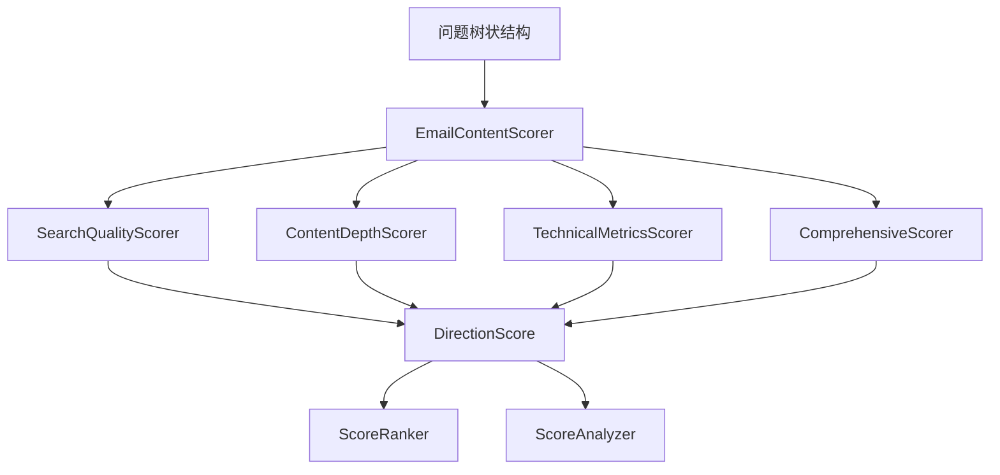

# 用户故事4：邮件内容评分系统详细设计

## 1. 概述

本文档详细描述了邮件内容评分系统的设计实现，该系统是用户故事4的核心组件之一，负责对邮件内容进行多维度量化评分，为最佳方向筛选提供科学依据。

## 2. 系统架构

### 2.1 核心组件



### 2.2 数据模型设计

#### 2.2.1 评分维度配置
评分系统采用多维度评估机制，包含以下核心配置：

**权重配置**：
- 搜索质量权重：搜索质量在综合评分中的权重比例
- 内容深度权重：内容深度在综合评分中的权重比例
- 技术指标权重：技术指标在综合评分中的权重比例
- 权重验证：确保所有权重总和为1.0

**质量等级定义**：
- 高质量：综合评分达到80分以上
- 中等质量：综合评分在60-80分之间
- 低质量：综合评分低于60分

#### 2.2.2 方向评分结果
每个方向的评分结果包含以下核心信息：

**评分信息**：
- 方向名称：被评分的具体方向
- 搜索质量评分：基于搜索结果质量的评分
- 内容深度评分：基于内容分析深度的评分
- 技术指标评分：基于系统性能的评分
- 综合评分：加权平均后的最终评分

**质量信息**：
- 质量等级：自动确定的质量等级
- 排名：在所有方向中的排名位置

**详细指标**：
- 搜索结果数量：该方向获得的搜索结果总数
- 搜索成功率：搜索成功的比例
- 平均摘要长度：该方向摘要的平均长度
- 平均关键点数量：该方向关键点的平均数量
- 平均处理时间：该方向搜索的平均处理时间

#### 2.2.3 评分结果汇总
评分结果汇总包含以下核心信息：

**基础信息**：
- 分析主题：被分析的主题名称
- 总方向数：参与分析的方向总数
- 已评分方向数：成功完成评分的方向数

**评分结果**：
- 各方向评分：所有方向的详细评分结果
- 最佳方向：评分最高的方向名称
- 最佳评分：最高评分值

**统计信息**：
- 平均综合评分：所有方向综合评分的平均值
- 评分分布：不同评分区间的方向数量分布
- 质量分布：不同质量等级的方向数量分布

**时间信息**：
- 计算时间：评分计算完成的时间戳
- 处理时间：整个评分过程的耗时

## 3. 核心算法设计

### 3.1 搜索质量评分算法
搜索质量评分器负责评估搜索结果的质量，主要评估维度包括：

**搜索结果数量评估**：
- 基于搜索结果数量计算评分
- 数量越多，评分越高
- 设置合理的数量上限

**搜索成功率评估**：
- 基于搜索成功的比例计算评分
- 成功率越高，评分越高
- 考虑搜索失败的影响

**结果相关性评估**：
- 基于搜索结果与问题的匹配度计算评分
- 相关性越高，评分越高
- 使用相似度算法计算相关性

### 3.2 内容深度评分算法
内容深度评分器负责评估内容分析的深度，主要评估维度包括：

**摘要长度评估**：
- 基于摘要长度计算评分
- 摘要越长，说明分析越深入
- 设置合理的长度阈值

**关键点数量评估**：
- 基于关键点数量计算评分
- 关键点越多，说明分析越全面
- 考虑关键点的质量

**内容完整性评估**：
- 基于内容结构的完整性计算评分
- 包括摘要、关键点、搜索结果的完整性
- 完整性越高，评分越高

### 3.3 技术指标评分算法
技术指标评分器负责评估系统性能，主要评估维度包括：

**处理时间效率评估**：
- 基于处理时间计算评分
- 时间越短，评分越高
- 考虑不同问题的复杂度差异

**系统稳定性评估**：
- 基于系统运行稳定性计算评分
- 基于成功率计算稳定性
- 稳定性越高，评分越高

### 3.4 综合评分计算
综合评分器负责计算最终的评分结果：

**权重加权计算**：
- 按照预设权重对各维度评分进行加权平均
- 搜索质量权重40%，内容深度权重40%，技术指标权重20%
- 确保权重总和为1.0

**质量等级划分**：
- 根据综合评分自动确定质量等级
- 高质量：80分以上
- 中等质量：60-80分
- 低质量：60分以下

**排名排序**：
- 对所有方向按综合评分进行降序排列
- 生成排名信息
- 提供排序结果

## 4. 集成接口设计

### 4.1 邮件内容评分器主类
邮件内容评分器主类负责协调各个子组件，提供统一的集成接口：

**主要功能**：
- 计算各方向的综合评分
- 生成评分结果汇总
- 提供评分分析功能
- 支持评分结果导出

**处理流程**：
1. **初始化评分器**：加载配置参数
2. **计算各维度评分**：调用各个子评分器
3. **计算综合评分**：调用综合评分器
4. **生成评分结果**：构建完整的评分结果
5. **分析评分结果**：调用评分分析器
6. **返回评分结果**：返回完整的评分数据

**返回结果**：
- 状态信息：处理状态（成功/失败）
- 评分结果：所有方向的详细评分
- 统计信息：评分分布和质量分布
- 分析结果：评分深度分析
- 时间信息：处理时间戳

### 4.2 评分结果分析
评分结果分析器负责提供评分结果的深度分析：

**分析内容**：
- 评分分布分析
- 质量等级分布
- 最佳方向识别
- 评分趋势分析
- 异常值检测

**分析结果**：
- 评分统计摘要
- 质量分布图表
- 趋势分析报告
- 异常值报告
- 改进建议

## 5. 配置参数

### 5.1 评分系统配置
评分系统的主要配置参数：

**权重配置**：
- 搜索质量权重：搜索质量在综合评分中的权重
- 内容深度权重：内容深度在综合评分中的权重
- 技术指标权重：技术指标在综合评分中的权重
- 权重验证：确保所有权重总和为1.0

**评分标准**：
- 最低综合评分：设定方向筛选的最低评分要求
- 最低质量等级：设定方向筛选的最低质量等级
- 评分范围：设定评分的有效范围（0-100分）

**功能开关**：
- 评分计算开关：控制是否启用评分计算
- 结果分析开关：控制是否启用结果分析
- 导出功能开关：控制是否启用导出功能

## 6. 错误处理

### 6.1 异常处理策略
评分系统的错误处理策略：

**数据验证错误**：
- 检查输入数据格式和完整性
- 验证必要字段是否存在
- 提供数据修复建议

**评分计算错误**：
- 使用默认评分作为备选方案
- 记录错误但继续执行
- 提供错误恢复机制

**结果分析错误**：
- 使用简化分析作为备选方案
- 记录错误但不影响主流程
- 支持部分分析功能

### 6.2 日志记录
详细的日志记录机制：

**记录内容**：
- 详细记录每个步骤的执行情况
- 记录错误和异常信息
- 提供性能指标统计
- 支持调试模式

**日志级别**：
- 信息日志：记录正常执行流程
- 警告日志：记录潜在问题
- 错误日志：记录错误和异常
- 调试日志：记录详细的调试信息
            "min_success_rate": 0.6,          # 最小成功率
            "min_relevance_score": 0.5        # 最小相关性评分
        }
    
    def calculate_search_quality_score(self, direction: str, search_rounds: List[SearchRoundRecord]) -> float:
        """计算搜索质量评分"""
        try:
            # 筛选该方向的搜索记录
            direction_rounds = [round for round in search_rounds if round.direction == direction]
            
            if not direction_rounds:
                self.logger.log_warning(f"方向 '{direction}' 没有搜索记录")
                return 0.0
            
            # 1. 计算搜索结果数量评分
            results_count_score = self._calculate_results_count_score(direction_rounds)
            
            # 2. 计算搜索成功率评分
            success_rate_score = self._calculate_success_rate_score(direction_rounds)
            
            # 3. 计算结果相关性评分
            relevance_score = self._calculate_relevance_score(direction_rounds)
            
            # 4. 计算综合评分
            comprehensive_score = (
                results_count_score * self.weights["results_count_weight"] +
                success_rate_score * self.weights["success_rate_weight"] +
                relevance_score * self.weights["relevance_weight"]
            )
            
            # 5. 标准化评分到0-100范围
            final_score = min(100.0, max(0.0, comprehensive_score * 100))
            
            self.logger.log_info(f"方向 '{direction}' 搜索质量评分: {final_score:.1f}")
            return final_score
            
        except Exception as e:
            self.logger.log_error(f"计算搜索质量评分失败: {str(e)}")
            return 0.0
    
    def _calculate_results_count_score(self, search_rounds: List[SearchRoundRecord]) -> float:
        """计算搜索结果数量评分"""
        total_results = sum(len(round.search_results) if round.search_results else 0 for round in search_rounds)
        avg_results = total_results / len(search_rounds) if search_rounds else 0
        
        # 基于平均结果数量计算评分
        if avg_results >= self.thresholds["max_results_count"]:
            return 1.0
        elif avg_results >= self.thresholds["min_results_count"]:
            # 线性插值
            return (avg_results - self.thresholds["min_results_count"]) / (
                self.thresholds["max_results_count"] - self.thresholds["min_results_count"]
            )
        else:
            return avg_results / self.thresholds["min_results_count"]
    
    def _calculate_success_rate_score(self, search_rounds: List[SearchRoundRecord]) -> float:
        """计算搜索成功率评分"""
        successful_rounds = sum(1 for round in search_rounds if round.success)
        success_rate = successful_rounds / len(search_rounds) if search_rounds else 0
        
        # 基于成功率计算评分
        if success_rate >= 0.9:
            return 1.0
        elif success_rate >= self.thresholds["min_success_rate"]:
            # 线性插值
            return (success_rate - self.thresholds["min_success_rate"]) / (0.9 - self.thresholds["min_success_rate"])
        else:
            return success_rate / self.thresholds["min_success_rate"]
    
    def _calculate_relevance_score(self, search_rounds: List[SearchRoundRecord]) -> float:
        """计算结果相关性评分"""
        relevance_scores = []
        
        for round in search_rounds:
            if not round.search_results:
                continue
            
            # 基于搜索结果的质量指标计算相关性
            round_relevance = 0.0
            
            # 检查搜索结果是否有标题和摘要
            valid_results = 0
            for result in round.search_results:
                if hasattr(result, 'title') and result.title and hasattr(result, 'snippet') and result.snippet:
                    valid_results += 1
            
            if round.search_results:
                round_relevance = valid_results / len(round.search_results)
            
            relevance_scores.append(round_relevance)
        
        # 返回平均相关性评分
        return sum(relevance_scores) / len(relevance_scores) if relevance_scores else 0.0
    
    def get_search_quality_metrics(self, direction: str, search_rounds: List[SearchRoundRecord]) -> Dict[str, Any]:
        """获取搜索质量指标"""
        direction_rounds = [round for round in search_rounds if round.direction == direction]
        
        if not direction_rounds:
            return {}
        
        total_results = sum(len(round.search_results) if round.search_results else 0 for round in direction_rounds)
        successful_rounds = sum(1 for round in direction_rounds if round.success)
        
        return {
            "total_search_rounds": len(direction_rounds),
            "successful_rounds": successful_rounds,
            "success_rate": successful_rounds / len(direction_rounds),
            "total_results": total_results,
            "avg_results_per_round": total_results / len(direction_rounds),
            "min_results": min(len(round.search_results) if round.search_results else 0 for round in direction_rounds),
            "max_results": max(len(round.search_results) if round.search_results else 0 for round in direction_rounds)
        }
```

### 3.2 内容深度评分算法

#### 3.2.1 ContentDepthScorer类设计
```python
class ContentDepthScorer:
    """内容深度评分器"""
    
    def __init__(self, config: Dict[str, Any]):
        self.config = config
        self.logger = workflow_logger
        
        # 评分权重配置
        self.weights = {
            "summary_length_weight": 0.4,     # 摘要长度权重
            "key_points_weight": 0.35,        # 关键点数量权重
            "content_completeness_weight": 0.25  # 内容完整性权重
        }
        
        # 评分阈值配置
        self.thresholds = {
            "min_summary_length": 50,         # 最小摘要长度
            "max_summary_length": 500,        # 最大摘要长度
            "min_key_points": 2,              # 最小关键点数量
            "max_key_points": 10,             # 最大关键点数量
            "min_completeness": 0.6           # 最小完整性阈值
        }
    
    def calculate_content_depth_score(self, direction: str, search_rounds: List[SearchRoundRecord]) -> float:
        """计算内容深度评分"""
        try:
            # 筛选该方向的搜索记录
            direction_rounds = [round for round in search_rounds if round.direction == direction]
            
            if not direction_rounds:
                self.logger.log_warning(f"方向 '{direction}' 没有搜索记录")
                return 0.0
            
            # 1. 计算摘要长度评分
            summary_length_score = self._calculate_summary_length_score(direction_rounds)
            
            # 2. 计算关键点数量评分
            key_points_score = self._calculate_key_points_score(direction_rounds)
            
            # 3. 计算内容完整性评分
            completeness_score = self._calculate_completeness_score(direction_rounds)
            
            # 4. 计算综合评分
            comprehensive_score = (
                summary_length_score * self.weights["summary_length_weight"] +
                key_points_score * self.weights["key_points_weight"] +
                completeness_score * self.weights["content_completeness_weight"]
            )
            
            # 5. 标准化评分到0-100范围
            final_score = min(100.0, max(0.0, comprehensive_score * 100))
            
            self.logger.log_info(f"方向 '{direction}' 内容深度评分: {final_score:.1f}")
            return final_score
            
        except Exception as e:
            self.logger.log_error(f"计算内容深度评分失败: {str(e)}")
            return 0.0
    
    def _calculate_summary_length_score(self, search_rounds: List[SearchRoundRecord]) -> float:
        """计算摘要长度评分"""
        summary_lengths = []
        
        for round in search_rounds:
            if round.summary:
                summary_lengths.append(len(round.summary))
        
        if not summary_lengths:
            return 0.0
        
        avg_length = sum(summary_lengths) / len(summary_lengths)
        
        # 基于平均长度计算评分
        if avg_length >= self.thresholds["max_summary_length"]:
            return 1.0
        elif avg_length >= self.thresholds["min_summary_length"]:
            # 线性插值
            return (avg_length - self.thresholds["min_summary_length"]) / (
                self.thresholds["max_summary_length"] - self.thresholds["min_summary_length"]
            )
        else:
            return avg_length / self.thresholds["min_summary_length"]
    
    def _calculate_key_points_score(self, search_rounds: List[SearchRoundRecord]) -> float:
        """计算关键点数量评分"""
        key_points_counts = []
        
        for round in search_rounds:
            if round.key_points:
                key_points_counts.append(len(round.key_points))
        
        if not key_points_counts:
            return 0.0
        
        avg_count = sum(key_points_counts) / len(key_points_counts)
        
        # 基于平均关键点数量计算评分
        if avg_count >= self.thresholds["max_key_points"]:
            return 1.0
        elif avg_count >= self.thresholds["min_key_points"]:
            # 线性插值
            return (avg_count - self.thresholds["min_key_points"]) / (
                self.thresholds["max_key_points"] - self.thresholds["min_key_points"]
            )
        else:
            return avg_count / self.thresholds["min_key_points"]
    
    def _calculate_completeness_score(self, search_rounds: List[SearchRoundRecord]) -> float:
        """计算内容完整性评分"""
        completeness_scores = []
        
        for round in search_rounds:
            completeness = 0.0
            
            # 有摘要（权重40%）
            if round.summary and len(round.summary.strip()) > 0:
                completeness += 0.4
            
            # 有关键点（权重30%）
            if round.key_points and len(round.key_points) > 0:
                completeness += 0.3
            
            # 有搜索结果（权重30%）
            if round.search_results and len(round.search_results) > 0:
                completeness += 0.3
            
            completeness_scores.append(completeness)
        
        # 返回平均完整性评分
        return sum(completeness_scores) / len(completeness_scores) if completeness_scores else 0.0
    
    def get_content_depth_metrics(self, direction: str, search_rounds: List[SearchRoundRecord]) -> Dict[str, Any]:
        """获取内容深度指标"""
        direction_rounds = [round for round in search_rounds if round.direction == direction]
        
        if not direction_rounds:
            return {}
        
        summary_lengths = [len(round.summary) if round.summary else 0 for round in direction_rounds]
        key_points_counts = [len(round.key_points) if round.key_points else 0 for round in direction_rounds]
        
        return {
            "total_rounds": len(direction_rounds),
            "avg_summary_length": sum(summary_lengths) / len(summary_lengths) if summary_lengths else 0,
            "min_summary_length": min(summary_lengths) if summary_lengths else 0,
            "max_summary_length": max(summary_lengths) if summary_lengths else 0,
            "avg_key_points_count": sum(key_points_counts) / len(key_points_counts) if key_points_counts else 0,
            "min_key_points_count": min(key_points_counts) if key_points_counts else 0,
            "max_key_points_count": max(key_points_counts) if key_points_counts else 0,
            "rounds_with_summary": sum(1 for round in direction_rounds if round.summary and len(round.summary.strip()) > 0),
            "rounds_with_key_points": sum(1 for round in direction_rounds if round.key_points and len(round.key_points) > 0)
        }
```

### 3.3 技术指标评分算法

#### 3.3.1 TechnicalMetricsScorer类设计
```python
class TechnicalMetricsScorer:
    """技术指标评分器"""
    
    def __init__(self, config: Dict[str, Any]):
        self.config = config
        self.logger = workflow_logger
        
        # 评分权重配置
        self.weights = {
            "processing_time_weight": 0.5,    # 处理时间权重
            "stability_weight": 0.5           # 稳定性权重
        }
        
        # 评分阈值配置
        self.thresholds = {
            "min_processing_time": 1.0,       # 最小处理时间（秒）
            "max_processing_time": 30.0,     # 最大处理时间（秒）
            "min_stability_rate": 0.8         # 最小稳定性阈值
        }
    
    def calculate_technical_score(self, direction: str, search_rounds: List[SearchRoundRecord]) -> float:
        """计算技术指标评分"""
        try:
            # 筛选该方向的搜索记录
            direction_rounds = [round for round in search_rounds if round.direction == direction]
            
            if not direction_rounds:
                self.logger.log_warning(f"方向 '{direction}' 没有搜索记录")
                return 0.0
            
            # 1. 计算处理时间效率评分
            processing_time_score = self._calculate_processing_time_score(direction_rounds)
            
            # 2. 计算系统稳定性评分
            stability_score = self._calculate_stability_score(direction_rounds)
            
            # 3. 计算综合评分
            comprehensive_score = (
                processing_time_score * self.weights["processing_time_weight"] +
                stability_score * self.weights["stability_weight"]
            )
            
            # 4. 标准化评分到0-100范围
            final_score = min(100.0, max(0.0, comprehensive_score * 100))
            
            self.logger.log_info(f"方向 '{direction}' 技术指标评分: {final_score:.1f}")
            return final_score
            
        except Exception as e:
            self.logger.log_error(f"计算技术指标评分失败: {str(e)}")
            return 0.0
    
    def _calculate_processing_time_score(self, search_rounds: List[SearchRoundRecord]) -> float:
        """计算处理时间效率评分"""
        processing_times = [round.processing_time for round in search_rounds if round.processing_time > 0]
        
        if not processing_times:
            return 0.0
        
        avg_time = sum(processing_times) / len(processing_times)
        
        # 基于平均处理时间计算评分（时间越短，评分越高）
        if avg_time <= self.thresholds["min_processing_time"]:
            return 1.0
        elif avg_time <= self.thresholds["max_processing_time"]:
            # 线性插值（反向）
            return 1.0 - (avg_time - self.thresholds["min_processing_time"]) / (
                self.thresholds["max_processing_time"] - self.thresholds["min_processing_time"]
            )
        else:
            return 0.0
    
    def _calculate_stability_score(self, search_rounds: List[SearchRoundRecord]) -> float:
        """计算系统稳定性评分"""
        successful_rounds = sum(1 for round in search_rounds if round.success)
        total_rounds = len(search_rounds)
        
        if total_rounds == 0:
            return 0.0
        
        success_rate = successful_rounds / total_rounds
        
        # 基于成功率计算稳定性评分
        if success_rate >= self.thresholds["min_stability_rate"]:
            return 1.0
        else:
            return success_rate / self.thresholds["min_stability_rate"]
    
    def get_technical_metrics(self, direction: str, search_rounds: List[SearchRoundRecord]) -> Dict[str, Any]:
        """获取技术指标"""
        direction_rounds = [round for round in search_rounds if round.direction == direction]
        
        if not direction_rounds:
            return {}
        
        processing_times = [round.processing_time for round in direction_rounds if round.processing_time > 0]
        successful_rounds = sum(1 for round in direction_rounds if round.success)
        
        return {
            "total_rounds": len(direction_rounds),
            "successful_rounds": successful_rounds,
            "success_rate": successful_rounds / len(direction_rounds),
            "avg_processing_time": sum(processing_times) / len(processing_times) if processing_times else 0,
            "min_processing_time": min(processing_times) if processing_times else 0,
            "max_processing_time": max(processing_times) if processing_times else 0,
            "total_processing_time": sum(processing_times)
        }
```

### 3.4 综合评分算法

#### 3.4.1 ComprehensiveScorer类设计
```python
class ComprehensiveScorer:
    """综合评分器"""
    
    def __init__(self, config: Dict[str, Any]):
        self.config = config
        self.logger = workflow_logger
        
        # 初始化子评分器
        self.search_quality_scorer = SearchQualityScorer(config)
        self.content_depth_scorer = ContentDepthScorer(config)
        self.technical_scorer = TechnicalMetricsScorer(config)
        
        # 综合评分权重配置
        self.dimensions = ScoringDimensions(
            search_quality_weight=config.get("search_quality_weight", 0.4),
            content_depth_weight=config.get("content_depth_weight", 0.4),
            technical_metrics_weight=config.get("technical_metrics_weight", 0.2)
        )
    
    def calculate_comprehensive_score(self, direction: str, search_rounds: List[SearchRoundRecord]) -> DirectionScore:
        """计算综合评分"""
        try:
            self.logger.log_info(f"开始计算方向 '{direction}' 的综合评分")
            
            # 1. 计算各维度评分
            search_quality_score = self.search_quality_scorer.calculate_search_quality_score(direction, search_rounds)
            content_depth_score = self.content_depth_scorer.calculate_content_depth_score(direction, search_rounds)
            technical_score = self.technical_scorer.calculate_technical_score(direction, search_rounds)
            
            # 2. 计算综合评分
            comprehensive_score = (
                search_quality_score * self.dimensions.search_quality_weight +
                content_depth_score * self.dimensions.content_depth_weight +
                technical_score * self.dimensions.technical_metrics_weight
            )
            
            # 3. 确定质量等级
            quality_level = self._determine_quality_level(comprehensive_score)
            
            # 4. 获取详细指标
            search_metrics = self.search_quality_scorer.get_search_quality_metrics(direction, search_rounds)
            content_metrics = self.content_depth_scorer.get_content_depth_metrics(direction, search_rounds)
            technical_metrics = self.technical_scorer.get_technical_metrics(direction, search_rounds)
            
            # 5. 构建评分结果
            direction_score = DirectionScore(
                direction=direction,
                search_quality_score=search_quality_score,
                content_depth_score=content_depth_score,
                technical_score=technical_score,
                comprehensive_score=comprehensive_score,
                quality_level=quality_level,
                search_results_count=search_metrics.get("total_results", 0),
                search_success_rate=search_metrics.get("success_rate", 0.0),
                avg_summary_length=content_metrics.get("avg_summary_length", 0.0),
                avg_key_points_count=content_metrics.get("avg_key_points_count", 0.0),
                avg_processing_time=technical_metrics.get("avg_processing_time", 0.0),
                metadata={
                    "search_metrics": search_metrics,
                    "content_metrics": content_metrics,
                    "technical_metrics": technical_metrics
                }
            )
            
            self.logger.log_info(f"方向 '{direction}' 综合评分完成: {comprehensive_score:.1f}分 ({quality_level.value}级)")
            return direction_score
            
        except Exception as e:
            self.logger.log_error(f"计算综合评分失败: {str(e)}")
            # 返回默认评分
            return DirectionScore(
                direction=direction,
                search_quality_score=0.0,
                content_depth_score=0.0,
                technical_score=0.0,
                comprehensive_score=0.0,
                quality_level=QualityLevel.LOW
            )
    
    def _determine_quality_level(self, score: float) -> QualityLevel:
        """确定质量等级"""
        if score >= 80.0:
            return QualityLevel.HIGH
        elif score >= 60.0:
            return QualityLevel.MEDIUM
        else:
            return QualityLevel.LOW
    
    def calculate_all_directions_scores(self, search_rounds: List[SearchRoundRecord], topic: str) -> ScoringResult:
        """计算所有方向的评分"""
        try:
            start_time = time.time()
            self.logger.log_info(f"开始计算主题 '{topic}' 的所有方向评分")
            
            # 获取所有方向
            directions = list(set(round.direction for round in search_rounds))
            self.logger.log_info(f"发现 {len(directions)} 个方向: {', '.join(directions)}")
            
            # 计算各方向评分
            direction_scores = []
            for direction in directions:
                score = self.calculate_comprehensive_score(direction, search_rounds)
                direction_scores.append(score)
            
            # 按综合评分排序
            direction_scores.sort(key=lambda x: x.comprehensive_score, reverse=True)
            
            # 设置排名
            for i, score in enumerate(direction_scores):
                score.ranking = i + 1
            
            # 计算统计信息
            avg_score = sum(score.comprehensive_score for score in direction_scores) / len(direction_scores) if direction_scores else 0.0
            
            # 计算评分分布
            score_distribution = self._calculate_score_distribution(direction_scores)
            quality_distribution = self._calculate_quality_distribution(direction_scores)
            
            # 确定最佳方向
            best_direction = direction_scores[0].direction if direction_scores else None
            best_score = direction_scores[0].comprehensive_score if direction_scores else 0.0
            
            processing_time = time.time() - start_time
            
            result = ScoringResult(
                topic=topic,
                total_directions=len(directions),
                scored_directions=len(direction_scores),
                direction_scores=direction_scores,
                best_direction=best_direction,
                best_score=best_score,
                avg_comprehensive_score=avg_score,
                score_distribution=score_distribution,
                quality_distribution=quality_distribution,
                processing_time=processing_time
            )
            
            self.logger.log_info(f"所有方向评分完成，最佳方向: {best_direction} ({best_score:.1f}分)")
            return result
            
        except Exception as e:
            self.logger.log_error(f"计算所有方向评分失败: {str(e)}")
            return ScoringResult(
                topic=topic,
                total_directions=0,
                scored_directions=0,
                direction_scores=[],
                processing_time=0.0
            )
    
    def _calculate_score_distribution(self, direction_scores: List[DirectionScore]) -> Dict[str, int]:
        """计算评分分布"""
        distribution = {
            "90-100": 0,
            "80-89": 0,
            "70-79": 0,
            "60-69": 0,
            "0-59": 0
        }
        
        for score in direction_scores:
            if score.comprehensive_score >= 90:
                distribution["90-100"] += 1
            elif score.comprehensive_score >= 80:
                distribution["80-89"] += 1
            elif score.comprehensive_score >= 70:
                distribution["70-79"] += 1
            elif score.comprehensive_score >= 60:
                distribution["60-69"] += 1
            else:
                distribution["0-59"] += 1
        
        return distribution
    
    def _calculate_quality_distribution(self, direction_scores: List[DirectionScore]) -> Dict[str, int]:
        """计算质量分布"""
        distribution = {
            "高": 0,
            "中": 0,
            "低": 0
        }
        
        for score in direction_scores:
            distribution[score.quality_level.value] += 1
        
        return distribution
```

## 4. 评分分析器设计

### 4.1 ScoreAnalyzer类设计
```python
class ScoreAnalyzer:
    """评分分析器"""
    
    def __init__(self, config: Dict[str, Any]):
        self.config = config
        self.logger = workflow_logger
    
    def analyze_scoring_result(self, scoring_result: ScoringResult) -> Dict[str, Any]:
        """分析评分结果"""
        try:
            analysis = {
                "overview": self._analyze_overview(scoring_result),
                "best_direction_analysis": self._analyze_best_direction(scoring_result),
                "score_trends": self._analyze_score_trends(scoring_result),
                "quality_insights": self._analyze_quality_insights(scoring_result),
                "recommendations": self._generate_recommendations(scoring_result)
            }
            
            return analysis
            
        except Exception as e:
            self.logger.log_error(f"分析评分结果失败: {str(e)}")
            return {}
    
    def _analyze_overview(self, scoring_result: ScoringResult) -> Dict[str, Any]:
        """分析概览"""
        return {
            "total_directions": scoring_result.total_directions,
            "scored_directions": scoring_result.scored_directions,
            "avg_score": scoring_result.avg_comprehensive_score,
            "best_direction": scoring_result.best_direction,
            "best_score": scoring_result.best_score,
            "score_range": {
                "min": min(score.comprehensive_score for score in scoring_result.direction_scores) if scoring_result.direction_scores else 0,
                "max": max(score.comprehensive_score for score in scoring_result.direction_scores) if scoring_result.direction_scores else 0
            }
        }
    
    def _analyze_best_direction(self, scoring_result: ScoringResult) -> Dict[str, Any]:
        """分析最佳方向"""
        if not scoring_result.direction_scores:
            return {}
        
        best_score = scoring_result.direction_scores[0]
        
        return {
            "direction": best_score.direction,
            "comprehensive_score": best_score.comprehensive_score,
            "quality_level": best_score.quality_level.value,
            "strengths": self._identify_strengths(best_score),
            "weaknesses": self._identify_weaknesses(best_score),
            "score_breakdown": {
                "search_quality": best_score.search_quality_score,
                "content_depth": best_score.content_depth_score,
                "technical": best_score.technical_score
            }
        }
    
    def _analyze_score_trends(self, scoring_result: ScoringResult) -> Dict[str, Any]:
        """分析评分趋势"""
        if len(scoring_result.direction_scores) < 2:
            return {}
        
        # 分析各维度评分分布
        search_quality_scores = [score.search_quality_score for score in scoring_result.direction_scores]
        content_depth_scores = [score.content_depth_score for score in scoring_result.direction_scores]
        technical_scores = [score.technical_score for score in scoring_result.direction_scores]
        
        return {
            "dimension_performance": {
                "search_quality": {
                    "avg": sum(search_quality_scores) / len(search_quality_scores),
                    "min": min(search_quality_scores),
                    "max": max(search_quality_scores)
                },
                "content_depth": {
                    "avg": sum(content_depth_scores) / len(content_depth_scores),
                    "min": min(content_depth_scores),
                    "max": max(content_depth_scores)
                },
                "technical": {
                    "avg": sum(technical_scores) / len(technical_scores),
                    "min": min(technical_scores),
                    "max": max(technical_scores)
                }
            },
            "score_variance": self._calculate_score_variance(scoring_result.direction_scores)
        }
    
    def _analyze_quality_insights(self, scoring_result: ScoringResult) -> Dict[str, Any]:
        """分析质量洞察"""
        insights = []
        
        # 分析质量分布
        quality_dist = scoring_result.quality_distribution
        total = sum(quality_dist.values())
        
        if quality_dist.get("高", 0) / total > 0.5:
            insights.append("大部分方向达到高质量标准")
        elif quality_dist.get("低", 0) / total > 0.5:
            insights.append("大部分方向质量有待提升")
        
        # 分析评分差距
        if scoring_result.direction_scores:
            scores = [score.comprehensive_score for score in scoring_result.direction_scores]
            score_range = max(scores) - min(scores)
            if score_range > 30:
                insights.append("各方向评分差距较大，存在明显优劣差异")
            elif score_range < 10:
                insights.append("各方向评分较为均衡")
        
        return {
            "insights": insights,
            "quality_distribution": quality_dist,
            "score_distribution": scoring_result.score_distribution
        }
    
    def _generate_recommendations(self, scoring_result: ScoringResult) -> List[str]:
        """生成建议"""
        recommendations = []
        
        if not scoring_result.direction_scores:
            return recommendations
        
        # 基于最佳方向的建议
        best_score = scoring_result.direction_scores[0]
        if best_score.comprehensive_score >= 80:
            recommendations.append(f"推荐重点关注 '{best_score.direction}' 方向，该方向表现优秀")
        elif best_score.comprehensive_score >= 60:
            recommendations.append(f"建议优先考虑 '{best_score.direction}' 方向，该方向表现良好")
        
        # 基于质量分布的建议
        quality_dist = scoring_result.quality_distribution
        if quality_dist.get("低", 0) > 0:
            recommendations.append("部分方向质量较低，建议进一步优化搜索策略和内容生成")
        
        # 基于评分差距的建议
        if len(scoring_result.direction_scores) > 1:
            scores = [score.comprehensive_score for score in scoring_result.direction_scores]
            score_range = max(scores) - min(scores)
            if score_range > 20:
                recommendations.append("各方向表现差异较大，建议平衡各方向的研究深度")
        
        return recommendations
    
    def _identify_strengths(self, score: DirectionScore) -> List[str]:
        """识别优势"""
        strengths = []
        
        if score.search_quality_score >= 80:
            strengths.append("搜索质量优秀")
        if score.content_depth_score >= 80:
            strengths.append("内容深度丰富")
        if score.technical_score >= 80:
            strengths.append("技术指标良好")
        
        return strengths
    
    def _identify_weaknesses(self, score: DirectionScore) -> List[str]:
        """识别劣势"""
        weaknesses = []
        
        if score.search_quality_score < 60:
            weaknesses.append("搜索质量有待提升")
        if score.content_depth_score < 60:
            weaknesses.append("内容深度不足")
        if score.technical_score < 60:
            weaknesses.append("技术指标需要优化")
        
        return weaknesses
    
    def _calculate_score_variance(self, direction_scores: List[DirectionScore]) -> float:
        """计算评分方差"""
        if len(direction_scores) < 2:
            return 0.0
        
        scores = [score.comprehensive_score for score in direction_scores]
        mean_score = sum(scores) / len(scores)
        variance = sum((score - mean_score) ** 2 for score in scores) / len(scores)
        
        return variance
```

## 5. 主评分器设计

### 5.1 EmailContentScorer主类
```python
class EmailContentScorer:
    """邮件内容评分器主类"""
    
    def __init__(self, config: Dict[str, Any]):
        self.config = config
        self.logger = workflow_logger
        
        # 初始化子组件
        self.comprehensive_scorer = ComprehensiveScorer(config)
        self.score_analyzer = ScoreAnalyzer(config)
    
    def score_email_content(self, search_rounds: List[SearchRoundRecord], topic: str) -> Dict[str, Any]:
        """评分邮件内容"""
        try:
            self.logger.log_info(f"开始评分邮件内容，主题: {topic}")
            
            # 1. 计算所有方向的综合评分
            scoring_result = self.comprehensive_scorer.calculate_all_directions_scores(search_rounds, topic)
            
            # 2. 分析评分结果
            analysis = self.score_analyzer.analyze_scoring_result(scoring_result)
            
            # 3. 构建返回结果
            result = {
                "status": "completed",
                "topic": topic,
                "scoring_result": scoring_result.dict(),
                "analysis": analysis,
                "created_at": datetime.now().isoformat()
            }
            
            self.logger.log_info(f"邮件内容评分完成，最佳方向: {scoring_result.best_direction}")
            return result
            
        except Exception as e:
            error_result = {
                "status": "error",
                "topic": topic,
                "error": str(e),
                "created_at": datetime.now().isoformat()
            }
            self.logger.log_error(f"评分邮件内容失败: {str(e)}")
            return error_result
    
    def get_direction_score(self, direction: str, search_rounds: List[SearchRoundRecord]) -> DirectionScore:
        """获取单个方向的评分"""
        return self.comprehensive_scorer.calculate_comprehensive_score(direction, search_rounds)
    
    def get_scoring_summary(self, scoring_result: ScoringResult) -> str:
        """获取评分摘要"""
        summary_lines = [
            f"# 邮件内容评分摘要",
            f"",
            f"**主题**: {scoring_result.topic}",
            f"**评分时间**: {scoring_result.calculated_at.strftime('%Y-%m-%d %H:%M:%S')}",
            f"**处理时间**: {scoring_result.processing_time:.2f}秒",
            f"",
            f"## 评分概览",
            f"- 总方向数: {scoring_result.total_directions}",
            f"- 已评分方向数: {scoring_result.scored_directions}",
            f"- 平均评分: {scoring_result.avg_comprehensive_score:.1f}分",
            f"- 最佳方向: {scoring_result.best_direction} ({scoring_result.best_score:.1f}分)",
            f"",
            f"## 各方向评分详情"
        ]
        
        for score in scoring_result.direction_scores:
            summary_lines.extend([
                f"",
                f"### {score.direction} (排名: {score.ranking})",
                f"- 综合评分: {score.comprehensive_score:.1f}分 ({score.quality_level.value}级)",
                f"- 搜索质量: {score.search_quality_score:.1f}分",
                f"- 内容深度: {score.content_depth_score:.1f}分",
                f"- 技术指标: {score.technical_score:.1f}分",
                f"- 搜索结果数: {score.search_results_count}",
                f"- 搜索成功率: {score.search_success_rate:.1%}",
                f"- 平均摘要长度: {score.avg_summary_length:.0f}字符",
                f"- 平均关键点数: {score.avg_key_points_count:.1f}个",
                f"- 平均处理时间: {score.avg_processing_time:.2f}秒"
            ])
        
        return "\n".join(summary_lines)
```

## 6. 配置参数

### 6.1 评分系统配置
```python
SCORING_SYSTEM_CONFIG = {
    # 综合评分权重
    "search_quality_weight": 0.4,      # 搜索质量权重
    "content_depth_weight": 0.4,       # 内容深度权重
    "technical_metrics_weight": 0.2,   # 技术指标权重
    
    # 搜索质量评分权重
    "search_quality": {
        "results_count_weight": 0.3,    # 搜索结果数量权重
        "success_rate_weight": 0.4,     # 搜索成功率权重
        "relevance_weight": 0.3         # 结果相关性权重
    },
    
    # 内容深度评分权重
    "content_depth": {
        "summary_length_weight": 0.4,   # 摘要长度权重
        "key_points_weight": 0.35,     # 关键点数量权重
        "completeness_weight": 0.25     # 内容完整性权重
    },
    
    # 技术指标评分权重
    "technical_metrics": {
        "processing_time_weight": 0.5,  # 处理时间权重
        "stability_weight": 0.5        # 稳定性权重
    },
    
    # 评分阈值
    "thresholds": {
        "min_results_count": 3,        # 最小结果数量
        "max_results_count": 20,       # 最大结果数量
        "min_success_rate": 0.6,       # 最小成功率
        "min_summary_length": 50,      # 最小摘要长度
        "max_summary_length": 500,      # 最大摘要长度
        "min_key_points": 2,           # 最小关键点数量
        "max_key_points": 10,          # 最大关键点数量
        "min_processing_time": 1.0,    # 最小处理时间
        "max_processing_time": 30.0,   # 最大处理时间
        "min_stability_rate": 0.8      # 最小稳定性阈值
    },
    
    # 质量等级阈值
    "quality_levels": {
        "high_threshold": 80.0,         # 高质量阈值
        "medium_threshold": 60.0        # 中等质量阈值
    }
}
```

## 7. 错误处理

### 7.1 异常处理策略
- **数据验证错误**：检查输入数据格式和完整性
- **评分计算错误**：提供默认评分和错误恢复
- **分析错误**：记录错误但继续执行
- **配置错误**：使用默认配置参数

### 7.2 日志记录
- 详细记录每个评分步骤
- 记录评分结果和统计信息
- 记录错误和异常信息
- 提供性能指标统计

## 8. 测试策略

### 8.1 单元测试
- 测试各个评分器的核心功能
- 测试评分算法的正确性
- 测试数据模型的验证

### 8.2 集成测试
- 测试完整的评分流程
- 测试与现有系统的集成
- 测试错误处理机制

### 8.3 性能测试
- 测试大规模数据的评分能力
- 测试内存使用情况
- 测试响应时间

## 9. 总结

本设计文档详细描述了邮件内容评分系统的完整实现方案，包括：

1. **多维度评分算法**：搜索质量、内容深度、技术指标三个维度的评分算法
2. **综合评分系统**：基于权重的综合评分计算
3. **评分分析器**：提供评分结果的深度分析和洞察
4. **质量等级划分**：自动确定质量等级和排名
5. **配置和错误处理**：完善的配置管理和错误处理机制

该系统能够科学、客观地对邮件内容进行量化评分，为最佳方向筛选提供可靠的数据支持，是用户故事4中智能分析和优化的重要基础。
