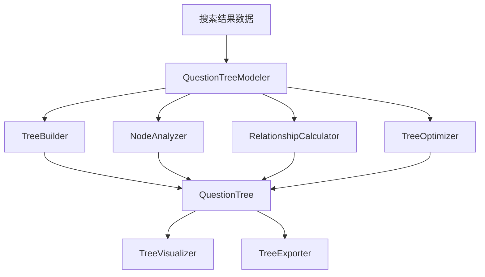

# 用户故事4：问题树状结构建模系统详细设计

## 1. 概述

本文档详细描述了问题树状结构建模系统的设计实现，该系统是用户故事4的核心组件之一，负责将5个方向的问题构建为层次化的树状结构，为后续的评分和优化提供基础数据。

## 2. 系统架构

### 2.1 核心组件



### 2.2 数据模型设计

#### 2.2.1 基础节点模型
问题树节点采用层次化设计，包含以下核心属性：

**基础属性**：
- 节点唯一标识：用于节点识别和关系建立
- 节点类型：区分根节点、方向节点、问题节点等不同类型
- 节点内容：节点的具体内容描述
- 节点层级：节点在树中的层级位置

**关系属性**：
- 父节点ID：指向父节点的引用
- 子节点ID列表：包含所有子节点的引用

**评分属性**：
- 重要性评分：基于搜索结果数量和质量计算
- 相关性评分：基于内容相关性计算
- 质量评分：综合评分结果

**搜索属性**：
- 搜索结果数量：该节点相关的搜索结果总数
- 搜索成功率：搜索成功的比例
- 平均处理时间：搜索处理的平均时间

**内容属性**：
- 摘要长度：相关摘要的总长度
- 关键点数量：提取的关键点总数
- 内容完整性：内容结构的完整程度

**元数据属性**：
- 创建时间：节点创建的时间戳
- 更新时间：节点最后更新的时间戳
- 扩展元数据：用于存储额外的自定义信息

#### 2.2.2 树状结构模型
问题树结构采用层次化组织，包含以下核心属性：

**结构属性**：
- 树结构唯一标识：用于识别不同的树结构
- 根节点引用：指向树的根节点
- 节点集合：包含所有节点的集合

**统计属性**：
- 方向列表：所有方向的名称列表
- 总问题数：树中问题节点的总数
- 树深度：树的最大层级数
- 最大分支因子：单个节点的最大子节点数

**质量指标**：
- 平均重要性评分：所有节点重要性评分的平均值
- 平均相关性评分：所有节点相关性评分的平均值
- 树结构一致性评分：树结构整体的一致性评估

**时间信息**：
- 创建时间：树结构创建的时间戳
- 更新时间：树结构最后更新的时间戳

#### 2.2.3 关系模型
节点关系采用多类型设计，包含以下核心属性：

**关系基础属性**：
- 源节点ID：关系的起始节点
- 目标节点ID：关系的目标节点
- 关系类型：区分父子关系、兄弟关系、相关关系等
- 关系强度：关系的强度值
- 相似度评分：节点间的相似度评分

**树结构指标**：
- 平衡性评分：评估树结构的平衡程度
- 深度合理性评分：评估树深度的合理性
- 分支合理性评分：评估分支结构的合理性
- 一致性评分：评估树结构的一致性
- 总体评分：树结构的综合评分

## 3. 核心算法设计

### 3.1 树状结构构建算法

#### 3.1.1 树状结构构建流程
树状结构构建器负责将搜索结果转换为层次化的问题树，主要流程包括：

**构建步骤**：
1. **创建根节点**：以用户输入的主题作为根节点
2. **创建方向节点**：为每个问题方向创建一级节点
3. **创建问题节点**：为每个具体问题创建二级节点
4. **建立节点关系**：建立完整的父子关系和兄弟关系网络
5. **计算节点评分**：基于搜索结果计算节点的重要性、相关性和质量评分
6. **构建树结构**：将所有节点组装成完整的树状结构
7. **优化树结构**：调整节点顺序，优化层级关系，提高树结构的一致性

#### 3.1.2 节点评分计算
节点评分计算采用多维度评估机制：

**重要性评分计算**：
- 搜索结果数量：基于搜索结果数量计算，数量越多评分越高
- 搜索成功率：基于搜索成功的比例计算
- 内容完整性：基于摘要、关键点、搜索结果的完整性计算

**相关性评分计算**：
- 摘要长度：基于摘要长度计算，摘要越长说明分析越深入
- 关键点数量：基于关键点数量计算，关键点越多说明分析越全面

**质量评分计算**：
- 综合评分：重要性评分和相关性评分的平均值

### 3.2 节点分析算法

#### 3.2.1 节点关系分析
节点分析器负责分析节点间的关系，主要功能包括：

**关系类型分析**：
- 父子关系：分析节点间的层次关系
- 兄弟关系：分析同层级节点间的关系
- 相关关系：基于内容相似度分析节点间的关联

**关系强度计算**：
- 基于内容相似度计算关系强度
- 基于搜索结果重叠度计算关系强度
- 基于评分相关性计算关系强度

#### 3.2.2 树结构指标计算
树结构指标计算包括以下维度：

**平衡性评分**：
- 检查各方向的问题数量是否均衡
- 计算问题数量分布的方差
- 方差越小，平衡性越好

**深度合理性评分**：
- 理想的树深度应该是3层（根-方向-问题）
- 计算实际深度与理想深度的差异
- 差异越小，深度合理性越好

**分支合理性评分**：
- 检查根节点的分支数是否合理
- 检查各方向节点的问题分布是否合理
- 分支分布越均匀，合理性越好

**一致性评分**：
- 基于节点评分的方差计算一致性
- 方差越小，一致性越好

### 3.3 树状结构优化算法

#### 3.3.1 树结构优化流程
树状结构优化器负责优化树结构，主要流程包括：

**优化步骤**：
1. **节点重要性排序**：按重要性评分对节点进行排序
2. **优化节点关系**：重新计算和优化节点间的关系
3. **重新计算评分**：基于优化后的结构重新计算评分
4. **更新树结构信息**：更新树结构的统计信息和质量指标

#### 3.3.2 优化策略
**节点排序优化**：
- 按重要性评分对问题节点进行排序
- 更新节点ID以反映排序结果
- 记录原始顺序和重要性排名

**关系优化**：
- 按重要性排序子节点
- 重新计算节点间的关系强度
- 优化兄弟节点的顺序

**评分重计算**：
- 重新计算平均评分
- 重新计算树结构一致性
- 更新所有质量指标

## 4. 可视化系统设计

### 4.1 树状结构可视化
树状结构可视化器负责生成树状结构的可视化图表，主要功能包括：

**可视化功能**：
- 生成Mermaid格式的树状图代码
- 生成树状结构的文本摘要
- 支持不同层级的节点展示
- 支持节点内容的截断显示

**可视化内容**：
- 根节点：显示分析主题
- 方向节点：显示各方向名称
- 问题节点：显示问题内容（支持截断）
- 节点关系：显示父子关系和兄弟关系

### 4.2 树状结构摘要
树状结构摘要包含以下核心信息：

**基础信息**：
- 分析主题
- 树结构ID
- 创建时间

**结构统计**：
- 总节点数
- 方向数
- 问题数
- 树深度

**质量指标**：
- 平均重要性评分
- 平均相关性评分
- 树结构一致性

**方向分析**：
- 各方向的问题数量
- 各方向的重要性评分
- 各方向的相关性评分

**结构特点**：
- 层次清晰性
- 逻辑合理性
- 覆盖全面性
- 质量均衡性

## 5. 集成接口设计

### 5.1 问题树状建模器主类
问题树状建模器主类负责协调各个子组件，提供统一的集成接口：

**主要功能**：
- 构建问题树状结构
- 分析节点关系
- 计算树结构指标
- 优化树结构
- 生成可视化图表

**处理流程**：
1. **构建基础树结构**：调用树状结构构建器
2. **分析节点关系**：调用节点分析器
3. **计算树结构指标**：调用节点分析器
4. **优化树结构**：调用树状结构优化器
5. **生成可视化**：调用树状结构可视化器
6. **构建返回结果**：整合所有结果并返回

**返回结果**：
- 状态信息：处理状态（成功/失败）
- 树结构数据：完整的树状结构数据
- 关系数据：节点间的关系信息
- 指标数据：树结构的质量指标
- 可视化数据：树状图代码和摘要
- 时间信息：创建时间戳

### 5.2 统计信息获取
提供树结构统计信息的获取功能：

**统计信息包括**：
- 总节点数
- 方向数量
- 问题数量
- 树深度
- 平均重要性评分
- 平均相关性评分
- 树结构一致性评分

### 5.3 数据导出功能
支持将树结构数据导出为不同格式：

**导出格式**：
- JSON格式：便于程序处理
- YAML格式：便于人工阅读
- 其他格式：根据需求扩展

**导出内容**：
- 完整的树结构数据
- 节点关系信息
- 质量指标数据
- 元数据信息

## 6. 配置参数

### 6.1 树状建模配置
树状建模系统的主要配置参数：

**结构参数**：
- 最大树深度：限制树状结构的最大层级数
- 最小重要性阈值：设定节点重要性的最低要求
- 相似度阈值：设定内容相似度的判断标准
- 最大分支因子：限制单个节点的最大子节点数

**功能开关**：
- 优化功能开关：控制是否启用树结构优化
- 可视化功能开关：控制是否生成可视化图表

**导出配置**：
- 支持的导出格式：JSON、YAML等
- 导出内容选择：可选择导出哪些数据

### 6.2 评分权重配置
节点评分计算中的权重配置：

**重要性评分权重**：
- 搜索结果权重：搜索结果数量在重要性评分中的权重
- 成功率权重：搜索成功率在重要性评分中的权重
- 完整性权重：内容完整性在重要性评分中的权重

**相关性评分权重**：
- 摘要长度权重：摘要长度在相关性评分中的权重
- 关键点权重：关键点数量在相关性评分中的权重

## 7. 错误处理

### 7.1 异常处理策略
树状建模系统的错误处理策略：

**数据验证错误**：
- 检查输入数据格式和完整性
- 验证必要字段是否存在
- 提供数据修复建议

**构建错误**：
- 提供降级方案，使用简化结构
- 记录错误但继续执行
- 确保基本结构完整性

**优化错误**：
- 记录错误但继续执行
- 使用原始结构作为备选方案
- 提供错误恢复机制

**可视化错误**：
- 提供文本格式的备选方案
- 记录错误但不影响主流程
- 支持部分可视化功能

### 7.2 日志记录
详细的日志记录机制：

**记录内容**：
- 详细记录每个步骤的执行情况
- 记录错误和异常信息
- 提供性能指标统计
- 支持调试模式

**日志级别**：
- 信息日志：记录正常执行流程
- 警告日志：记录潜在问题
- 错误日志：记录错误和异常
- 调试日志：记录详细的调试信息

## 8. 测试策略

### 8.1 单元测试
测试各个组件的核心功能：

**测试内容**：
- 测试各个组件的核心功能
- 测试数据模型的验证
- 测试算法的正确性

### 8.2 集成测试
测试完整的树状结构构建流程：

**测试内容**：
- 测试完整的树状结构构建流程
- 测试与现有系统的集成
- 测试错误处理机制

### 8.3 性能测试
测试大规模数据的处理能力：

**测试内容**：
- 测试大规模数据的处理能力
- 测试内存使用情况
- 测试响应时间

## 9. 总结

本设计文档详细描述了问题树状结构建模系统的完整实现方案，包括：

1. **完整的数据模型**：定义了节点、树结构、关系等核心数据结构
2. **核心算法实现**：提供了树构建、节点分析、结构优化等关键算法
3. **可视化支持**：支持树状结构的图形化展示
4. **集成接口**：提供了与现有系统的集成接口
5. **配置和错误处理**：完善的配置管理和错误处理机制

该系统为后续的评分和优化系统提供了坚实的基础数据结构，能够有效地将问题组织为层次化的树状结构，为智能分析和优化提供支持。
    
    def _calculate_quality_score(self, node: QuestionTreeNode) -> float:
        """计算质量评分"""
        return (node.importance_score + node.relevance_score) / 2.0
    
    def _calculate_content_completeness(self, record: SearchRoundRecord) -> float:
        """计算内容完整性"""
        completeness = 0.0
        
        # 有摘要（权重40%）
        if record.summary and len(record.summary.strip()) > 0:
            completeness += 0.4
        
        # 有关键点（权重30%）
        if record.key_points and len(record.key_points) > 0:
            completeness += 0.3
        
        # 有搜索结果（权重30%）
        if record.search_results and len(record.search_results) > 0:
            completeness += 0.3
        
        return completeness
    
    def _get_direction_for_question(self, question: str) -> str:
        """根据问题内容确定方向"""
        # 这里需要根据实际的搜索记录来确定方向
        # 暂时返回默认值，实际实现时需要从搜索记录中获取
        return "unknown"
    
    def _assemble_tree(self, root_node: QuestionTreeNode,
                      direction_nodes: Dict[str, QuestionTreeNode],
                      question_nodes: Dict[str, QuestionTreeNode]) -> QuestionTree:
        """组装树结构"""
        # 合并所有节点
        all_nodes = {"root": root_node}
        all_nodes.update(direction_nodes)
        all_nodes.update(question_nodes)
        
        # 计算统计信息
        total_questions = len(question_nodes)
        tree_depth = 3  # 根-方向-问题
        directions = list(direction_nodes.keys())
        
        # 计算平均评分
        avg_importance = sum(node.importance_score for node in question_nodes.values()) / max(total_questions, 1)
        avg_relevance = sum(node.relevance_score for node in question_nodes.values()) / max(total_questions, 1)
        
        tree = QuestionTree(
            tree_id=f"tree_{datetime.now().strftime('%Y%m%d_%H%M%S')}",
            root_node=root_node,
            nodes=all_nodes,
            directions=directions,
            total_questions=total_questions,
            tree_depth=tree_depth,
            total_nodes=len(all_nodes),
            leaf_nodes_count=total_questions,
            internal_nodes_count=len(direction_nodes) + 1,  # 方向节点 + 根节点
            avg_importance_score=avg_importance,
            avg_relevance_score=avg_relevance
        )
        
        return tree
    
    def _optimize_tree_structure(self, tree: QuestionTree) -> QuestionTree:
        """优化树结构"""
        # 重新计算树结构指标
        tree.tree_coherence_score = self._calculate_tree_coherence(tree)
        
        # 更新树结构
        tree.updated_at = datetime.now()
        
        return tree
    
    def _calculate_tree_coherence(self, tree: QuestionTree) -> float:
        """计算树结构一致性评分"""
        # 基于节点评分的方差计算一致性
        importance_scores = [node.importance_score for node in tree.nodes.values() if node.node_type == NodeType.QUESTION]
        if len(importance_scores) > 1:
            variance = sum((score - tree.avg_importance_score) ** 2 for score in importance_scores) / len(importance_scores)
            coherence = max(0, 1 - variance)
        else:
            coherence = 1.0
        
        return coherence
```

### 3.2 节点分析算法

#### 3.2.1 NodeAnalyzer类设计
```python
class NodeAnalyzer:
    """节点分析器"""
    
    def __init__(self, config: Dict[str, Any]):
        self.config = config
        self.logger = workflow_logger
    
    def analyze_node_relationships(self, tree: QuestionTree) -> List[NodeRelationship]:
        """分析节点关系"""
        relationships = []
        
        # 分析父子关系
        for node_id, node in tree.nodes.items():
            if node.parent_id:
                parent_relationship = NodeRelationship(
                    from_node_id=node.parent_id,
                    to_node_id=node_id,
                    relationship_type="parent",
                    strength=1.0
                )
                relationships.append(parent_relationship)
            
            # 分析兄弟关系
            if node.children_ids:
                for child_id in node.children_ids:
                    child_relationship = NodeRelationship(
                        from_node_id=node_id,
                        to_node_id=child_id,
                        relationship_type="child",
                        strength=1.0
                    )
                    relationships.append(child_relationship)
        
        # 分析相关关系（基于内容相似度）
        related_relationships = self._analyze_content_relationships(tree)
        relationships.extend(related_relationships)
        
        return relationships
    
    def _analyze_content_relationships(self, tree: QuestionTree) -> List[NodeRelationship]:
        """分析内容相关关系"""
        relationships = []
        question_nodes = [node for node in tree.nodes.values() if node.node_type == NodeType.QUESTION]
        
        for i, node1 in enumerate(question_nodes):
            for j, node2 in enumerate(question_nodes[i+1:], i+1):
                similarity = self._calculate_content_similarity(node1.content, node2.content)
                if similarity > 0.3:  # 相似度阈值
                    relationship = NodeRelationship(
                        from_node_id=node1.node_id,
                        to_node_id=node2.node_id,
                        relationship_type="related",
                        strength=similarity,
                        similarity_score=similarity
                    )
                    relationships.append(relationship)
        
        return relationships
    
    def _calculate_content_similarity(self, content1: str, content2: str) -> float:
        """计算内容相似度"""
        # 简单的词汇重叠相似度计算
        words1 = set(content1.lower().split())
        words2 = set(content2.lower().split())
        
        if not words1 or not words2:
            return 0.0
        
        intersection = words1.intersection(words2)
        union = words1.union(words2)
        
        return len(intersection) / len(union) if union else 0.0
    
    def calculate_tree_metrics(self, tree: QuestionTree) -> TreeMetrics:
        """计算树结构指标"""
        # 平衡性评分
        balance_score = self._calculate_balance_score(tree)
        
        # 深度合理性评分
        depth_score = self._calculate_depth_score(tree)
        
        # 分支合理性评分
        branching_score = self._calculate_branching_score(tree)
        
        # 一致性评分
        coherence_score = tree.tree_coherence_score
        
        # 总体评分
        overall_score = (balance_score + depth_score + branching_score + coherence_score) / 4.0
        
        return TreeMetrics(
            tree_id=tree.tree_id,
            balance_score=balance_score,
            depth_score=depth_score,
            branching_score=branching_score,
            coherence_score=coherence_score,
            overall_score=overall_score
        )
    
    def _calculate_balance_score(self, tree: QuestionTree) -> float:
        """计算平衡性评分"""
        # 检查各方向的问题数量是否均衡
        direction_counts = {}
        for node in tree.nodes.values():
            if node.node_type == NodeType.QUESTION and node.parent_id:
                parent_node = tree.nodes.get(node.parent_id)
                if parent_node and parent_node.node_type == NodeType.DIRECTION:
                    direction = parent_node.content
                    direction_counts[direction] = direction_counts.get(direction, 0) + 1
        
        if not direction_counts:
            return 0.0
        
        counts = list(direction_counts.values())
        avg_count = sum(counts) / len(counts)
        variance = sum((count - avg_count) ** 2 for count in counts) / len(counts)
        
        # 平衡性评分：方差越小，平衡性越好
        balance_score = max(0, 1 - variance / (avg_count ** 2))
        return balance_score
    
    def _calculate_depth_score(self, tree: QuestionTree) -> float:
        """计算深度合理性评分"""
        # 理想的树深度应该是3层（根-方向-问题）
        ideal_depth = 3
        actual_depth = tree.tree_depth
        
        # 深度评分：越接近理想深度，评分越高
        depth_score = max(0, 1 - abs(actual_depth - ideal_depth) / ideal_depth)
        return depth_score
    
    def _calculate_branching_score(self, tree: QuestionTree) -> float:
        """计算分支合理性评分"""
        # 检查根节点的分支数（应该是方向数）
        root_children_count = len(tree.root_node.children_ids)
        expected_directions = len(tree.directions)
        
        if expected_directions == 0:
            return 0.0
        
        # 分支合理性评分
        branching_score = min(root_children_count / expected_directions, 1.0)
        return branching_score
```

### 3.3 树状结构优化算法

#### 3.3.1 TreeOptimizer类设计
```python
class TreeOptimizer:
    """树状结构优化器"""
    
    def __init__(self, config: Dict[str, Any]):
        self.config = config
        self.logger = workflow_logger
    
    def optimize_tree(self, tree: QuestionTree) -> QuestionTree:
        """优化树状结构"""
        try:
            self.logger.log_info("开始优化树状结构")
            
            # 1. 节点重要性排序
            optimized_tree = self._sort_nodes_by_importance(tree)
            
            # 2. 优化节点关系
            optimized_tree = self._optimize_node_relationships(optimized_tree)
            
            # 3. 重新计算评分
            optimized_tree = self._recalculate_scores(optimized_tree)
            
            # 4. 更新树结构信息
            optimized_tree.updated_at = datetime.now()
            
            self.logger.log_info("树状结构优化完成")
            return optimized_tree
            
        except Exception as e:
            self.logger.log_error(f"优化树状结构失败: {str(e)}")
            return tree
    
    def _sort_nodes_by_importance(self, tree: QuestionTree) -> QuestionTree:
        """按重要性排序节点"""
        # 对问题节点按重要性评分排序
        question_nodes = [node for node in tree.nodes.values() if node.node_type == NodeType.QUESTION]
        sorted_question_nodes = sorted(question_nodes, key=lambda x: x.importance_score, reverse=True)
        
        # 更新节点ID以反映排序
        for i, node in enumerate(sorted_question_nodes):
            node.node_id = f"question_{i+1}"
            node.metadata["original_order"] = i + 1
            node.metadata["importance_rank"] = i + 1
        
        return tree
    
    def _optimize_node_relationships(self, tree: QuestionTree) -> QuestionTree:
        """优化节点关系"""
        # 重新计算节点间的关系强度
        for node_id, node in tree.nodes.items():
            if node.children_ids:
                # 按重要性排序子节点
                child_nodes = [tree.nodes[child_id] for child_id in node.children_ids]
                sorted_children = sorted(child_nodes, key=lambda x: x.importance_score, reverse=True)
                node.children_ids = [child.node_id for child in sorted_children]
        
        return tree
    
    def _recalculate_scores(self, tree: QuestionTree) -> QuestionTree:
        """重新计算评分"""
        # 重新计算平均评分
        question_nodes = [node for node in tree.nodes.values() if node.node_type == NodeType.QUESTION]
        
        if question_nodes:
            tree.avg_importance_score = sum(node.importance_score for node in question_nodes) / len(question_nodes)
            tree.avg_relevance_score = sum(node.relevance_score for node in question_nodes) / len(question_nodes)
        
        # 重新计算树结构一致性
        tree.tree_coherence_score = self._calculate_updated_coherence(tree)
        
        return tree
    
    def _calculate_updated_coherence(self, tree: QuestionTree) -> float:
        """计算更新后的一致性评分"""
        question_nodes = [node for node in tree.nodes.values() if node.node_type == NodeType.QUESTION]
        
        if len(question_nodes) <= 1:
            return 1.0
        
        importance_scores = [node.importance_score for node in question_nodes]
        avg_score = sum(importance_scores) / len(importance_scores)
        
        variance = sum((score - avg_score) ** 2 for score in importance_scores) / len(importance_scores)
        coherence = max(0, 1 - variance)
        
        return coherence
```

## 4. 可视化系统设计

### 4.1 TreeVisualizer类设计
```python
class TreeVisualizer:
    """树状结构可视化器"""
    
    def __init__(self, config: Dict[str, Any]):
        self.config = config
        self.logger = workflow_logger
    
    def generate_tree_diagram(self, tree: QuestionTree) -> str:
        """生成树状结构图表"""
        try:
            # 使用Mermaid语法生成树状图
            mermaid_code = self._generate_mermaid_tree(tree)
            return mermaid_code
            
        except Exception as e:
            self.logger.log_error(f"生成树状结构图表失败: {str(e)}")
            return ""
    
    def _generate_mermaid_tree(self, tree: QuestionTree) -> str:
        """生成Mermaid树状图代码"""
        lines = ["graph TD"]
        
        # 添加根节点
        root_id = "root"
        lines.append(f'    {root_id}["{tree.root_node.content}"]')
        
        # 添加方向节点
        for direction in tree.directions:
            direction_node = None
            for node in tree.nodes.values():
                if node.node_type == NodeType.DIRECTION and node.content == direction:
                    direction_node = node
                    break
            
            if direction_node:
                direction_id = direction_node.node_id
                lines.append(f'    {direction_id}["{direction}"]')
                lines.append(f'    {root_id} --> {direction_id}')
                
                # 添加问题节点
                for child_id in direction_node.children_ids:
                    child_node = tree.nodes.get(child_id)
                    if child_node and child_node.node_type == NodeType.QUESTION:
                        question_id = child_node.node_id
                        # 截断过长的内容
                        question_content = child_node.content[:50] + "..." if len(child_node.content) > 50 else child_node.content
                        lines.append(f'    {question_id}["{question_content}"]')
                        lines.append(f'    {direction_id} --> {question_id}')
        
        return "\n".join(lines)
    
    def generate_tree_summary(self, tree: QuestionTree) -> str:
        """生成树状结构摘要"""
        summary_lines = [
            f"# 问题树状结构摘要",
            f"",
            f"**主题**: {tree.root_node.content}",
            f"**树结构ID**: {tree.tree_id}",
            f"**创建时间**: {tree.created_at.strftime('%Y-%m-%d %H:%M:%S')}",
            f"",
            f"## 结构统计",
            f"- 总节点数: {tree.total_nodes}",
            f"- 方向数: {len(tree.directions)}",
            f"- 问题数: {tree.total_questions}",
            f"- 树深度: {tree.tree_depth}",
            f"",
            f"## 质量指标",
            f"- 平均重要性评分: {tree.avg_importance_score:.3f}",
            f"- 平均相关性评分: {tree.avg_relevance_score:.3f}",
            f"- 树结构一致性: {tree.tree_coherence_score:.3f}",
            f"",
            f"## 方向分析"
        ]
        
        # 按方向分析
        for direction in tree.directions:
            direction_node = None
            for node in tree.nodes.values():
                if node.node_type == NodeType.DIRECTION and node.content == direction:
                    direction_node = node
                    break
            
            if direction_node:
                question_count = len(direction_node.children_ids)
                summary_lines.extend([
                    f"",
                    f"### {direction}",
                    f"- 问题数量: {question_count}",
                    f"- 重要性评分: {direction_node.importance_score:.3f}",
                    f"- 相关性评分: {direction_node.relevance_score:.3f}"
                ])
        
        return "\n".join(summary_lines)
```

## 5. 集成接口设计

### 5.1 QuestionTreeModeler主类
```python
class QuestionTreeModeler:
    """问题树状建模器主类"""
    
    def __init__(self, config: Dict[str, Any]):
        self.config = config
        self.logger = workflow_logger
        
        # 初始化子组件
        self.tree_builder = TreeBuilder(config)
        self.node_analyzer = NodeAnalyzer(config)
        self.tree_optimizer = TreeOptimizer(config)
        self.tree_visualizer = TreeVisualizer(config)
    
    def build_question_tree(self, search_results: List[SearchRoundRecord], topic: str) -> Dict[str, Any]:
        """构建问题树状结构"""
        try:
            self.logger.log_info(f"开始构建问题树状结构，主题: {topic}")
            
            # 1. 构建基础树结构
            tree = self.tree_builder.build_tree(search_results, topic)
            
            # 2. 分析节点关系
            relationships = self.node_analyzer.analyze_node_relationships(tree)
            
            # 3. 计算树结构指标
            metrics = self.node_analyzer.calculate_tree_metrics(tree)
            
            # 4. 优化树结构
            optimized_tree = self.tree_optimizer.optimize_tree(tree)
            
            # 5. 生成可视化
            tree_diagram = self.tree_visualizer.generate_tree_diagram(optimized_tree)
            tree_summary = self.tree_visualizer.generate_tree_summary(optimized_tree)
            
            # 6. 构建返回结果
            result = {
                "status": "completed",
                "tree": optimized_tree.dict(),
                "relationships": [rel.dict() for rel in relationships],
                "metrics": metrics.dict(),
                "visualization": {
                    "diagram": tree_diagram,
                    "summary": tree_summary
                },
                "created_at": datetime.now().isoformat()
            }
            
            self.logger.log_info(f"问题树状结构构建完成，共{optimized_tree.total_nodes}个节点")
            return result
            
        except Exception as e:
            error_result = {
                "status": "error",
                "error": str(e),
                "created_at": datetime.now().isoformat()
            }
            self.logger.log_error(f"构建问题树状结构失败: {str(e)}")
            return error_result
    
    def get_tree_statistics(self, tree: QuestionTree) -> Dict[str, Any]:
        """获取树结构统计信息"""
        return {
            "total_nodes": tree.total_nodes,
            "directions_count": len(tree.directions),
            "questions_count": tree.total_questions,
            "tree_depth": tree.tree_depth,
            "avg_importance_score": tree.avg_importance_score,
            "avg_relevance_score": tree.avg_relevance_score,
            "tree_coherence_score": tree.tree_coherence_score
        }
    
    def export_tree_data(self, tree: QuestionTree, format: str = "json") -> str:
        """导出树结构数据"""
        if format == "json":
            return tree.json(indent=2)
        elif format == "yaml":
            import yaml
            return yaml.dump(tree.dict(), default_flow_style=False)
        else:
            raise ValueError(f"不支持的导出格式: {format}")
```

## 6. 配置参数

### 6.1 树状建模配置
```python
TREE_MODELING_CONFIG = {
    "max_tree_depth": 3,                    # 最大树深度
    "min_importance_threshold": 0.3,          # 最小重要性阈值
    "similarity_threshold": 0.3,              # 相似度阈值
    "max_branching_factor": 10,              # 最大分支因子
    "enable_optimization": True,              # 启用优化
    "enable_visualization": True,             # 启用可视化
    "export_formats": ["json", "yaml"]        # 支持的导出格式
}
```

### 6.2 评分权重配置
```python
SCORING_WEIGHTS = {
    "importance": {
        "search_results_weight": 0.4,         # 搜索结果权重
        "success_rate_weight": 0.3,           # 成功率权重
        "completeness_weight": 0.3            # 完整性权重
    },
    "relevance": {
        "summary_length_weight": 0.5,         # 摘要长度权重
        "key_points_weight": 0.5              # 关键点权重
    }
}
```

## 7. 错误处理

### 7.1 异常处理策略
- **数据验证错误**：检查输入数据格式和完整性
- **构建错误**：提供降级方案，使用简化结构
- **优化错误**：记录错误但继续执行
- **可视化错误**：提供文本格式的备选方案

### 7.2 日志记录
- 详细记录每个步骤的执行情况
- 记录错误和异常信息
- 提供性能指标统计
- 支持调试模式

## 8. 测试策略

### 8.1 单元测试
- 测试各个组件的核心功能
- 测试数据模型的验证
- 测试算法的正确性

### 8.2 集成测试
- 测试完整的树状结构构建流程
- 测试与现有系统的集成
- 测试错误处理机制

### 8.3 性能测试
- 测试大规模数据的处理能力
- 测试内存使用情况
- 测试响应时间

## 9. 总结

本设计文档详细描述了问题树状结构建模系统的完整实现方案，包括：

1. **完整的数据模型**：定义了节点、树结构、关系等核心数据结构
2. **核心算法实现**：提供了树构建、节点分析、结构优化等关键算法
3. **可视化支持**：支持树状结构的图形化展示
4. **集成接口**：提供了与现有系统的集成接口
5. **配置和错误处理**：完善的配置管理和错误处理机制

该系统为后续的评分和优化系统提供了坚实的基础数据结构，能够有效地将问题组织为层次化的树状结构，为智能分析和优化提供支持。
